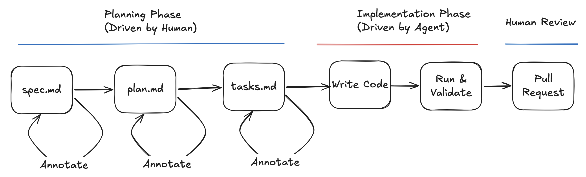

**Module 3: Spec driven development**
First hands-on moment. Attendees write a spec for a real or dummy feature by the end of this module.
- Why spec-first? — what changes when you plan before implementing
- The planning phase overview — spec → plan → tasks as a pipeline, not a negotiation
- The spec.md file — purpose, required sections, what good looks like vs what bad looks like
- The annotation loop — how to use the agent to fill gaps and surface edge cases in the spec before implementation
- The plan.md file — breaking the spec into ordered steps
- The tasks.md file — granular tasks with validation criteria baked in

---

TODO: talk about using spec+plan+tasks vs plan+tasks only. depends on use case. A spec is useful for newer repos or new tech and we want to detach the WHAT from the technical decisions (that should come last). Technical decisions too early can lead is to inefficient solutions (ie choose an architecture because it fits the tool, rother than designing a good architecture and choosing the right tools)

The workflow I follow consists of 3 parts, planning phase, implementation phase and final code review phase.

### The Planning Phase

The planning phase consists of an in depth set of documents that contian in deputh specifications of WHAT needs to built, WHY and HOW we are going to implement it. This is the most important part, and where we have to focus all of our attention to ensure we gather all of the correct requirements and make the correct decisions.

During this psahe, we do not implement any code.

#### The spec.md file

[TODO: tips, keywords to use "WHAT, not HOW", "WHY". Provide an example doc]

First I create a spec.md file in the repository. I tell the agent to create the file based on my initial specifications and let it create a detailed initial draft. The specs file contains information about WHY we are building this feature and WHAT this feature is. At this point we do not specify technologies or anything related to HOW we are going to build this. This file needs to be a reflection of what we are building, agnostic of any technical decisions.

Some of the things you can include in this file are:
- context around the purpose of the current repo
- What is being implemented and why; User stories
- Functional Requirements
- Key Entities (ie data schemas)
- Success Criteria.
- Architecture (non-technical)

The quality of the first draft will only be as good as your original specifications. Example prompt:

> _Create a specs.md file for this feature. Focus on the what and why, no technical decisions. Include context about the repo, user stories, functional requirements, key entities, and success criteria. Here are my original specs: [paste your JIRA ticket here]_

From this, the agent should have created an initial specs document ready for you to review and provide feedback on.

#### The annotation loop

The specs.md file will be where you spend most of your time during the whole process. You need to carefully read the contents and ensure all of the information is correct. If the model made any assumptions, they need to be corrected. You can either annotate them directly in the spec file or propmt the model with the changes you want to make. The agent will then update the spec file to include all the new changes.

You may spend hours or days going through your spec file. You should make corrections and ask the agent to update the spec.md based on your corrections. You may also need to find out more information from your team or the stakeholders. Add all of this information here and ask the agent to update the document each time. Remember, any lack of detail or ambiguity might result in the final feature not turning out the way you wanted. You may go through this annotation process multiple times.

Once your spec.md is ready to go, ask the model to analyze the current state of the file to find any ambiguity or lack of clarification. This will help identify any ambiguity in the file that need clarifying from you, which will reduce any assumptions made by the model at implementation time, which is what we want to minimise as much as possible. Example prompt:

>: _Check the existing spec.md and identify any lack of detail or ambiguity. Ask me for further clarification on what you find._

When the final clarifications are done, and the final spec is ready, I move on to the planning phase.

#### The plan.md file

The next step is to create a plan.md file. The plan contains the technical implementation details, such as architecture, frameworks and technical decisions. The plan should be aware of the structure of the current repository, and know which changes will be applied and where. In the plan we con specify which tests and validations we are going to run. It should know how to spin up a local environmont to run test things.

If you are building an an existing repo, you may want the agent to scan the current repo to understand how to build the feature using the existing patterns. If you are creating something new, you may want to be more specific in the languages, tools and so on. Example prompt:

> _Create a plan.md file with technical implementation details and chosen tech stack. Specify technical decisions. Do a deep research of the relevant sections of the repo before suggesting how the changes will be made. Any decisions should be backed up by data, to ensure functionality is available and changes are based on existing practices and functionality. The plan does not need to be broken down into tasks (we will do that later). We want a detailed overview of the technical decisions and how we will implement the changes._

For the plan you can choose to either provide specific information about the frameworks, or let it do its own thing. That is up to you. Similarly to the spec.md, you need to spend time reviewing the plan and changing anything that does not look right.

Then we are ready to move on to the tasks file.

#### The tasks.md file

The tasks.md file is a breakdown of the plan into executable steps. It is essentially a sequential TODO list of what needs to be implemented from the plan, broken down into small tasks. The tasks.md file is essential for you to know exactty what it is that will be implemented, and the model will follow these steps one by one. It makes the model run exactly what is there, rather that it making its own choices about implementation.

You can structurre the file into small TODOs that the model can update as it implements things. Example prompt:

> _Create a tasks.md file as detailed todo list to the plan, with all the phases and individual tasks necessary to complete the plan - don't implement yet._

The most important thing in the tasks file, is ensuring there are validation steps for each task. These can be unit tests, or custom scripts the agent creates to test functionality. These validation tasks will serve the agent as a validation loop that it can use to verify functionality to ensure it meets the success criteria before marking it done.
