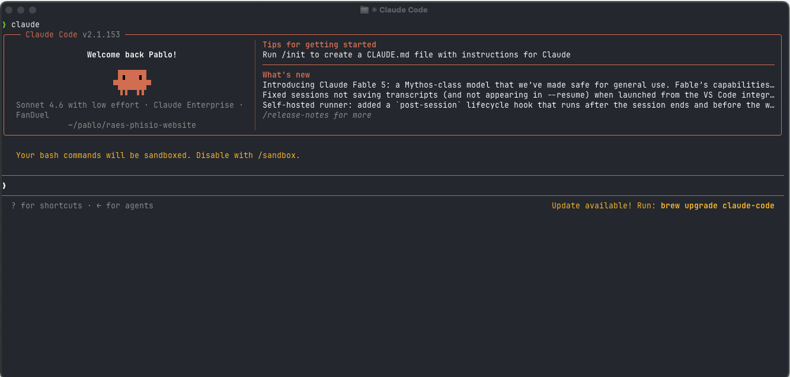
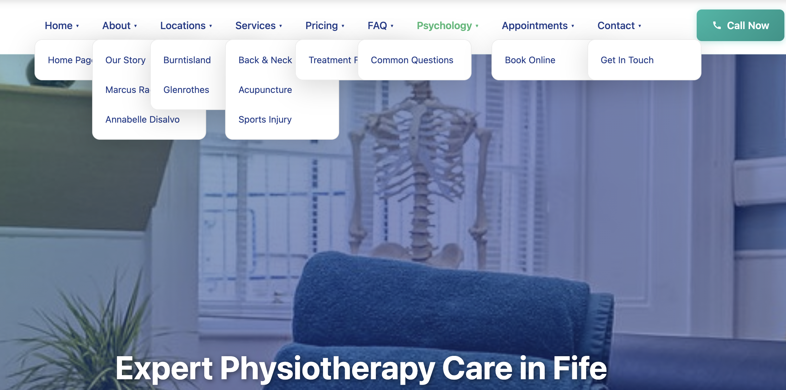

This is the story of how I overengineered a whole website migration. This was originally going to be a success story of how I managed to rescue my friend's webisite from his web developer who was keeping it hostage. I was going to write about how I used AI to rewrite a whole website in a day, despite me not being a web developer, but in the end I realised what a fool I was.

----
The story begins with me and my family going to our neighbors house to take my son to a playdate with his friend. My neighbor owns a physiotherapy business, and my wife had recently visited to see their accupunture specialist. I told him (in a nice way as possible) that I had a look at my wife's phone while she was browsing his website, and that I thought it looked a buggy and not as good as it could be, specially the mobile version. I'm not an expert web developer by any means, but even I know that these days you should design websites thinking about phone first, because that's what most people will use to book their appointments.

He then told me he was having issues with the web developer who built and maintains their website. He told me that he wanted to be given access to the website code, because he was thinking of potentially using another web developer who was more reliable or even migrating his website to a wordpress that he could easily manage. However, the web developer didn't want to give him access to the code artifacts, he was essentially holding it hostage so he could keep his monthly maintenace fee.

I told him that, although I'm not a professional web developer, I know my way around websites, and that I could take a look for him. With AI coding agents, it could not be too hard to make a copy of the website so that he could own the code.

He also told me that the guy who had created his website had told him that he had his own "AI platform to build it". I didn't mention anything to him at the time, but it felt to me like this guy was trying to sell him some snake oil. In my head I thought he was probably just using claude, like everyone else, to build websites, and he was marketing it as something bigger than it really is.

The next day, I went and had a look at his site. It seemed like a simple static website, with a bunch of HTML pages and no complex logic anywhere beyond your typical hamburger menu in the navigation section. So I decided to give it a go. I could see from 100 miles away that the dev had indeed used AI to create the website. I could tell by the shape of the cards, emojis, font colors in titles etc. So I had already formed this idea in my head that the website was going to be a mess.

 Making these assumptions early on, without any proof, was going to be my downfall, but I'm getting ahead of myself.

## The Requirements

The requirements for this project were simple

1. Create a clone of the website. The copy should look as similar to the original. If we were to swap them a returning customer should feel like they have landed on the same site.
2. Create a clean repo structure that can easily be picked up by any developer that has landed on it.
3. No frameworks. Plain HTML + CSS + JavaScript so we would not need to worry about library updates in the years to come.
4. All the links, media and everything else should work as per the origininal site.
5. Make the site is mobile first. Ensure the mobile version looks good since that's what most people will use.

## The Setup

I decided to use claude combined with the [agent skills](https://github.com/addyosmani/agent-skills) framework. With this framework you can break large tasks such as this one into a set of requirements and a detail plan, that the agent can follow to complete the task.

## Getting started

The first thing I wanted to do was to download the existing website locally for reference. I had already formed a plan in my head, I would clone the website locally and use it for reference to build the clone. I would write the new version from scratch. I had already formed the idea that the original clone would not be usable.

The command that claude suggested was this. I asked it run it for me and run the website in localhost.

```shell
  wget --mirror --convert-links --adjust-extension --page-requisites --no-parent https://example.com
```

Once it downloaded, I had a quick look at the files. To be honest, I spent less that 5 seconds looking at the list. I could see a bunch of HTML stuff and png files with random names, all flat in the directory. I had already decided that rebuilding the whole thing was the best way forward, and with AI it would not be too much upheaval.


```shell
home-physio.html
Homehero.jpeg
index.html
joint-mobilisation.html
lisa.html
locations.html
manipulation.html
manual-therapy.html
massage-therapy.html
MBM00268.jpeg
opc1.jpeg
opc2.jpeg
opc3.jpeg
Pic_placeholder.png
post-op-rehab.html
pricing.html
privacy-policy.html
psychologist-writing-his-notebook copy.jpg
psychology-reviews.html
psychology.html
...
```

I checked my local server, and I could see that the website was running locally, and it looked exactly like the original, so I was ready to migrate.

## Building the Webiste

I got started. I opened claude code in the terminal and fired up the agent skills framework.



I started using the `/interview-me` skill to set the original requirements. I have to say, whoever came up with this idea is a genious. This skill will ask you questions about what you want to build until it has enough confidence that it's got enough detail of all the specs. If you combine this skill with your microphone to narrate your answers, it makes for a pretty sweet workflow.

Within 5 minutes I had all of the requirements defined. So I moved on to generate the spec file with the `/spec` skill. This file gathered all of the HTML files that we needed to create, 32 in total, one for each page in the website, and all the external links that needed to be preserved. The generated spec.md document was quite long, as it is normally the case with AI generated documents, so without going too much into detail, I checked that everything in there more or less made sense, and everything looked more or less okay. After that I moved on to the planning phase.

The plan phase consists on using the `/plan` skill, which creates a breakdown of the tasks to complete the whole project. In the plan you can also specify any tech choices you want to follow. In my case I made sure no frameworks were getting used. I wanted a simple HTML/CSS/Javascript site that needed litttle maintenance and could easily be handed over to any web developer.

The plan document had 7 steps to build the whole thing incrementally. It would start with the landing page and the base styles. Once that was correct it would go on to build the rest of the site, re-using styles from the first step. THis looked good to me, so I asked claude to start building the website.

## Human in the loop

I first let claude do its own thing, and it cracked on for 10 minutes setting things up. I was using the sonnet 4.7, which I believe is quite a good model, so I was filled with confidence that I was going to get it right in one shot. After all I'd specified in the spec that it should use the dowloaded website as guide.

When I first opened the first draft, to check the nav bar and styles it was all a mess. The nav bar was showing some of the options without anyone hovering on it, and the options were overlapping each other. It was obviosly not checking the actual website to see what it "looked like". So I started providing some screenshots of the issues and asking claude to fix it.



As you can imagine, this was a lot of work. The idea of using AI is that it has it's own feedback loop to check its own work so that it can self evaluate if a task is complete. After hoving provided 20 different screenshots, I decided that it was enough, so I explicitly asked it to take screenshots of the website to validate its own code. And that's all that was needed, somehow Claude got hold of the screenshot tool provided by mac, and it used it to grab screenshots and self evaluating the final website results. From here on the results were much better and consistent with the original website.

 

I still had to do a lot of manual approval of the random scripts (because I'm too much of a coward to run `--dangerously-skip-permissions`). But I could do this while focusing on other stuff, so I didn't mind it too much.

## Final Refinements

It took a whole day to finish the website and have it in a reasonable state. The website looked more or less the same as the original, with some differences here and there. The biggest issue was that for some of the pages it had ignored the original and it had "hallucinated" its own page structure and content. Towards the end, I had to go through each page and compare it to the original, and specifically tell claude what things needed fixed.

The morning of the following day I had finished clone of the website. Everything was looking well on both web and mobile versions, almost exactly the same as the original, with minor improvements here and there.


## I Could Have Saved Myself 80% of the work

The website was finished. Like with many AI Developed projects, I hadn't spent the time going through the generated files. I simply assumed that claude was staying true to the original specs. At the end, I had a bunch of HTML files, a single CSS file and a javascript file.

I hosted the site in github pages and shared it with my neighbor. He was really impressed.

The next day, I sat in my desk to write this blog on how I can dedicate myself to web development now, even though I'm not a web developer.

As I started writing the blog, it occurred to me that I hadn't really checked the original files. What was wrong with them in the first place? Why did I need a full rebuild? How different was the final outcome to the original stuff?

Upon checking the original files using the `ls` command, it looks surprisingly similar to my "cloned" version. A bunch of HTML files, one for each page and some image files. I open the HTML files for the original website, and the main difference between the clone and the original is that the original baked all of the CSS and javascript inside each HTML file. Other than that, the content of the HTML files are pretty much the same.

The main improvements from my version is that I re-organised the images into an `assets` folder, and I created some re-usable CSS styles. I then realise, I could have asked claude to take the copy of the original website, and simply re-organise the file structure to the structure I wanted, and also to extract some of the CSS and javascript into re-usable styles that could be used across files.

More importantly, none of the "improvements" I made were that relevant. I could have simply taken the dowloaded files from the original, and deploy that directly and shared the files with my neighbor to do with them whatever he wanted. That would have saved me 95% of the work and would have taken 20 minutes instead of a day and a half.

No AI required at all.


## Final thoughts

Reflecting back on this, I think there were a few things that contributed me to overengineer the solution to this problem.

First, I knew I had access to AI, and I know AI can do all of these things for me without much effort from my side beyond a little babysitting. So I didn't really considered if my approach to cloning the website was the most efficient.

Second, I could see a lot of signs that the person had used AI in the first place to create the site. For some reason, I have a negative association with this, so I assumed the original work would be some sort of mess or slop. WHich is not really fair, since I was 100% using AI to generate the new version as well. I had also assumed that they would have used some framework like react or something to make things complicated. I thought that I was the smarter one by using simple HTML and CSS to build the whole thing. Turns out, that if I'd paid attention at the beggining, I'd realised the original dev had the same idea, and I could have re-used that.

Finally, I think because I'm not a web developer, I didn't really have the expertise to catch some of these things early on, leading me to solving the problem using the overengineered solution.


In the end, it wasn't too bad. It took a full day of this thing running in the background, while I was still able to do other things. The context switching was still tough, taking concentration away from the other tasks I was doing. Still, it is tough to think I could have solved the problem in 20 minutes instead of a whole day.

With AI, now solving problems is more a question of time, rather than effort.
