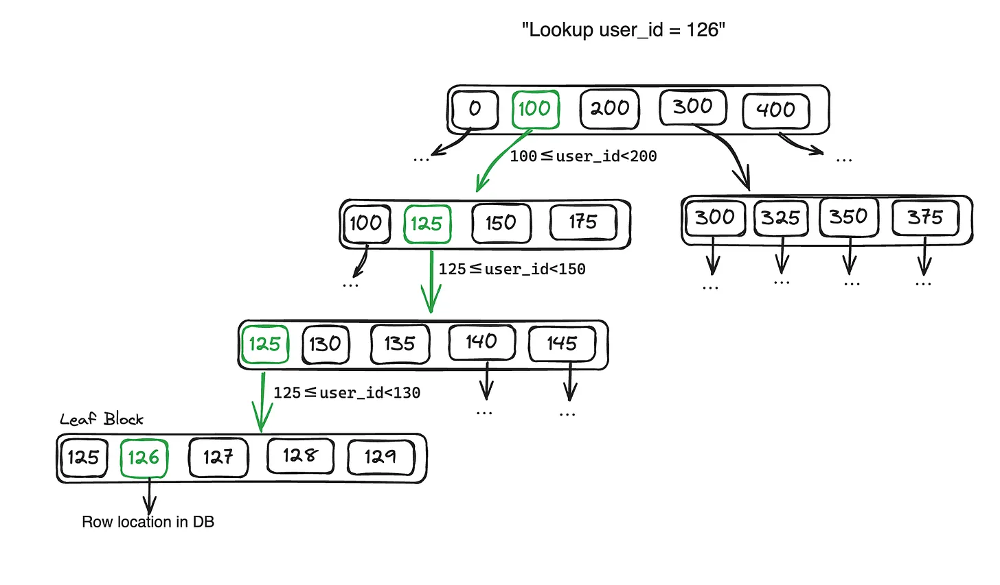

Indexes are like going to the airport and looking at the signs to see where your gate is located. The signs tell you how to get to your gate quickly. The alternative to not having signs is walking the whole airport randomly until you come across your gate. So by having the signs you can reach your gate a lot faster. Makes sense right? This is the idea behind indexes.


A database has two main functions, read and write. Writing data is normally a simple operation, all you need to do is take your data and put it into disk. Reading data however can become slow when we have large amounts of data.

To make reading operations more efficient we can use indexes. Indexes are additional metadata kept on the side which acts as a signpost and helps you locate the data you want. You can use different types of indexes to search the data in different ways.

Most databases allow you to add or remove indexes and it won’t affect the contents of the database. However maintaining these additional structures can incur more overhead in writing operations because the database needs to make an extra effort to add indexes for the new data and keep the indexes up to date.

In the airport example, imagine the airport gets expanded and new gates are added, someone will need to come and update the signs to include directions to those new gates. In this example, people reaching the gates are the read operations. People will reach them much faster if we update the signs with directions to get there. The downside is that it takes a little bit extra effort to add those new signs after the new gates have been added ( what a weird example right? I’m sticking to it though.)

This is where the tradeoff comes with indexes. Your writes may be slowed down with the benefit of having faster queries. It is important to test whether adding a new index will actually improve the performance. If the read benefit is not there you may be using the wrong type of index or you may not need one at all.

****So why are the indexes not created by default?****

The reason why databases don’t create indexes for all of your data is because 
1 - Indexes take additional space in the database and 
2 - deciding the type of indexes depends on your type of data and your querying patterns. Different types of indexes have their own advantages, like we’ll see below.

## Types of Indexes
In this section, I’ll explain Hash and BTree indexes. These are two popular types of indexes however there are many more.

### Hash Indexes
These are indexes for key-value data. They are stored using hash maps, which would look similar to a Python dictionary. The way they work is that each key points to the location of a row in the database, not the value itself. So if you are looking for a specific ID in your data, it will tell you where in the database that row with that ID is stored.

Hash Indexes are particularly efficient in equality (`=`) matches - when you are looking for a record that matches a specific value.

Hash indexes are fast because they can be loaded into memory and it can quickly find the location in the database for a particular value. They work particularly well when your keys in the database are not updated as often as the values.

For example, let’s imagine we have a table with 2 columns, `video_url` and `number_of_clicks`. If we create an index on `video_url` it will create a key such as `http://my_video` and the value will point to the location of that row in the database. Now we can quickly search for that video using the URL and update the number of clicks.

```sql
UPDATE number_of_clicks
SET number_of_clicks = 1928
WHERE video_url = 'http://my_video'
```

In this specific situation, it's necessary to frequently update the values, but the addition of new keys is less common (since the frequency of users watching videos surpasses that of users uploading new videos).

**How does the database update or add new keys?**

When adding a new key it is simply appended to our list of indexes.

If we want to update a key with a new value then we append the key value at the end of the list. This will create a duplicate index: the new version with the new value and the old version containing the older value. To handle this, the database will run a merge operation from time to time to merge duplicate keys keeping the latest entry only (remember we are appending, so the last one will be the newest one).

```
key1:123, key2:323, key3:231, key2: 333
```
and merge
```
merge → key1:123, key2:333, key3:231
```

The reason why appending is a better idea than updating the value in place is because it will give us the ability to roll back should the operation fail midway. We don’t want to end up with a key that is half the old value and half the new value.

**Pros of Hash Indexes:**

- Good for equality searches `WHERE` columns = value as they allow for direct computation of where the row is stored.

- They are fast because keys can be loaded into memory

**Cons of Hash Indexes:**

- Equality Searches only. Doing something like `WHERE` column `>` value won’t bring any benefit.

### Binary Tree Indexes
Binary trees (BTrees) are the indexes you use when you want to query range data efficiently. Instead of each key pointing to the exact location of the row like in hash indexes, each key points to a range of indexes.

Let’s look at the image example. In this case, each index corresponds to a unique user id. Our indexes are sorted by key (1,2,3,4…100…200…) and the indexes are organised in ranges. The topmost block of range indexes includes a range from the min to the max value in our database. Each key points to a smaller range of values until we reach a leaf block. A leaf block are indexes that cannot be broken into smaller ranges. The indexes in a leaf block will give us the location of or row in the database.



**How are new keys added or updated?**

In BTrees, each block containing a range is of limited size. When adding a new key, it finds the leaf block and adds it. If there is not enough space in the block, it is broken into 2 and the new key is added.

To update a value, you find the leaf node containing that key and update it.


**Pros of BTrees**

- Works well with range values like dates (date ≤ key < date)

**Cons of BTrees**

- Slower than hash indexes when looking for exact matches.

## Conclusion

We can use indexes to speed up our database reads. We can use different types of indexes depending on our use case. Dealing with range data? Binary trees will be great. Looking for exact matches? Hash indexes will be best. We can also combine both if we query the same data in different ways. The thing to remember is that adding indexes will slow down your writes with the benefit of increasing your read speed.

