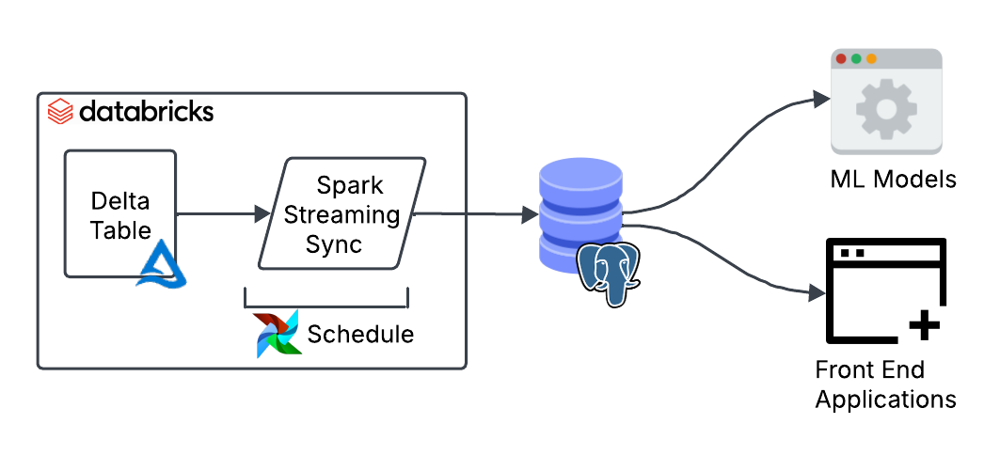
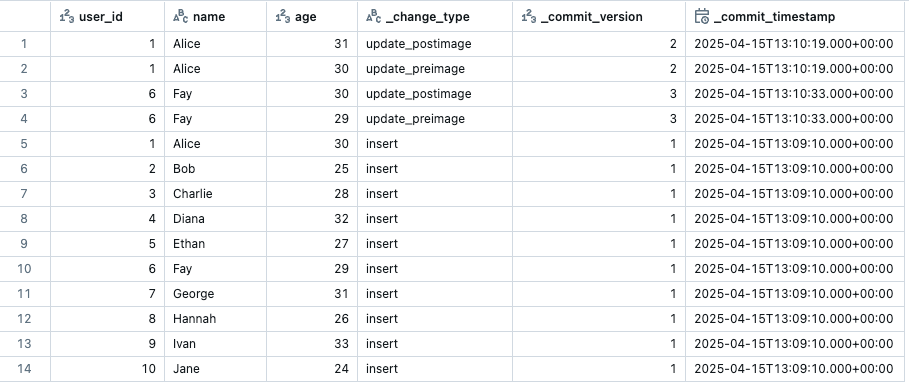
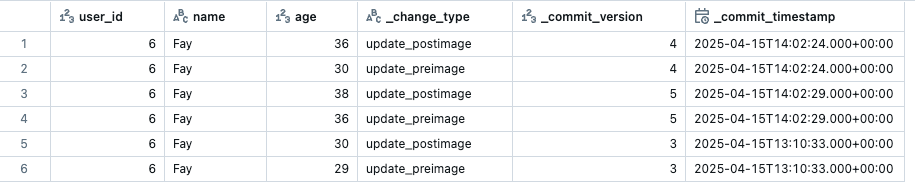

In this post, I share how to build a Reverse ETL pipeline to upsert data from Delta (Databricks) into Postgres to provide sub-second response times to our tables.

The goal is to make warehouse data available to downstream systems that require millisecond response times. These systems could be front-end applications that need to consume this data, or online machine learning models that require additional data as input to generate predictions in real time.

Data warehouses are optimised for analytics and they won’t perform well if you want low latency over a high volume of requests. On the other hand, Postgres leverages indexes to make reading data very fast.

This blog post shows a step by step implementation of a Reverse ETL pipeline using Delta’s structured streaming. I’ll begin by defining the requirements, then demonstrate how to implement them using Spark. Next, I’ll cover how to orchestrate the pipelines, and finally, I’ll show how to optimise the tables in Postgres for fast reads.

Let’s dive in!

## The Jargon

Let’s get the jargon out of the way first. Reverse ETL is an overcomplicated name that refers to moving data from the data warehouse to an external system. That’s it!

## What are our requirements?

Before we start implementing, there are some things we need to find out: how often does the data update? how fresh does the data need to be on the consumer end? What’s the data volume? Is the data append only or are there upserts and deletes?

The answer to these questions will shape the data pipeline design to satisfy the end-users’ needs.

For our use case let’s imagine we have the following requirements:

- The source Delta table is 50 million rows, approximately 8GB in size.
- The load type is primarily updates and some appends, no deletes.
- The source data is updated every 30 minutes.
- The end users want to have this data available within 5 minutes of the data being updated.
- Rows updated per refresh is around 40k rows.

## Design the pipeline



We can start shaping a good design to meet those requirements. The data is updated every 30 minutes, so a batch job will do. No need to burn money on a continuous streaming job.

Interestingly, in Delta you can create streaming jobs that run on a schedule by using the availableNow trigger. This trigger processes all available data up to that point. The cool thing about it is that you can easily convert it into a streaming job later on should your needs change by simply removing the trigger.

Only 40k rows out of 50 million are updated each time (0.08% of the data). This makes a full reload highly inefficient. A better approach is to move only the data that has changed since the last run. We can achieve this using Delta’s Change Data Feed (CDF) which tracks row-level changes between table versions.

Finally, we need to consider the types of updates. For our use case, the data is updated in place or appended, so we can use a MERGE query to combine both operations in a single query.

If you’ve not seen a MERGE query before, my ex-colleague Max cleverly defined it as “a switch statement for SQL”. Using a MERGE query is also a great way to ensure idempotency in the pipeline, ensuring there are no duplicates are introduced when you re-run your pipelines after a failed job.

## Implementation

Now to the juicy bit. To start using Change Data Feed (CDF) to track row-level changes we need to enable it in the source table.

```sql
ALTER TABLE
  public.mycatalog.mytable
SET TBLPROPERTIES
  (delta.enableChangeDataFeed = true)
```

Once enabled, we can view the CDF changes in the Delta table by running the following query. The number indicates the start version you want to start querying from.

```sql
SELECT * FROM table_changes('`public`.`mycatalog`.`mytable`', 1);
```

The CDF output will show your data with three additional metadata columns: the change type for that row, the version when the change happened and the timestamp. It will only show the rows that have changed from the specified starting version.



The next step is defining the function to upsert data into Postgres. We’ll create a function that takes in two parameters: a dataframe representing the micro-batch, and a batch id.

```python
def writeToPostgres(df, batch_id):

    with psycopg.connect(...) as conn:
        with conn.cursor() as cur: 
         
          query = """
          MERGE INTO public.mytable AS target
          USING (
            VALUES (%s, %s, %s) , (%s, %s, %s), ...
          ) AS source ("user_id", "name", "age")
          ON target.user_id = source.user_id
          WHEN MATCHED AND source._commit_timestamp >= target._commit_timestamp THEN
            UPDATE SET "name" = source."name", "age" = source."age"
          WHEN NOT MATCHED THEN
            INSERT ("user_id", "name", "updated_at")
            VALUES (source."user_id", source."name", source."age");
          """
          values = (...)  # dynamically generated from df
          cur.execute(query, values)

         conn.commit()
```

Within this function we define the MERGE query which checks if a record exists or not based on a primary key (user_id). If the record exists, it uses the `_commit_timespamp` column to ensure only newer records are inserted. The code shows a simplified version of the MERGE query for illustrative purposes. You can build the values and columns dynamically based on your dataframe.

Before we plug this function into a streaming pipeline we need to deal with the duplication problem that happens when running CDF workflows on a schedule.

As we saw earlier, CDF returns all updated rows since the last run. If the pipeline is paused or fails to run, multiple updates to the same row may accumulate. CDF will return all these rows with its corresponding version.



To solve the duplication issue, we can create a function that filters the data to keep only the rows with the latest version. This will be the row with the most up to date values. Here is a function that does this:

```python
def get_latest_cdf_record(df, primary_key_name):
  window_spec = Window.partitionBy(primary_key_name).orderBy(
    col("_commit_version").desc(), col("_commit_timestamp").desc()
  )
  df_dedup = (
    df.filter("_change_type != 'update_preimage'")
      .withColumn("row_num", row_number().over(window_spec))
      .filter(col("row_num") == 1)
      .drop("row_num")
  )
  return df_dedup
```

This logic ensures we only keep the latest change for each primary key based on `_commit_version` and `_commit_timestamp`. The function can be applied to each batch before we upsert the data.


```python
primary_key_name = 'user_id'

def writeToPostgres(df: DataFrame, batch_id):
  df = get_latest_cdf_record(df, primary_key_name)
  # MERGE query logic below
  ...
```

We now have all the ingredients to put this all together into a structured streaming job:

```python
(
    spark.readStream.format("delta")
    .option("readChangeFeed", "true")
    .table("public.mycatalog.mytable")
    .writeStream.foreachBatch(writeToPostgres)
    .option("checkpointLocation", "/mnt/checkpoints/mycheckpoint")
    .trigger(availableNow=True)
    .start()
)
```

This Spark streaming pipeline does the following:

- Reads from a Delta table as a stream.
- Enables readChangeFeed to capture only row-level changes (inserts, updates, deletes).
- Uses the availableNow trigger, meaning it only processes new data when executed, then stops once done. We use this trigger to simulate a batch job when using a stream.
- Writes each micro-batch using the writeToPostgres function.
- Tracks progress with a checkpoint, so it can pick up where it left off last time.

Before you can run this, ensure you’ve created the tables and schema where the data is going to land on the Postgres end.

With this setup, we now have a fully functioning pipeline ready for testing. Copying 50k rows to Postgres takes around 30 seconds. However, the initial load of 50 million rows will take around 20 hours with the current implementation. These numbers will of course vary depending on the compute used.

## Dealing with the first load

The bottleneck is the first load. We are using a MERGE query with a custom psycopg connection which isn’t optimised to be fast. To speed things up, we can use the JDBC connector to write in append mode, which will be significantly faster. We can write a separate job which will run for the initial load only.

```python
def writeToPostgresAppend(df, batch_id):
  url = "jdbc:postgresql://localhost:5432/mydatabase"
  properties = {"user": "user", "password": "password", "driver": "org.postgresql.Driver"}

  df.write.format('delta').jdbc(url=url, table="mytable", mode="append", properties=properties).save()
```

This approach takes 40 minutes to load all 50 million rows into Postgres, which is a significant improvement. This approach has its own challenges though, for example running it more than once will create duplicates in the destination table.

To keep the pipeline idempotent (no duplicates if we run it multiple times), we can load the data into a temporary table in Postgres. We then swap it with the production table inside a single transaction. Swapping avoids locking or partial state in case of failure, ensuring zero-downtime for consumers.

We can write this logic in the job itself or define it externally as separate steps to run before and after the job. Here’s what it looks like:

```python
def writeToPostgresAppend(df, batch_id):
    url = "jdbc:postgresql://localhost:5432/mydatabase"
    properties = {"user": "user", "password": "password", "driver": "org.postgresql.Driver"}
    df.write.jdbc(url=url, table="myschema.mytable_tmp", mode="append", properties=properties)
  
# Create tmp table
with psycopg.connect(...) as conn:
  with conn.transaction():
    cur = conn.cursor()
    cur.execute("DROP TABLE IF EXISTS myschema.mytable_tmp;")
    cur.execute("CREATE TABLE myschema.mytable_tmp (LIKE myschema.mytable INCLUDING ALL);")

# Run full load
stream = (
    spark.readStream.format("delta")
    .option("checkpointLocation", "/mnt/checkpoints/mycheckpoint")
    .table("public.mycatalog.mytable")
    .trigger(availableNow=True)
    .stream.writeStream.foreachBatch(writeToPostgresAppend)
    .start()
).awaitTermination()

# Swap tables
with psycopg.connect(...) as conn:
  with conn.transaction():
    cur = conn.cursor()
    cur.execute("ALTER TABLE myschema.mytable RENAME TO mytable_old;")
    cur.execute("ALTER TABLE myschema.mytable_tmp RENAME TO mytable;")
    cur.execute("DROP TABLE myschema.mytable_old;")
```

Now we can run this script to load all the data for the first time. If we run this multiple times it will safely swap tables without creating any downtime for our end-users consuming the data.

Note that we are not using Change Data Feed here because we want to move all the data across not the row-level changes. It is also important that you use a fresh checkpoint when you run this so that it loads all the data and not just the appends since the last execution.

## Putting it all together

The final step to put these pipeline into production is the orchestration part. In an ideal world we would start the job when the source table updates. But for simplicity’s sake we can run it on a 5 minute schedule: if there’s been an update it will process it, if not it will quickly shut down.

To smoothly coordinate the transition from the initial load (using append) to ongoing upserts, the simplest approach is to define two separate jobs:

- One for the initial load, which we’ll run manually once.
- One for the upserts, which we’ll scheduled to run regularly thereafter.

It’s important that both jobs share the same checkpoint location so the upsert job can resume from where the initial load left off.

As for orchestrating tools, we can use the scheduling functionality from Databricks or an external tool like Airflow.

## Serving the data

We now have the data landing in Postgres on a regular basis, so the last thing to do is to add indexes on the columns to improve reading speed. To know which indexes to create you need to look at your users’ query patterns.

Let’s say for example that most of the queries filter by either `user_id` or `age`. We could create the following indexes:


```sql
CREATE INDEX idx_user_id_btree ON mytable (user_id);
CREATE INDEX idx_age_btree ON mytable (age);
```

## Conclusion

We’ve built a Reverse ETL pipeline that upserts data from Delta into Postgres using Structured Streaming. It runs every 30 minutes, handles updates with Change Data Feed, and stays idempotent to avoid duplication.

By combining batch-style streaming with deduplication and merge logic, we’ve made warehouse data available in Postgres. This data can now be read by downstream systems with sub-second latency.

Thank you for making it this far! I hope you’ve found the post interesting. Feel free to reach out to me on Linkedin or Substack!

Thanks to Oleksandr for providing feedback on earlier versions of this post.

