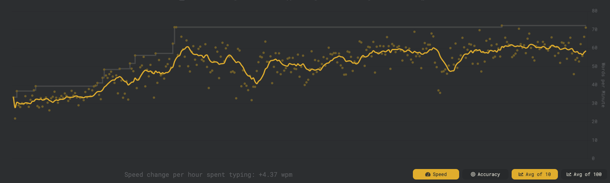
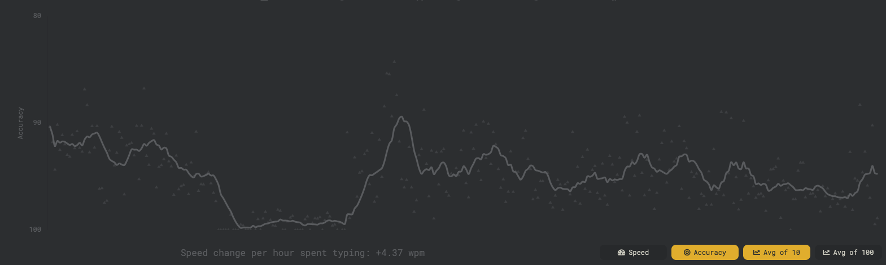

In this post, guest writer Billy interviews Pablo on learning Dvorak. Pablo started to learn Dvorak in January 2025. This is an interview about his experience.

---

**First of all, can you explain what Dvorak is?**

Dvorak is a keyboard layout created in the 1930s, proposed as a more efficient alternative to Qwerty. Dvorak groups letters on the keyboard based on how often they are used (in the English language), so the most used ones are located in the "home row" and less used ones are located in locations that require further finger reach.

**Why did you learn Dvorak? Were there any issues with Qwerty that prompted you to move away from it?**

There is absolutely nothing wrong with Qwerty. Some people learn Dvorak because it is supposed to enable you faster typing speeds. I just wanted to learn it because it sounded like fun, although I was also intrigued by the increased speed.

I remember the typing lessons in school quite fondly, and I wanted to re-create the experience.

I've also always enjoyed learning new languages, but because I never get to practice my German or Portuguese I forgot them almost completely. Learning Dvorak felt almost close enough to learning a new langague. I'd get to use it every day, so there would be no risk of forgetting it.

**Did you consider other keyboard layouts?**

I started learning Dvorak as a fun exercise after having heard about it from a couple different sources. At the time, I didn't really do much research into it, I just wanted to jump straight into learning it.

Only after a few months of learning I started to do a bit of research into the world of typing, and found out about other alternatives such as Colemak which sounds like an awesome layout as well. If I had known about it back then, perhaps I would have chosen it instead.

**How did you start learning it?**

I went online and searched for "Learn Dvorak", and a website called typing.com came up. It has a couple of courses on learning Dvorak which were a really good start. As my progression and typing speed got better, I moved towards monkeytype.com, which is very nice, because it has different modes and keeps track of your progression.

Learning where the keys are without looking (touch typing) takes a few days - at a very slow pace at the beginning, of course. After I started getting a bit more confident at knowing where the keys were, I started to use it in my day to day. 

**Do you need to buy a special keyboard to learn?**

Not at all. The best way to learn is to use your Qwerty keyboard and simply change the layout in your system settings. In mac, you can have both enabled and quickly switch  between the two.

A lot of people also mention using mechanical keyboards to type and learn "faster". In my opinion, mechanical keyboards don't make a difference at all, except make your desk look cooler. I would know because I spent £100 on one. Any keyboard will do.

**Once you get past that initial phase, how do you progress?**

The first few days the progression can be really fast, you can go from 0 to 30 WPM in a matter of days. After that, my progression started to slow down. As soon as I finished the course on typing.com I could type at around 30 WPM, at which point I switched to monkeytype.com where I would practice for 20 minutes each day, mostly focusing on getting over 95% accurary in all tests.

At this point I felt I could type fast enough to start using it in my daily job. Replying to Slack messages was painful, specially since the person on the other side can see you've been typing 10 minutes for a 2 line message. I started to get good at getting straight to the point!

As a fun fact, as soon as I started using Dvorak full time, I could no longer switch back to Qwerty without my brain mixing up with Dvorak. My brain's mental mapping of the Qwerty keybaord layout suddenly started to vanish. I had no choice but to make the full switch to Dvorak.

**Wait there! So you forgot how to type in Qwerty?!**

I did, and I still have. For a few days I kept switching back and forth: using Qwerty for any tasks that required some speed and Dvorak for everything else. At one point when trying to type Qwerty, I would mix up my keys with the Dvorak layout. My brain had all of a sudden forgotten how to Qwerty.

A lot of guides online say you can learn them side by side. But what they forget to mention is that you lose Qwerty in the process, and you have to make an effort to re-learn it after you learn Dvorak. I've read online that it takes a couple of months of practice to get Qwerty back. I wouldn't know, because I can't be bothered to go through this again.

**How do you get over the plateaus where you felt you weren't making any progress?**

At around week 7, I wrote this in my notes:

> *Learning this is a lot harder than I thought. I can write fast enough now (around 50wpm on avg?) but still my fingers feel very unsure of some keys and it is very frustrating. I make a lot of mistakes while typing which can be infuriating and frustrating at the same time. I’m doing my best to get better but the process is a lot slower than I was hoping. If I could go back I would probably not bother.*

My first mistake was having the wrong expectations. I had read online about someone who got 100wpm within 4 weeks. I could only type at around 45wpm after one month.

The plateaus are different at different stages. My first big plateau was around the 45-55wpm region. My problem there was that I tried to type too fast while making a lot of mistakes. This started to create bad habits by reinforcing repeated mistakes. What worked for me was finding out which keys I was struggling the most with and practising those more. Particularly those letters used less often such as `qjk` or combinations such as `ch` or `qu`.

Slowing down and focusing on accuracy started to pay off. Typing more consistently and having to correct fewer mistakes was giving me faster typing speeds.

The second big plateau is when I reached the 60-70 WPM mark, which is where I'm still now. At this point I'm not getting any faster by simply typing on my day to day. To get faster I would need to keep practicing daily with specfic drills to improve accuracy and speed. But it is not something I'm interested on at the moment. I'm happy with my current speed.

**How did learning affect your productivity?**

I decided to start learning during a period of time where work wasn't too busy. At the beginning it did not affect me much because I kept switching between Qwerty and Dvorak depending on the urgency of the work. At the point where I had to do the full switch to Dvorak it would take me slightly longer to complete some tasks such as replying to messages or writing docs. But remember that unless your job is to do live transcription as a job, writing faster or slower doesn't really affect you much. In my case, I don't think anyone noticed any productivity change.

For me, as a programmer, I don't really need to type that much unless I'm writing a confluence doc or replying to slack. Programming usually involves a combination of thinking and typing. I've never had the need to type my code faster than 30WPM.

**You started learning Dvorak over 7 months ago, how is it going now?**

I can type at about 70WPM which is 15WPM slower than I could type when I used Qwerty. I've made my peace with it. 70WPM is fast enough for me.

**Have you noticed any physical benefits or drawbacks?**

My life feels the same as it did when I typed Qwerty. Except for the bragging rights of being a nerd.

**Any tips for anyone who wants to learn?**

The first thing I would recommend when learning Dvorak is to have your expectations set very low. Your progress will depend on how much effort you put into learning. In some cases, over practising won't make you learn faster. What works best is to do consistent practice every day.

Also, to get faster, you need to keep practising. Using it full time in your every day work will only get you so far, but if you want to type really fast (100WPM +) you need to keep the practice going. I stopped practising after week 8, and after 7 months I've plateaued at 65-70WPM. This speed is good enough for me.

If I can give one tip, is that slow is fast: focusing on accuracy and making few mistakes will get you faster speeds than fast typing where you have to keep correcting mistakes. It will also stop you from learning bad habits.

**You are a VIM user. How was re-learning VIM mappings in Dvorak?**

I started learning Dvorak only after a couple of months of learning vim, so my vim knowledge was not so extensive that it would bother me too much to re-learn it. The nice thing about vim is that the key mappings have actual meanings (`diw` -> delete in word; `vt;` -> view to next colon ';'), so it is quite easy to keep using them with the new layout.

One of the more annoying things is losing the navigation keys `hjkl`. But even then, the way it works out it is not too bad, with Dvorak you get the horizontal movement on the right hand (index and pinky fingers) and vertical movement in your left hand (both on the index finger). 

Another slightly annoying thing is that a lot of the symbols useful for programming land on the pinky finger of the right hand, which makes them a bit harder to hit cleanly. 

**So, is it worth it?**

From a productivity point of view? No, not really.

It takes a few weeks/months of practice to get to a reasonable speed, and it doesn't really bring any benefits, at least for the casual typer person like me. Of course, there is always the nice feeling of having learned something new. 

But if you are looking to challenge yourself and learn something new, then absolutely go for it. Usually the most useless projects are the most fun to learn.

Have fun and keep learning.

---

### Progression Charts

Progression charts from monkeytype.com. Pablo started using it after week 3 of learning.

Fun fact, if you pay close attention at the accuracy chart (bottom chart), there was a week where he was practicing for 99% accuracy. Not surprising that the speed (top chart) suddenly increased during that time.

---
### 📅 Extra: Dvorak Learning Diary

Raw notes from Pablo's learning diary.

**Week 1**

- My Qwerty speed is around 85 WPM before switching.
- I start using a Qwerty keyboard with Dvorak mappings, which means I’m learning to type without looking from the very beginning.
- Practicing 15-30 minutes daily.
- Doing the Dvorak course on typing.com, repeating most lessons until I get 95%+ accuracy.
- Touch typing is easy! within one day, I learn the home row (aoeui dhtn). Within three days, I learn the full layout.
- Starting speed: 10 WPM.
- Trying to switch to Dvorak full-time after 3-4 days once I memorise the keys.
- Slack messages are painful.
- Still have to use Qwerty for coding and Vim.
- For shell and code, I have to switch back to Qwerty.
- My brain sometimes forgets Qwerty when switching back, so I have to look at the keyboard.

**Week 2**

- Re-learning Vim is a hassle. Good thing I had only just started learning it a few weeks before switching to Dvorak.
- Started using Dvorak in Vim after two weeks. The process is painful at first. Luckily, I’m not an expert, so I don’t have to relearn a bunch of movements. Vim’s keybindings are well-designed, making the transition a bit easier.
- Typing speed after 14 days: 29 WPM.
- By week 1.5, I start having glimpses of typing without thinking - but only for easy words such as “these” and “where”.
- Some words are easier than others, while others are frustratingly difficult.
- Struggling with J, Q, I, U, and K-I have to think extra hard to get them right.
- As soon as I switch “more” fully to Dvorak, switching back to Qwerty stops working. It’s like my brain has completely forgotten Qwerty.
- Now I’m forced to type in Dvorak at 30 WPM - no way back. Slack messaging is slow and painful. People on the other side must think I type using only my index finger.

**Week 3**

- At the start of week 3, Vim starts to feel better. Still slow, but no longer painful.
- Some words now flow without thinking! Feels amazing.
- Started using Monkeytype to practise with punctuation and numbers.
- I never properly learned the numbers on Qwerty, so I need to get good at them now.
- I wish the number row had tactile marks like F and J.
- Slow is fast. When I focus on accuracy, I type at the same speed as when I try to type fast but make mistakes.
- Fixing mistakes slows me down more than just typing carefully.
- Breaking the 30 WPM barrier feels great.
- Now averaging 35 WPM, but I feel like I’m stuck here forever.
- Goal: Get faster than my Qwerty speed (85 WPM) - but right now, it feels impossible.
- Feel like I’m going to be stuck in the 30’s forever!
- Today I have taken the 3 minute typing test 3 times and got 43,40 and 44 WPM. Seems like I’m slowly getting there! I think the fewer mistakes I make the faster my speed.
- At this rate it will take me a few months to get to the 100 WPM mark :sigh:

**Week 4**
- What have I done. I will never get fast at this. I was hoping to be 100wpm within one month
- I still have trouble with the ‘d,i,f,k,q,y’ keys mostly
- I’m going to try to practice 100% accuracy even if I’m slow see if that improves my typing 
- First try today and got 44 wpm speed! Nice. Feeling pumped. 48 on the second with 95% accuracy!
- By the way I only count it if I get over 95% accuracy and test that are long (at least 100 words)
- Very frustrated. My speed seems to go up slowly but I still make a lot of mistakes which I think is slowing me down but also creating bad habbits. I need to slow dow and get 100% accuracy before I try going back to typing fast.
- I’ve changed the settings so I fail any test if my accuracy goes below 98%. It’s quite hard. I can only afford one mistake. I am going to focus on accuracy and let the speed come later
- I need to be careful, because bad habits form when I’m not practicing. So need to be extra mindful to retain accuracy when I’m typing emails or slack
- I can get up to 55 wpm on shorter typing tests
- The weirdest thing is getting used to the punctuation being in the places where Qwerty used to have letters.
- After doing the speed test I’m sitting at around 48wpm. Not a lot of improvement since last week! I think I will go back to do some muscle memory exercises.

**Week 5**

- Went back to the basics. Started practicing the home row a lot to get good muscle memory. Trying to get good muscle memory to stop making repeated mistakes when typing faster https://learn.Dvorak.nl/?lang=en&lesson=2
- I can get up to 70wpm on short sentences (i.e 10 words). It gets harder when you try 50+ words with at least 98% accuracy.
- I feel like I’m making snow progress. Speed does not get a lot faster, but I feel like I can type longer tests without making many mistakes. I can type about 53 to 60wpm for 50 words with over 98% accuracy (thats about a maximum of 2 mistakes)
- I can do about 53 WPM on the typing test with 96% accuracy. 49% at the 3 minute test
- I should have never started learining Dvorak. I was expecting to be a lot faster sooner so I think my expectations were to high. AAAAGGGHHHRR
- I’ve started using https://www.keybr.com/ which is a website that tracks your mistakes and gets you to practice on words that you find hard. Hopefully it pays off because I feel like I’ve plateaued at 49-60wpm
- started feeling pain in my left wrist for the first time today. It started when I was heavily practicing typing ‘qu’ words
- The goal of achieving 100wpm seems impossible now
- Practicing the j and the q real hard. I really suck at those! Also I am really slow at ck which is a very recurring set of words
- I’m starting to feel a bit more agile with VIM again.
- Typing speed test was 57 with 98% accuracy (a tricky test with hard words!). The tests were quite tricky, I took about 5 different ones and got 57 on all of them except the last one where I got 64% with 97% accuracy

**Week 6**

- Smashing 60 to 72 wpm on keybr practice.
- Sick and off typing for the rest of the week

**Week 7**  
- Learning this is a lot harder than I thought. I can write fast enough now (around 50wpm on avg?) but still my fingers feel very unsure of some keys and it is very frustrating. I make a lot of mistakes while typing which can be infuriating and frustrating at the same time. I’m doing my best to get better but the process is a lot slower than I was hoping. If I could go back I would probably not bother.
- I read plenty of stories online of people getting up to 100wpm within a month which gave me so much false hope. I don’t know if thats all bullshit and people are trying to make themselves look good, or perhaps I’m just not good at this. Maybe they practice more than me.

**Week 8**
- It’s been a few weeks where I’ve been busy and I’ve not been able to practice as much
- keybr.com is not that useful. I feel like all the words are very short and you don’t get to practice as many words
- I’m back to monkeytype, I’m practicing the top 5k english words because that seems to be the test that I find the most difficult to get top accuracy out of all the things I’ve tried so far. I’m still averaging around 55wpm which is not much, but feeling hopeful today.
- I was hitting 65wpm in the afternoon with the same tests. Do I write faster in the evenings when I’ve warmed up?
- Typing at the 61 mark

**Week 11**
- Typed at 69WPM on monkeytype today with 96% accuracy
- I found that when you look at the word that you need to type and you quickly process it in your brain and acknowledge what word it is, and then you start looking at the next word while you finish typing this one, it helps you write faster and more confident. What happens is that you acknowledge the word and you are also acknowledging that you know how to type it then your brain does the rest of the work. If you instead look at the word letter by letter and you have not acknowledged it your brain, you don’t know what letter is coming next, so you need to think about each individual word which slows you down. This is why you struggle more with rare words that you don’t know the spelling of straight away. 

**Week … who knows**

- It’s been a few weeks since I’ve added anything to this diary. I feel like I’ve plateaued. I’m not really practicing as much these days beyond what I have to write for work or during my writing for blog posts.
- I’m writing at 55-65 wpm on average. Although I occasionally hit the 70+ mark, but very rarely.
- Suprisingly, I tend to do better when I’m typing and my brain is thinking about something else. I’m pretty sure that I type faster than my score in monkeytype, but we’ll never know. The more I focus the more mistakes I make. 

**Week ...**
- Its been at least 4 weeks since my last entry. I have stopped trying to improve my speed, it is good enough by this point (60s or so). The only thing I want now is to re-learn Qwerty, but I cannot be bothered!

---

## Resources

Some helpful resources that supported me throughout the Dvorak learning process:

- [dvzine.org – What is Dvorak?](https://www.dvzine.org/zine/index.html)  
  A fun and well-designed zine that explains the motivation behind Dvorak and its advantages.

- [typing.com](https://www.typing.com)  
  Great for beginners. Includes structured Dvorak courses with progression tracking.

- [monkeytype.com](https://monkeytype.com)  
  Sleek interface with many custom modes. Best for real-world word practice and measuring speed/accuracy.

- [keybr.com](https://www.keybr.com)  
  Focuses on weak spots by generating words based on your error patterns. Great for targeted improvement. Although I didn't really see that many benefits from it

- [learn.Dvorak.nl](https://learn.Dvorak.nl/?lang=en&lesson=2)  
  A simple tool for building muscle memory by repeating Dvorak sequences.

Curious about learning Dvorak? Reach out to me on linkedin!

