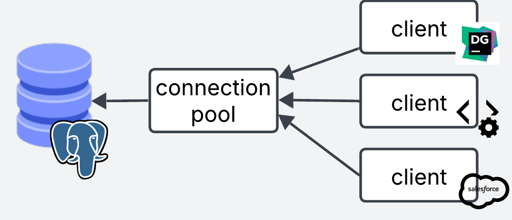
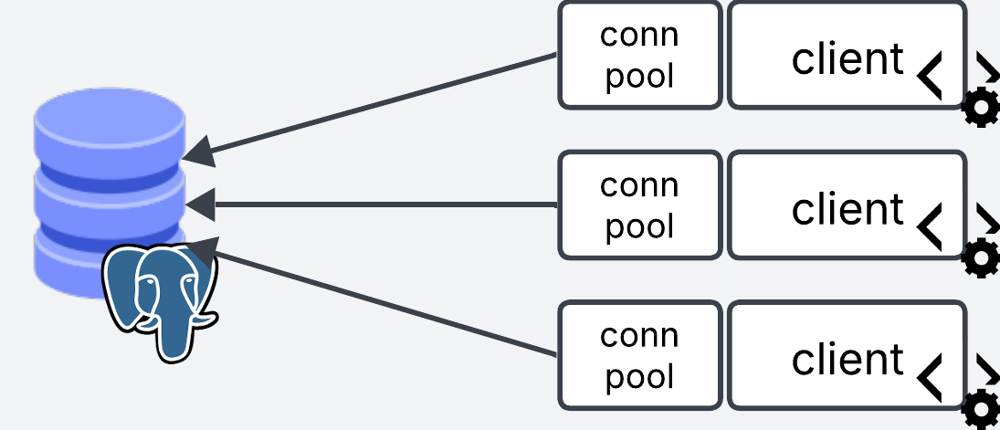

I recently had to run load testing for an API that fetches data from Postgres. I was monitoring Postgres when running the first test, and I noticed that hundreds of connections were being opened. I was also seeing runtime errors in Postgres such as "no more connections allowed" or "out of shared memory".

Clearly the database was not prepared for the load.

So I started to look for ways to improve connection management to the database, and I came across pgBouncer, a connection pooling service for Postgres.

Although pgBouncer would not directly solve my problem with the increased load, it would reduce database load by efficiently re-using database connections. As soon as I implemented it, all my errors went away.

In this blog post I explain the concept of connection pooling and go into the specifics of pgBouncer. At the end I show a couple of examples of how to deploy this service.

## What is connection Pooling?
Open a connection. Run the queries. Close the connection. Repeat.

This is the process a client goes through to run a queries in a database.

Rather than opening and closing a connection every time a new client connects, connection pooling helps by keeping a number of connections always open (a pool of connections) and re-assigning them across clients.

Imagine you have a lot of short lived queries hitting your database from different thousands of clients.

Instead of opening and closing hundreds or thousands of connections per second, you can keep a smaller *pool* of connections open and re-use them across clients. 

You may also have the case where you have clients that keep long lived connections to the database and never disconnect because they need to constantly run transactions.

From this point of view, clients rarely need to open and close connections. So where does pooling help?

It is very unlikely that clients need to be running transactions 100% of the time. Think of a website (the client) that fetches data from a database. When it hits the database to get some data, it spends some time processing the data, rendering it back to the user etc. In those "idle" times, connection pooling can efficiently re-assign the connection to a different client, and give this client a new connection when it actually needs it again.

By re-assigning the same connections you can efficiently keep a smaller number of connections open to serve a much larger number of clients.


## The Pooling Simulator
<iframe width="100%" height="1500" name="iframe" src="/posts/014_using_pg_bouncer/pgbouncer_demo.html"></iframe>


## What is pgbouncer?

Pgbouncer is a lightweight connection pooling service for Postgres. It comes with the following pooling modes: session, transaction or statement.

### Session Pooling

When a user connects, pgBouncer finds a connection from the pool and assigns it to the user. The connection is released back to pool **after the client disconnects**. This is the default mode.

### Transaction Pooling
Transaction pooling is a bit more aggressive and efficient in re-using the connections.

In this mode, connections are released once the **transactions are finished**, which after `commit` or `rollback`.

```SQL
-- Get new connection from pool
BEGIN;
DROP TABLE IF EXISTS backup_table_name;
ALTER TABLE old_table_name RENAME TO backup_table_name;
ALTER TABLE new_table_name RENAME TO old_table_name;
COMMIT;
-- Release connection
```

### Statement Pooling

Statement pooling tries to be even more aggressive than transaction pooling: the connection is released back to pool **after each query finishes**.

In statement mode, transactions like the previous example are not allowed. Each query is executed separately.

For this mode to work you need to have autocommit enabled. 

```SQL
-- Get new connection from pool
DROP TABLE IF EXISTS backup_table_name;
-- Release connection

-- Get new connection from pool
ALTER TABLE old_table_name RENAME TO backup_table_name;
-- Release connection

-- Get new connection from pool
ALTER TABLE new_table_name RENAME TO old_table_name;
-- Release connection
```


## Does PGBouncer really work?

PGBouncer may sound great on paper, but does it really take that much time to establish a connection? Is it worth it?

I run an example locally to find out if there really are performance gains. The setup is as follows:
- Postgres database running locally (Docker) with max number of Postgres connections set to 10
- PGBouncer running locally (Docker) in *transaction* mode with a default pool size of 3

I use a simple SELECT query which I benchmark and it runs within ~2.8ms.

I use a python script to run this query 80,000 times with a maximum of 3 concurrent queries.

I test both setups: with and without PGBouncer. When hitting Postgres directly clients open and close a connection on each request.

I limit the connections to 10 and pool size of 3 for simplicity. In production you'd be dealing with hundreds or thousands of concurrent connections.

Results

```bash
Average Execution Time:
  PostgreSQL: 0.0181 seconds
  PGBouncer:  0.0148 seconds
  PGBouncer was 18.2% faster
```

PGBouncer is 3.3ms faster on average than hitting Postgres directly, which is quite good considering the query takes 2.8ms to execute.

Of course, this is only a small scale experiment, so take it with a grain of salt. Test on your production systems and decide for yourself.

### Connection Queues 

A nice bonus of pgBouncer is that it will handle spikes of requests where `number of concurrent requests > number of connections available` by queuing the requests until connections are available.

If the queries were going directly to Postgres without pgBouncer in between, those additional requests would be refused.

This can come in handy if your database is not prepared to handle a large number of concurrent requests, so you limit your max connections to a reasonable number you know it can handle, and handle the excess requests gracefully by adding them to the queue.

Having said that, it is better that you design your systems to handle spikes, rather than relying on pgBouncer alone.


## Client vs Database side Pooling

You can implement connection pooling at the client level or at the database level. Where you decide to implement it makes a difference, each approach with its advantages and tradeoffs.

### Database side Pooling



With database side pooling, the pooling service sits right in front of the database. All connections from different clients are centrally managed in one place.

Database side pooling is best when you have incoming connections from multiple clients that you have no control of, e.g webservers, APIs, desktop clients, third party applications, analytics, etc, so you can centrally control connection pooling on the database side.

The main downside is that clients still need to establish a connection to pgBouncer, which adds some latency. Although this should be faster than establishing a connection to Postgres directly.

### Client Side Pooling




Client side pooling is when you manage the pool on the client side. Each client manages their own pooling service.

For this approach you can either place pgBouncer in front of each of your services, or you can use the pooling implementations from client side libraries (e.g. psycopg for python).

Take the following pseudocode for an API service. We start a pool of connections when the service starts. Every time a request comes through, it grabs a connection from the pool. When the request is done it releases it back to the pool.

```python
# Start the pool globally when the application starts
pool = pooling.new(database_connection="user=billy password=1234 host=myhost dbname=mydata")

# When a request to the server comes through, grab a connection from the global pool
app("/user", method=GET)
    conn = pool.get_connection()
    conn.execute("SELECT * FROM users")
    conn.release()

app("/users", method=GET)
    conn = pool.get_connection()
    conn.execute("SELECT * FROM users")
    conn.release()
# ...
```

This approach is best when you have a lot of short lived requests coming from your service. You establish the connections once at the beginning in the pool, and re-use them across the lifetime of the service.

Client side pooling can shave that extra time that it takes to establish the connection to pgbouncer, because it keeps long lived connections open.

The limitations with this approach, is that it is very unlikely that you will always have control of the clients that access your database. In real life, clients connecting to the database may come from different sources.

These clients may or may not have efficient connection management implemented (e.g. Data scientists connecting via notebooks and forgetting to close the connection).

The other limitation with this approach is that the pooling is managed at the service end, which means that the pool size is calculated via *pool size* x *number of services*. If you have very dynamic horizontal autoscaling, it can make the number of connections to the database unpredictable and hard to control. 

### Client and Database side pooling together

There is a third option where you use pgBouncer in front of your database as database side pooling, and you also implement pooling to pgBouncer on the client side to benefit from long lived connections. This may require a little bit of tuning to get right, but you get the best of both worlds.

## Setting up pgbouncer locally

To setup pgbouncer locally you need to have Postgres database running, either locally (Docker) or with your favorite cloud provider.

### Install using brew

```bash
brew install pgbouncer
```

### Setup Config files
Create the `pgbouncer.ini` file. This file tells pgbouncer how to connect to the Postgres database. Here is also where you define your settings.

```toml
[databases]
mydb = host=my-database-host port=5432 dbname=postgres user=postgresuser password=postgrespassword

[pgbouncer]
listen_addr = localhost
listen_port = 6432
auth_type = md5
auth_file = userlist.txt
logfile = pgbouncer.log
pidfile = pgbouncer.pid
admin_users = billy

```

### Credentials
Next thing is to create the `userlist.txt` auth file. This file contains the list of users allowed in.

Create a new user/password. Note that this user is pgbouncer specific and has nothing to do with the postgres database user.

For example add this username and password to `userlist.txt`.

```yaml
"billy" "12345"
```

Pgbouncer expects the password as an md5 hash. To do this, we need to provide the username password in this format `md5<passwordusername>`, which in our case looks like this `md5<12345billy>`.

We can use the following bash command to get the hash (if you get a `%` sign at the end of the hash, ignore it)

```bash
echo -n "md5$(echo -n "12345billy" | md5sum | cut -d' ' -f1)" 
# output: md54d45974e13472b5a0be3533de4666414
```

Then we take the output and update our `userlist.txt`

```yaml
"billy" "md54d45974e13472b5a0be3533de4666414"
```

### Launch!
Now we can launch pgbouncer locally

```bash
pgbouncer pgbouncer.ini
```

And we can use psql to test the connection. When prompted for the password, use `12345` or whatever you specified in `userlist.txt`

```bash
psql -p 6432 -U billy mydb
```

And bam! You are in!


If you get below error ensure you have created the md5 hash properly. If you get a specific error for your Postgres user (defined in the `[database]` section of `pgbouncer.ini`), ensure that the Postgres connection is correct. 
```
2025-06-12 11:56:44.176 UTC [1] WARNING C-0x7fe106331280: mydb/billy@127.0.0.1:50004 pooler error: password authentication failed
```

## Setting up pgbouncer in Kubernetes

Now that we have set this up locally, here it is what it wold look like if you wanted to set it up in kubernetes. For this we will spin up a Deployment, Secret, Configmap and a Service.

```shell
k8s/
├── pg_bouncer.deploy.yaml
├── pg_bouncer.cm.yaml
├── pg_bouncer.secret.yaml
└── pg_bouncer.service.yaml
```

Note that you need to have an existing Kubernetes cluster and a Postgres database to follow along!


### Deployment

The deployment will run pgbouncer in a single replica. It reads the secrets from a Secret and the config from a Configmap.
```yaml
apiVersion: apps/v1
kind: Deployment
metadata:
  name: pgbouncer
spec:
  replicas: 1
  selector:
    matchLabels:
      app: pgbouncer
  template:
    metadata:
      labels:
        app: pgbouncer
    spec:
      initContainers:
        - name: init-config
          image: busybox:1.35
          command: ["sh", "-c"]
          args:
            - |
              cp /config/pgbouncer.ini /etc/pgbouncer/
              cp /userlist/userlist.txt /etc/pgbouncer/
              chmod 644 /etc/pgbouncer/pgbouncer.ini
              chmod 600 /etc/pgbouncer/userlist.txt
              chown -R 70:70 /etc/pgbouncer/
          volumeMounts:
            - name: config-volume
              mountPath: /config
            - name: userlist-volume
              mountPath: /userlist
            - name: pgbouncer-data
              mountPath: /etc/pgbouncer
      containers:
        - name: pgbouncer
          image: edoburu/pgbouncer:1.18.0
          ports:
            - containerPort: 6432
              name: pgbouncer
          volumeMounts:
            - name: pgbouncer-data
              mountPath: /etc/pgbouncer
          resources:
            requests:
              cpu: 100m
              memory: 128Mi
            limits:
              cpu: 500m
              memory: 256Mi
          livenessProbe:
            tcpSocket:
              port: 6432
            initialDelaySeconds: 30
            periodSeconds: 10
          readinessProbe:
            tcpSocket:
              port: 6432
            initialDelaySeconds: 5
            periodSeconds: 10
      volumes:
        - name: config-volume
          configMap:
            name: pgbouncer-config
        - name: userlist-volume
          secret:
            secretName: pgbouncer-userlist
        - name: pgbouncer-data
          emptyDir: {}
```

### Configmap

The configmap will contain the `pgbouncer.ini` config.

```yaml
# Configmap
apiVersion: v1
kind: ConfigMap
metadata:
  name: pgbouncer-config
data:
  pgbouncer.ini: |
    [databases]
    mydb = host=my-database-host port=5432 dbname=postgres user=postgresuser password=mypassword # Don't use this in prod. Use vault or ENV vars instead

    [pgbouncer]
    listen_addr = 0.0.0.0
    listen_port = 6432
    auth_type = md5
    auth_file = /etc/pgbouncer/userlist.txt
    admin_users = myuser
    pool_mode = transaction
    max_client_conn = 1000
    default_pool_size = 100
```

### Secret
The secret will contain the values from `userlist.txt`. Kubernetes expects the secrets to be encoded in base64. All we need to do is take the contents of `userlist.txt` and encode them such as `cat userlist.txt | base64`. Use the output as the value for secret.

```yaml
# secret
apiVersion: v1
kind: Secret
metadata:
  name: pgbouncer-userlist
  namespace: trino-facade
type: Opaque
data:
  userlist.txt: InVzZXIiICJtZDU0ZDQ1OTc0ZTEzNDcyYjVhMGJlMzUzM2RlNDY2NjQxNCI=
```

### Service

Finally we create the service which will be used as the entrypoint for pgbouncer.

```yaml
apiVersion: v1
kind: Service
metadata:
  name: pgbouncer
spec:
  selector:
    app: pgbouncer
  ports:
    - protocol: TCP
      port: 6432
      targetPort: 6432
  type: ClusterIP

```

### Deploy!

You can deploy all the files in one go using

```bash
kubectl deploy -f *.yaml
```

Connect your applications or clients to pgbouncer instead of Postgres and you are good to go!

## Final words

This blog post started as a simple guide step by step guide to setup pgBouncer. However, each time I thought I understood the nuances of connection pooling, something new popped up that didn't make complete sense.

This blog post is the product of me trying to break down all the nuances in a clear way. I hope you've enjoyed reading it as much I've enjoyed learning and writing about the topic.

Resources:
- https://www.depesz.com/2012/12/02/what-is-the-point-of-bouncing/
- https://www.pgbouncer.org/config.html
