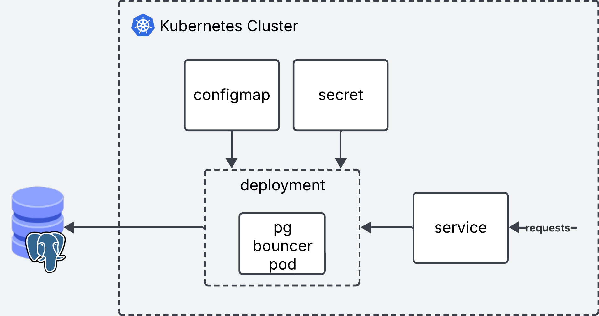

## What is connection Pooling?
When a user wants to run a query in the database, first, they open a connection. Then, they run the query(es). When they are done they close the connection.

This process has to happen every time a user wants to run a query or transaction in the database.

Imagine you have a use case where you have a lot of short lived queries hitting your database from different thousands of clients. Instead of opening and closing hundreds or thousands of connections per second, you can keep a *pool* of connections open and re-use them across clients. By re-assigning the same connections you can efficiently keep a small number of connections to serve a much larger number of clients.

You can also have the case where you have clients that keep long lived connections to the database because they need to constantly run transactions.

From this point of view, clients rarely need to open and close connections. So where does pooling help?

It is very unlikely that clients need to be running transactions 100% of the time. Think of a webserver client. When it hits the database to get some data, it spends some time processing the data, rendering it back to the user etc. In those "idle" times, connectionn pooling can efficiently re-assign the connection to a different client, and give this client a new connection when it actually needs it again.

Even if some clients do use the connection a 100% of the time, why not let a connection pooling service efficiently re-use those other connections that are not being used 100% of the time?

Connection pooling lets you re-use connections to your database. Whether you have a few users making a lot of consecutive requests or many different users making fewer sporadic requests, connection pooling helps by keeping connections alive and re-using them acrcoss requests.


## The Pooling Simulator
Step 1: Click.
Step 2: Click some more.
Step 3: Learn!

<iframe width="100%" height="1500" name="iframe" src="/posts/014_using_pg_bouncer/pgbouncer_demo.html"></iframe>


## What is pgbouncer

PG bouncer is a lightweight connection pooling service that sits in between your Postgres database and your clients.

You can use PG Pooling in the following modes

### Session Pooling

### Transaction Pooling

### Statement Pooling

## Does PGBouncer really save you that much time?

Okay, this may sound great on paper, but does it really take that much time to establish a connection? Is pgbouncer worth it?

I run an example locally to compare both setups, and see if there's any improvement at all. The setup is as follows:
- Postgres database running locally (Docker) with max number of Postgres connections set to 10
- PGBouncer running locally (Docker) with a default pool size of 3

I use a simple SELECT query which I benchmark and it runs within ~2.8ms.

I use a python script to run this query 80,000 times with a maximum of 3 queries executing concurrently and I test both setups: with and without PGBouncer. When hitting postgres directly clients open and close a connection on each request.

I use 10 postgres connections and a pool size of 3 for simplicity. In production you'd be dealing with hundreds or thousands of concurrent connections.

Results

```bash
Average Execution Time:
  PostgreSQL: 0.0181 seconds
  PGBouncer:  0.0148 seconds
  PGBouncer was 18.2% faster
```

PGBouncer is 3.3ms faster than hitting postgres directly, which is quite good considering the query takes 2.8ms to execute.

Of course, is only a small scale experiment, so take it with a grain of salt. Test on your production systems and decide for yourself.

A nice bonus of PGBouncer is that it will handle spikes of requests where `number of concurrent requests > number of connections available` by queing the requests until connections are available.

If the queries are going directly to postgres without PGBouncer in between, those additional requests would be refused.

This can come in handy if your database is not prepared to handle a large number of concurrent requests, so you limit your max connections to a reasonable number you know it can handle, and handle the excess requests gracefully by adding them to the queue.


## Setting up locally

To setup pgbouncer locally you need to have Postgres database running, either locally (Docker) or with your favorite cloud provider.

### Install using brew

```bash
brew install pgbouncer
```

### Setup Config files
Create the `pgbouncer.ini` file. This file tells pgbouncer how to connect to the Postgres database. Here is also where you define your settings.

```toml
[databases]
mydb = host=my-database-host port=5432 dbname=postgres user=postgresuser password=mypassword

[pgbouncer]
listen_addr = localhost
listen_port = 6432
auth_type = md5
auth_file = userlist.txt
admin_users = myuser
logfile = pgbouncer.log
pidfile = pgbouncer.pid
admin_users = billy

```

### Credentials
Next thing is to create the `userlist.txt` auth file. This file contains the list of users allowed in.

Create a new user/password. Note that this user is pgbouncer specific and has nothing to do with the postgres user.

For example add this username and password to `userlist.txt`.

```yaml
"billy" "12345"
```

Pgbouncer expects the password as an md5 hash. To do this, we need to provide the username password in this format `md5<passwordusername>`, which in our case looks like this `md5<12345billy>`.

We can use the following bash command to get the hash (if you get a `%` sign at the end of the hash, ignore it)

```bash
echo -n "md5$(echo -n "12345billy" | md5sum | cut -d' ' -f1)" 
# output: md54d45974e13472b5a0be3533de4666414
```

Then we take the output and update our `userlist.txt`

```yaml
"billy" "md54d45974e13472b5a0be3533de4666414"
```

### Launch!
Now we can launch pgbouncer locally

```bash
pgbouncer pgbouncer.ini
```

And we can use psql to test the connection. For the password use `12345` as specified in `userlist.txt`

```bash
psql -p 6432 -U billy mydb
```

And bam! You are in!


If you get this error esure you have created the md5 hash properly. If you get a specific error for your postgres user (defined in the `[database]` section of `pgbouncer.ini`), ensure that the postgres connection is correct. 
```
2025-06-12 11:56:44.176 UTC [1] WARNING C-0x7fe106331280: mydb/billy@127.0.0.1:50004 pooler error: password authentication failed
```

## Setting it up in Kubernetes

Now that we have set this up locally, here it is what it wold look like if you wanted to set it up in kubernetes. For this we will spin up a Deployment, Secret, Configmap and a Service.

```shell
k8s/
├── pg_bouncer.deploy.yaml
├── pg_bouncer.cm.yaml
├── pg_bouncer.secret.yaml
└── pg_bouncer.service.yaml
```

Note that you need to have an existing Kubernetes cluster and a Postgres database to follow along!



### Deployment

The deployment will run pgbouncer in a single replica. It reads the secrets from a Secret and the config from a Configmap.
```yaml
apiVersion: apps/v1
kind: Deployment
metadata:
  name: pgbouncer
spec:
  replicas: 1
  selector:
    matchLabels:
      app: pgbouncer
  template:
    metadata:
      labels:
        app: pgbouncer
    spec:
      initContainers:
        - name: init-config
          image: busybox:1.35
          command: ["sh", "-c"]
          args:
            - |
              cp /config/pgbouncer.ini /etc/pgbouncer/
              cp /userlist/userlist.txt /etc/pgbouncer/
              chmod 644 /etc/pgbouncer/pgbouncer.ini
              chmod 600 /etc/pgbouncer/userlist.txt
              chown -R 70:70 /etc/pgbouncer/
          volumeMounts:
            - name: config-volume
              mountPath: /config
            - name: userlist-volume
              mountPath: /userlist
            - name: pgbouncer-data
              mountPath: /etc/pgbouncer
      containers:
        - name: pgbouncer
          image: edoburu/pgbouncer:1.18.0
          ports:
            - containerPort: 6432
              name: pgbouncer
          volumeMounts:
            - name: pgbouncer-data
              mountPath: /etc/pgbouncer
          resources:
            requests:
              cpu: 100m
              memory: 128Mi
            limits:
              cpu: 500m
              memory: 256Mi
          livenessProbe:
            tcpSocket:
              port: 6432
            initialDelaySeconds: 30
            periodSeconds: 10
          readinessProbe:
            tcpSocket:
              port: 6432
            initialDelaySeconds: 5
            periodSeconds: 10
      volumes:
        - name: config-volume
          configMap:
            name: pgbouncer-config
        - name: userlist-volume
          secret:
            secretName: pgbouncer-userlist
        - name: pgbouncer-data
          emptyDir: {}
```

### Configmap

The configmap will contain the `pgbouncer.ini` config.

```yaml
# Configmap
apiVersion: v1
kind: ConfigMap
metadata:
  name: pgbouncer-config
data:
  pgbouncer.ini: |
    [databases]
    mydb = host=my-database-host port=5432 dbname=postgres user=postgresuser password=mypassword # Don't use this in prod. Use vault or ENV vars instead

    [pgbouncer]
    listen_addr = 0.0.0.0
    listen_port = 6432
    auth_type = md5
    auth_file = /etc/pgbouncer/userlist.txt
    admin_users = myuser
    pool_mode = transaction
    max_client_conn = 1000
    default_pool_size = 100
```

### Secret
The secret will contain the values from `userlist.txt`. Kubernetes expects the secrets to be encoded in base64. All we need to do is take the contents of `userlist.txt` and encode them such as `cat userlist.txt | base64`. Use the output as the value for secret.

```yaml
# secret
apiVersion: v1
kind: Secret
metadata:
  name: pgbouncer-userlist
  namespace: trino-facade
type: Opaque
data:
  userlist.txt: InVzZXIiICJtZDU0ZDQ1OTc0ZTEzNDcyYjVhMGJlMzUzM2RlNDY2NjQxNCI=
```

### Service

Finally we create the service which will be used as the entrypoint for pgbouncer.

```yaml
apiVersion: v1
kind: Service
metadata:
  name: pgbouncer
spec:
  selector:
    app: pgbouncer
  ports:
    - protocol: TCP
      port: 6432
      targetPort: 6432
  type: ClusterIP

```

### Deploy!

You can deploy all the files in one go using

```bash
kubectl deploy -f *.yaml
```

Connect your applications or clients to pgbouncer instead of postgres and you are good to go!

## Final words

Pgbouncer is a lightweight and easy to use connection pooling service for Postgres. You'll likely need connection pooling as your application starts to scale and you need to deal with many users and requests.

Hope you've enjoyed the post. See you next time!


