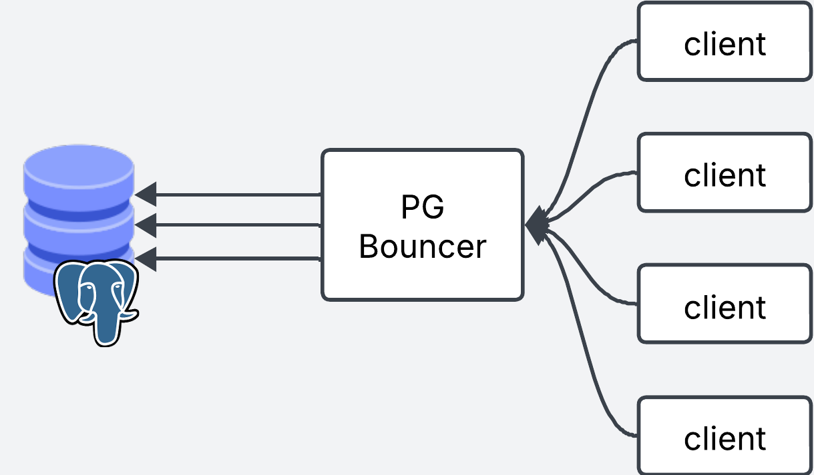

## What is connection Pooling?
When a user wants to run a query in the database, a few things need to happen. First a connection is opened. Then, they run the queries. When they are done they close the connection.

The process of opening and closing the connections takes some time and resources.

Think about having to open and close the door every time you go into the livingroom in your house. It doesn't take much time right? But what if your whole family comes over for Sunday lunch, and all 20 of those suckers have to open and close the door behind them, for this to be repeated by each family memeber wanting to come into the livingroom. The first person might as well leave the door open and let people come and go as they please.


Think for example a use case where you have a lof of short lived requests to the database. Rather than opening and closing thousands of connections per second, you can keep the connections open and re-use them across requests.

On the other hand, you can also have the case where you have clients with long lived connections to the database, where a client (e.g a webserver) always keeps hold of a connection to the database. This is fine if the client is constantly needing to run queries against the database, and for this use case you will probably not benefit from pg bouncer. THe thing is, it is very unlikely that they are running requests 100% of the time. There will be times where the client is quiet and isn't running any requests to the database, nontheless they keep that connection to themselves creating and "idle" connection. With connection pooling connections can be re-used so that idle connections moved back to the pool to be used by other clients that actially need it, thus creating a more efficient use of connections

Finally, connection pooling gives you the ability to queue requests when all the connections are busy, rather than refusing those requests. Rather late than never.

Connection pooling lets you re-use connections to your database. Whether you have a few users making a lot of consecutive requests or many different users making fewer sporadic requests, connection pooling helps by keeping connections alive and re-using them acrcoss requests.

## Does it take that much time to open and close a connection?
You might be wondering, does it really take that much time to establish a connection? Is pgbouncer worth it?

I run an example locally to compare both setups, and see if there's any improvement at all. The setup is as follows:
- Postgres database with max number of Postgres connections 3 
- PGBouncer with a default pool size of 3

I use a simple SELECT query which executes within 2.8ms. I use a script to run this query 10000 times, within 3 concurrent threads (3 queries at the same time). I test both setups: with and without PGBouncer. When hitting postgres directly clients open and close a connection on each request.

I use a small number of connections for illustrative purposes only. In production you'd be dealing with hundreds or thousands of concurrent connections.

Results

```bash
==================================================
Comparison Results:
==================================================
Connection Success Rate:
  PostgreSQL: 99.9%
  PGBouncer:  100.0%
  PGBouncer improved connection success rate by 0.1%

Query Success Rate:
  PostgreSQL: 99.9%
  PGBouncer:  100.0%
  PGBouncer improved query success rate by 0.1%

Average Execution Time:
  PostgreSQL: 0.0061 seconds
  PGBouncer:  0.0043 seconds
  PGBouncer was 30.1% faster
```

PGBouncer is able to re-use connections across requests, making queries slightly faster (by 22ms). This is a very considerable of time saved considering the query only takes 2.8ms to execute. Of course, we are testing on a small sandbox environment, but still.

Another benefit of PGBouncer is that it is capable of queuing requests when there are no connections available in the pool. In some cases you might prefer queuing rather than increasing the max connections parameter to avoid database overload. This might be helpful to handle unexpected spikes of requests.

To illustrate the last example, we run 10 concurrent requests when the database only accepts a maximum of 3 connections. 

```bash
==================================================
Comparison Results:
==================================================
Connection Success Rate:
  PostgreSQL: 20.9%
  PGBouncer:  100.0%
  PGBouncer improved connection success rate by 379.2%

Query Success Rate:
  PostgreSQL: 20.9%
  PGBouncer:  100.0%
  PGBouncer improved query success rate by 379.2%

Average Execution Time:
  PostgreSQL: 0.0168 seconds
  PGBouncer:  0.0136 seconds
  PGBouncer was 18.9% faster
```

PG Bouncer is able to queue the connections and avoid dropping requests. In the real world, if this is a common occurrence, you might want to consider scaling your database vertically (CPU, MEM) or horizontally (Load Balance across replicas) instead of queing the requests.

## Interactive Example
1. Click on `Send Request` to send a request
2. Play with the `max connections` and `pool size` options to see what happens with new requests
3. Click like a maniac!

<iframe width="100%" height="1400" name="iframe" src="/posts/014_using_pg_bouncer/pgbouncer_demo.html"></iframe>


## What is pgbouncer

PG bouncer is a lightweight connection pooling service that sits in between your Postgres database and your clients and it will manage the connections for you.



## Setting up locally

To setup pgbouncer locally you need to have Postgres database running, either locally (Docker) or with your favorite cloud provider.

### Install using brew

```bash
brew install pgbouncer
```

### Setup Config files
Create the `pgbouncer.ini` file. This file tells pgbouncer how to connect to the Postgres database. Here is also where you define your settings.

```toml
[databases]
mydb = host=my-database-host port=5432 dbname=postgres user=postgresuser password=mypassword

[pgbouncer]
listen_addr = localhost
listen_port = 6432
auth_type = md5
auth_file = userlist.txt
admin_users = myuser
logfile = pgbouncer.log
pidfile = pgbouncer.pid
admin_users = billy

```

### Credentials
Next thing is to create the `userlist.txt` auth file. This file contains the list of users allowed in.

Create a new user/password. Note that this user is pgbouncer specific and has nothing to do with the postgres user.

For example add this username and password to `userlist.txt`.

```yaml
"billy" "12345"
```

Pgbouncer expects the password as an md5 hash. To do this, we need to provide the username password in this format `md5<passwordusername>`, which in our case looks like this `md5<12345billy>`.

We can use the following bash command to get the hash (if you get a `%` sign at the end of the hash, ignore it)

```bash
echo -n "md5$(echo -n "12345billy" | md5sum | cut -d' ' -f1)" 
# output: md54d45974e13472b5a0be3533de4666414
```

Then we take the output and update our `userlist.txt`

```yaml
"billy" "md54d45974e13472b5a0be3533de4666414"
```

### Launch!
Now we can launch pgbouncer locally

```bash
pgbouncer pgbouncer.ini
```

And we can use psql to test the connection. For the password use `12345` as specified in `userlist.txt`

```bash
psql -p 6432 -U billy mydb
```

And bam! You are in!


If you get this error esure you have created the md5 hash properly. If you get a specific error for your postgres user (defined in the `[database]` section of `pgbouncer.ini`), ensure that the postgres connection is correct. 
```
2025-06-12 11:56:44.176 UTC [1] WARNING C-0x7fe106331280: mydb/billy@127.0.0.1:50004 pooler error: password authentication failed
```

## Setting it up in Kubernetes

Now that we have set this up locally, here it is what it wold look like if you wanted to set it up in kubernetes. For this we will spin up a Deployment, Secret, Configmap and a Service.

```shell
k8s/
├── pg_bouncer.deploy.yaml
├── pg_bouncer.cm.yaml
├── pg_bouncer.secret.yaml
└── pg_bouncer.service.yaml
```

Note that you need to have an existing Kubernetes cluster and a Postgres database to follow along!


### Deployment

The deployment will run pgbouncer in a single replica. It reads the secrets from a Secret and the config from a Configmap.
```yaml
apiVersion: apps/v1
kind: Deployment
metadata:
  name: pgbouncer
spec:
  replicas: 1
  selector:
    matchLabels:
      app: pgbouncer
  template:
    metadata:
      labels:
        app: pgbouncer
    spec:
      initContainers:
        - name: init-config
          image: busybox:1.35
          command: ["sh", "-c"]
          args:
            - |
              cp /config/pgbouncer.ini /etc/pgbouncer/
              cp /userlist/userlist.txt /etc/pgbouncer/
              chmod 644 /etc/pgbouncer/pgbouncer.ini
              chmod 600 /etc/pgbouncer/userlist.txt
              chown -R 70:70 /etc/pgbouncer/
          volumeMounts:
            - name: config-volume
              mountPath: /config
            - name: userlist-volume
              mountPath: /userlist
            - name: pgbouncer-data
              mountPath: /etc/pgbouncer
      containers:
        - name: pgbouncer
          image: edoburu/pgbouncer:1.18.0
          ports:
            - containerPort: 6432
              name: pgbouncer
          volumeMounts:
            - name: pgbouncer-data
              mountPath: /etc/pgbouncer
          resources:
            requests:
              cpu: 100m
              memory: 128Mi
            limits:
              cpu: 500m
              memory: 256Mi
          livenessProbe:
            tcpSocket:
              port: 6432
            initialDelaySeconds: 30
            periodSeconds: 10
          readinessProbe:
            tcpSocket:
              port: 6432
            initialDelaySeconds: 5
            periodSeconds: 10
      volumes:
        - name: config-volume
          configMap:
            name: pgbouncer-config
        - name: userlist-volume
          secret:
            secretName: pgbouncer-userlist
        - name: pgbouncer-data
          emptyDir: {}
```

### Configmap

The configmap will contain the `pgbouncer.ini` config.

```yaml
# Configmap
apiVersion: v1
kind: ConfigMap
metadata:
  name: pgbouncer-config
data:
  pgbouncer.ini: |
    [databases]
    mydb = host=my-database-host port=5432 dbname=postgres user=postgresuser password=mypassword # Don't use this in prod. Use vault or ENV vars instead

    [pgbouncer]
    listen_addr = 0.0.0.0
    listen_port = 6432
    auth_type = md5
    auth_file = /etc/pgbouncer/userlist.txt
    admin_users = myuser
    pool_mode = transaction
    max_client_conn = 1000
    default_pool_size = 100
```

### Secret
The secret will contain the values from `userlist.txt`. Kubernetes expects the secrets to be encoded in base64. All we need to do is take the contents of `userlist.txt` and encode them such as `cat userlist.txt | base64`. Use the output as the value for secret.

```yaml
# secret
apiVersion: v1
kind: Secret
metadata:
  name: pgbouncer-userlist
  namespace: trino-facade
type: Opaque
data:
  userlist.txt: InVzZXIiICJtZDU0ZDQ1OTc0ZTEzNDcyYjVhMGJlMzUzM2RlNDY2NjQxNCI=
```

### Service

Finally we create the service which will be used as the entrypoint for pgbouncer.

```yaml
apiVersion: v1
kind: Service
metadata:
  name: pgbouncer
spec:
  selector:
    app: pgbouncer
  ports:
    - protocol: TCP
      port: 6432
      targetPort: 6432
  type: ClusterIP

```

### Deploy!

You can deploy all the files in one go using

```bash
kubectl deploy -f *.yaml
```

Connect your applications or clients to pgbouncer instead of postgres and you are good to go!

## Final words

Pgbouncer is a lightweight and easy to use connection pooling service for Postgres. You'll likely need connection pooling as your application starts to scale and you need to deal with many users and requests.

Hope you've enjoyed the post. See you next time!


