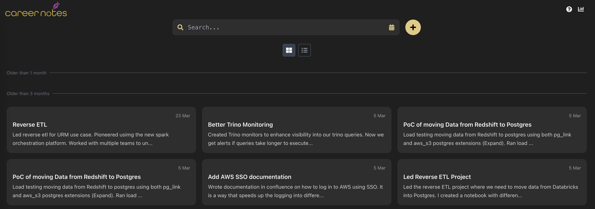
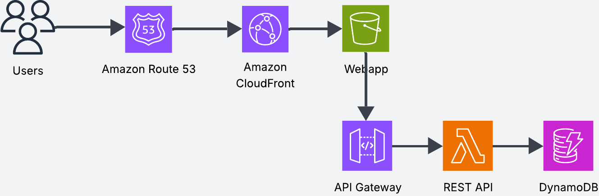

- Describe architecture of careernotes.com
- Describe each of the components and why it was chosen
    - Route53, Cloudfront, S3 website, API Gateway, Lambda API, DynamoDB
    - Security - CORS (API), SG in bucket to only allow access from Cloudfront
- Describe the difference between static website and non static - deploy as server or micro service
- Section with CI/CD - GH actions + Cloudformation (SAM)
- Section with pros/cons and tradeoffs - when to choose different compontents
    - Database - Aurora RDS Serverless or Dynamo?
    - Deploy website as a server with EC2 + ASG + Load balancer (or EKS, ECS)?


---


[careernotes.app](careernotes.app) is a lightweight note taking app for keeping track of career progession milestones. I created as a small side project to showcase how to you can deploy serverless applications in AWS with very little cost. 

The following architecture is cheap to maintain (when you have low traffic), but it can also easily scale to large workloads thanks to being serverless. 

## Architecture

The goal of the project was to build a fully serverless app that was easy to build, cheap to run, and that it could easily scale to unpredictable workloads without having to worry about provisioning compute.



### The Webapp

The webapp is built using React and Tailwind.

AWS S3 lets you host static websites, which means you can serve HTML files that don't require a running server. In our case the application needs to interact with the database via an API. That means we need to detach the API from the frontend and deploy them as separate microservices.

Using this approach we can deploy the static website in S3 and the API to read and write from the database in a Lambda.

The API code is deployed in a lambda function, which is fronted by an API Gateway. API Gateway offers capabilties such as authentication, rate limiting and caching which are useul in APIs.


### The Database 

I use dynamoDB for the database. Dynamo is a serverless key value store which is why I chose it for this project. 

Dynamo also offers flexible schema capabilities that are not really necessary for this particular app. As this application scales, a relational database such as RDS could probably offer a bit more flexibility, so it would have been considering Aurora Serverless.

However, I chose dynamo because of its pricing model, and because it was easy to setup.

The notes table looks something like this

(show schema)

### DNS and CDN

The S3 bucket is fronted by cloudfront. Cloudfront is a Content Delivery Network (CDN) which is able to deliver the website at the edge to consumers around the world. It can also cache content, which speeds up website reads improving overall user experience.

To enable secure HTTPS access, I created a certificate in AWS Certificate Manager and imported it in Cloudfront directly.

I used Route53 to create the DNS careernotes.app

### Security

CORS is a security method implemented by browsers where it does not allow website to make external calls to other APIs, unless the external API explicitly allows it. We implement CORS in the API to only allow traffic from the website.

(Other security methods? Can I hit the API directly??)

VPC?

## The Code

The repository structure is as follows, the frontend and backend are deployed as different services.

```bash
.
├── backend/
│   └── api/
│       ├── requirements.txt
│       ├── template.yml
│       └── src/
│           └── app.py
└── frontend/
    └── work-summary/
        ├── README.md
        ├── package.json
        ├── tailwind.config.js
        └── src/
            └── app.py
```

The code is deployed using a CI/CD pipeline and infrastructre as code. Any time changes are merged into the main branch, the changes are automaticall deployed into production. 

I use github actions for the pipeline, and cloudformation to define the infrastructure.

### The website

The website is packaged and deployed to S3, where it is served. The gitbub action bundles the website files and deploys them to S3. AWS credentials are stored in github.

```yaml
name: Deploy to S3

on:
  push:
    branches:
      - main 
jobs:
  deploy:
    runs-on: ubuntu-latest
    defaults:
      run:
        working-directory: frontend/work-summary
    steps:
      - name: Checkout repository
        uses: actions/checkout@v3

      - name: Install dependencies
        run: npm install

      - name: Build project
        env:
          REACT_APP_GOOGLE_CLIENT_ID: ${{ secrets.REACT_APP_GOOGLE_CLIENT_ID }}
          REACT_APP_API_BASE_URL: ${{ secrets.REACT_APP_API_BASE_URL }}
        run: npm run build

      - name: Deploy to S3
        uses: jakejarvis/s3-sync-action@v0.5.1
        timeout-minutes: 5
        env:
          AWS_ACCESS_KEY_ID: ${{ secrets.AWS_ACCESS_KEY_ID }}
          AWS_SECRET_ACCESS_KEY: ${{ secrets.AWS_SECRET_ACCESS_KEY }}
          AWS_REGION: ${{ secrets.AWS_REGION }}
          AWS_S3_BUCKET: ${{ secrets.AWS_S3_BUCKET }}
          SOURCE_DIR: ./frontend/work-summary/build
        with:
          args: --delete
```

### The API

The API infrastructure is defined in cloudformation. THe following template defines the lambda function and the API gateway.

```yaml
AWSTemplateFormatVersion: '2010-09-09'
Transform: AWS::Serverless-2016-10-31
Description: Accomplishly API with proper preflight (OPTIONS) handling

Resources:
  FastApiFunction:
    Type: AWS::Serverless::Function
    Properties:
      FunctionName: AccomplishlyFastApiFunction
      Handler: src.app.handler
      Runtime: python3.10
      CodeUri: ./
      MemorySize: 128
      Timeout: 30
      Environment:
        Variables:
          LOGS_TABLE: "LogsTable"
          USERS_TABLE: "UsersTable"
          COFFEE_CODE: "LE3OW2KY22X"
      Policies:
        - Statement:
            Effect: Allow
            Action:
              - dynamodb:PutItem
              - dynamodb:DeleteItem
              - dynamodb:UpdateItem
              - dynamodb:Scan
              - dynamodb:GetItem
              - dynamodb:Query
            Resource: "arn:aws:dynamodb:eu-west-1:236212633992:table/LogsTable"
        - Statement:
            Effect: Allow
            Action:
              - dynamodb:PutItem
              - dynamodb:DeleteItem
              - dynamodb:UpdateItem
              - dynamodb:Scan
              - dynamodb:GetItem
              - dynamodb:Query
            Resource: "arn:aws:dynamodb:eu-west-1:236212633992:table/UsersTable"
      Events:
        ProxyApi:
          Type: Api
          Properties:
            RestApiId: !Ref AccomplishlyApi
            Path: /{proxy+}
            Method: ANY

  AccomplishlyApi:
    Type: AWS::Serverless::Api
    Properties:
      StageName: Prod
      # Using an OpenAPI definition lets us explicitly define an OPTIONS method
      # with a mock integration that returns the desired CORS headers.
      MethodSettings:
      - ResourcePath: "/*"
        HttpMethod: "*"
        ThrottlingBurstLimit: 100
        ThrottlingRateLimit: 50
      DefinitionBody:
        openapi: 3.0.1
        info:
          title: Accomplishly API
          version: '1.0'
        paths:
          /{proxy+}:
            # ANY method integration using Lambda proxy
            x-amazon-apigateway-any-method:
              parameters:
                - name: proxy
                  in: path
                  required: true
                  schema:
                    type: string
              x-amazon-apigateway-integration:
                uri: !Sub "arn:aws:apigateway:${AWS::Region}:lambda:path/2015-03-31/functions/${FastApiFunction.Arn}/invocations"
                httpMethod: POST
                type: aws_proxy
            # OPTIONS method for CORS preflight
            options:
              responses:
                '200':
                  description: "Default response for CORS preflight"
                  headers:
                    Access-Control-Allow-Origin:
                      schema:
                        type: string
                    Access-Control-Allow-Methods:
                      schema:
                        type: string
                    Access-Control-Allow-Headers:
                      schema:
                        type: string
              x-amazon-apigateway-integration:
                type: mock
                requestTemplates:
                  application/json: |
                    {
                      "statusCode": 200
                    }
                responses:
                  default:
                    statusCode: "200"
                    responseParameters:
                      method.response.header.Access-Control-Allow-Origin: "'https://careernotes.app'"
                      method.response.header.Access-Control-Allow-Methods: "'GET,POST,DELETE,OPTIONS'"
                      method.response.header.Access-Control-Allow-Headers: "'Content-Type'"
        components: {}
        
Outputs:
  ApiInvokeURL:
    Description: "Base URL for the Accomplishly API"
    Value: !Sub "https://${AccomplishlyApi}.execute-api.${AWS::Region}.amazonaws.com/Prod"

  ```


I then use github actions to build and deploy the cloudformation template using the `aws sam` cli.

```yaml
name: Deploy Backend API

on:
  push:
    branches:
      - main
jobs:
  deploy:
    runs-on: ubuntu-latest
    defaults:
      run:
        working-directory: backend/api

    steps:
      - name: Checkout repository
        uses: actions/checkout@v3

      - name: Set up python
        uses: actions/setup-python@v4
        with:
          python-version: '3.10'

      - name: Install AWS SAM CLI
        run: |
          pip install aws-sam-cli

      - name: Validate SAM template
        run: |
          sam validate --region eu-west-1

      - name: Build SAM application
        run: |
          sam build

      - name: Deploy SAM application
        env:
          AWS_ACCESS_KEY_ID: ${{ secrets.AWS_ACCESS_KEY_ID }}
          AWS_SECRET_ACCESS_KEY: ${{ secrets.AWS_SECRET_ACCESS_KEY }}
          AWS_DEFAULT_REGION: 'eu-west-1'
        run: sam deploy --no-confirm-changeset --no-fail-on-empty-changeset --stack-name accomplishly-api --capabilities CAPABILITY_IAM CAPABILITY_NAMED_IAM --s3-bucket pablo-utils --s3-prefix artifacts/accomplishly-api
```

### Other Services

I created the database manually because it is a one time operation, and it was simpler to create the tables using the AWS console. However you can also add them to the Cloudformation template to create them via CI/CD. Make sure you enable termination protection to avoid shutting them down by accident.

Same with Cloudfront and Route53. This was a one time operation which was easier to do via the AWS console. Although for any production systems I always recommend using IaC.


## Conclusion
