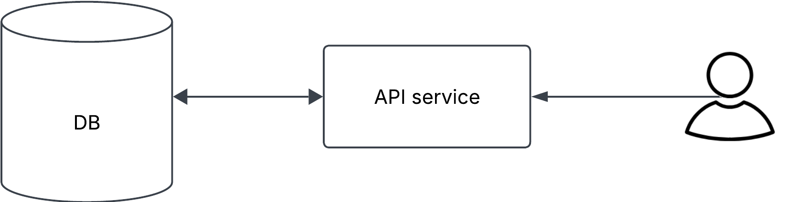
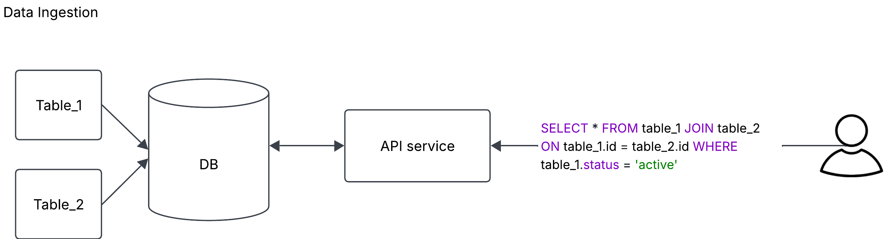
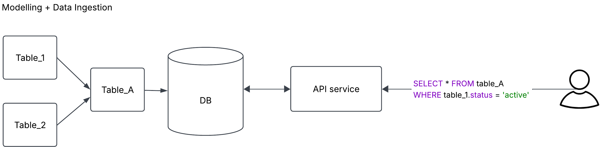

Over the last 3 years I've spent a lot of time building highly scalable Data APIs, to enable teams to access data from different sources with minimal effort. There have been several mistakes made along the way, and many lessons learned. I believe these lessons will form strong foundations to build performant Data APIs from day one.

Before diving into the lessons, I'll define Data API.

A Data API is an API service that serves some data to the user. The API backend connects to a database, such as Postgres, Redis or MongoDB, it runs a query based on the API call received, and it serves that data to the end user.

Simple, right?

## Lesson 1: Model the Data Before it Arrives

If you were to take a single takeaway from all of this, is that with Data APIs, the infrastructure is rarely the bottleneck, the Data is.

When we were first building the Data API platform, we made the mistake of not enforcing the pre-modelling of data before it arrives in the database. Instead of doing joins, filters and business logic on the table beforehand, we landed the raw tables directly in Postgres. Every time the API was called, we ran very complex queries, combining tables on the fly, or doing expensive window and filtering operations. This meant our API SLAs quickly went out the window, depending on the use case.

We went with this approach because it was the easier option. It meant very little coordination with the Data Engineering teams in charge of the source Data. We didn't need to bother them with creating the table our API customers needed, and we would add this logic at query time. Over time this became a real issue, because SLAs were not good enough, which meant we needed a better approach.

The solution was simple: model the data before it touched Postgres. Before creating an API endpoint, we'd get together with consumers and Data Engineers to define the data shape. The Data Engineers would model the data in the warehouse before landing it in Postgres. This required more planning work across teams, but the payoff was clear. Tables in Postgres were now queryable with simple SELECT statements and minimal filters, serving data in milliseconds instead of 4 to 60 seconds.

The biggest challenge with the new approach was when dealing with large volumes of real-time data. We had a use case where we were receiving thousands of events per second directly into our system, which meant we needed to make that data queryable via the API as quickly as possible. Rather than landing raw data and doing complex joins and filters at query time, we modeled the data upstream before it arrived in Postgres. This meant the tables in Postgres were clean and simple to query, enabling us to serve that real-time data with minimal latency.

## Lesson 2: Index on the Right Columns
<!-- why indexes matter → types of indexes → concrete before/after example (e.g. seconds → milliseconds) -->

Indexes matter a lot. If you're new to databases, an index makes the difference between a query taking 4 seconds or 100 milliseconds. They're the mechanism that "bookmarks" your data, so you don't have to scan everything. You point your query directly at what you need.

Without going into too much detail, we were able to reduce the latency of some of the more complex queries from 4 seconds to 100 milliseconds by indexing the right columns based on the query patterns. It is important to know your database well to know which indexes are useful for different situations. Some scenarios will require hash indexes (such as user ids) vs tree search (date ranges) vs other options available in each individual database. There is also a benefit to using composite indexes vs individual indexes. All of this knowledge comes when you know your database well to make the right decisions for each scenario.

## Lesson 3: Partitioning Solves the Write Problem
<!-- the write bottleneck at scale → async index creation as first fix → partitioning by date as second fix → outcome -->

One of our use cases was serving streaming data as soon as it happened using a real time API. This meant several thousand writes per second landing in our Postgres Database.

If you've worked with Postgres, you know there's only one writer replica available, and write-heavy operations can quickly become a bottleneck. This is what happened to us. One of our tables was receiving thousands of write requests per second on a several-Terabyte database. Postgres could handle the load. We had the compute. But something else was breaking.

The problem: as the table grew, index creation slowed exponentially. When you add new indexes, existing ones need updating too. On a terabyte-scale table, this became unbearably slow. The slow index creation prevented data from being available for reads, and eventually the database couldn't keep up. It went down.

The first part of the solution was to partition the database by date. Some of our queries used the date column to filter, so it meant we could effectively redirect users to the right partitions reducing query times. The partitions also meant that we could create indexes on a much smaller table size, which was manageable enough to create the indexes fast enough.

A second improvement was async index creation. By default, Postgres creates indexes synchronously. Data isn't available for querying until the index is done. With async creation, data is available immediately while indexes build in the background. We traded query speed for availability: if someone queries before the index is ready, they get a slightly slower scan. In practice, this rarely happened, but it meant we could serve data even if index creation lagged.

## Lesson 4: Partitioning Has a Cost
<!-- query pattern lock-in pitfall → maintenance overhead (cron jobs) → callback: this was a patch, Lesson 1 was the real fix -->

Partitioning solved one of our biggest problems with large growing tables. However, it's important to understand the ongoing costs.

In theory, partitioning is a great way to split your data into smaller tables, potentially making querying more efficient and dropping older tables very easy.

In reality, partitioning adds significant operational overhead. In Postgres, you must manage partition creation, setting up a cron job that runs constantly to create new partitions ahead of time. A partition is just an empty table you create before data arrives. This cron job becomes one of your most critical systems: if it fails, you won't have partitions ready when data arrives, and you're in trouble. You need solid visibility and alerting so your team knows immediately when it breaks.

The other problem with partitioning is when query patterns change. For example, we partitioned by date, and this was originally a good idea because some of the queries in the API filtered by date, which meant we could effectively use partitioning to reduce the amount of data needed to be queried, potentially making query times faster.

Over time, new use cases arrived that queried the same data, which didn't use date as a filter query. Our ANALYZE queries revealed that all partitions were being scanned for these queries. Because indexes are created at the partition level, it meant that scanning all partitions is slower than scanning a single table. Our decision to partition helped us with some queries, but made other queries worse.

Undoing any partitioning can be very hard and take a lot of effort to do, which is why it needs to be carefully considered as the right option.

The lesson here is that partitioning was a necessary solution for our write problem at the time. However, in hindsight, the real fix would have been to go back to Lesson 1: better data modelling before the data landed in our database. If we had modelled the data correctly upstream, we would have written less data in the first place, potentially avoiding the need to partition altogether. That would have saved us a lot of operational overhead.

## Closing thoughts

Data APIs are all about the Data. If your data is well modelled and it has the correct indexes, you'll have a very performant API and you'll save yourself a lot of issues down the line. In our case, a lot of our challenges could have been easily solved by getting this right the first time.


