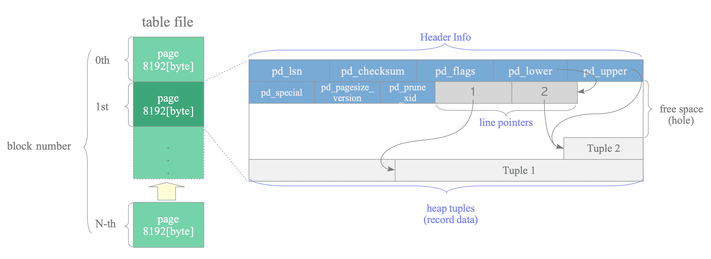

I am a baby of the cloud. I started my professional career deploying things in AWS, thinking cloud first.

This creates a problem, because the "cloud" can be so abstracted that you start to imagine some services are just magic. I don't think about how they work, they just do, and the technology behind it must be some black magic that is beyond my understanding.

It is not until I actually remember that the cloud is simply a program running on a server somewhere, built by a bunch of engineers like myself, that I can break down everything to the very basics.

Take Aurora RDS for example. It can do some truly amazing stuff with replication, load balancing, failover and so on. But all Aurora is just Postgres running on a server. Over time they have built improvements to this postgres instance to add all the cool features you can use today, but at the end of the day, it is just running a fancy version of Postgres in their own private machines.

The point I'm trying to make is that like everything else, Postgres is not ran by magic. Databases are not magic either. Postgres is essentially a program that writes files to your filesystem and lets you read the files using SQL query language. This might be obvious to some, but I sometimes forget, so it is good to remind myself.

In this post I look inside postgres to understand how tables are stored in the filesystem. The goal of this post is nothing more than to understand a small part of the whole Postgres ecosystem to demistify things a bit. More as a learning process to myself than anything else.

Let's begin.


## Installation

Install postgres in your machine using brew, and start the service
```bash
brew install postgresql@17
brew services start postgresql@17
```

Use `psql` to connect to the `postgres` database.

```bash
psql postgres
```
As a refresher, remember that within a Postgres cluster, we can have different databases. `postgres` is the default database, but we could easily create many other databases.

Lets create our own database. From within the `pysql` console run

```sql
psql>  CREATE DATABASE mydb;
```

And then exit the `postgres` database using the `\q` command. Then connect to the newly created database using

```sql
pysql mydb
```

From this point on, any shell command prefixed by `psql>` is ran inside the `psql` console connected to `mydb`.

### Add Data

The final step in this setup is to create a dummy table. I run the following queries within the `psql` console.

```sql
psql> CREATE TABLE films (
    code        char(5) CONSTRAINT firstkey PRIMARY KEY,
    title       varchar(40) NOT NULL,
    did         integer NOT NULL,
    date_prod   date,
    kind        varchar(10),
    len         interval hour to minute
);
```

and add some data to the table

```SQL
psql> INSERT INTO films (code, title, did, date_prod, kind, len) VALUES
('B6717', 'The Shawshank Redemption', 101, '1994-09-23', 'Drama', '02:22'),
('C8874', 'Inception',                102, '2010-07-16', 'Sci-Fi', '02:28'),
('A1234', 'The Godfather',            103, '1972-03-24', 'Crime', '02:55'),
('D4521', 'Interstellar',             104, '2014-11-07', 'Sci-Fi', '02:49'),
('E7789', 'Parasite',                  105, '2019-05-30', 'Thriller', '02:12');
```

Now we have a `films` table inside the `public` schema in the `mydb` database.


## Finding the Location of the Table in the Filesystem

A postgres database is basically a single directory containing all its data inside it. In this section I'll find where the `films` table is stored within our filesystem.

We can find the base directory where the Postgres cluster lives in our machine by running this command:

```sql
psql> show data_directory;

/opt/homebrew/var/postgresql@17
```

We can verify this path actually exists by running `ls` on our machine

```shell
ls -lh /opt/homebrew/var/postgresql@17
total 120
drwx------@  6 pablolopez  admin   192B Aug 19 20:19 base
drwx------@ 65 pablolopez  admin   2.0K Aug 19 20:20 global
drwx------@  2 pablolopez  admin    64B Aug 11 19:39 pg_commit_ts
drwx------@  2 pablolopez  admin    64B Aug 11 19:39 pg_dynshmem
...
```

Here you get a bunch of directories. They all do different things in postgres, but that's outside the scope of this blog. In this case we will focus on the `base` directory which is the one containing the database directories.

When we look into the `base` directory we get a list of folders representing the different postgres databases.

```shell
ls -lh /opt/homebrew/var/postgresql@17/base
total 0
drwx------@ 301 pablolopez  admin   9.4K Aug 19 20:03 1
drwx------@ 303 pablolopez  admin   9.5K Aug 19 20:20 16438
drwx------@ 300 pablolopez  admin   9.4K Aug 11 19:39 4
drwx------@ 304 pablolopez  admin   9.5K Aug 19 20:02 5
```

Each of these numbers is the object id (OID) referencing a database. We can find out which OID belongs to which database by running this SQL inside the `psql` console

```sql
psql> SELECT oid, datname
FROM pg_database;

  oid  |  datname
-------+-----------
     5 | postgres
 16438 | mydb
     1 | template1
     4 | template0
(4 rows)
```

As we can see `mydb` folder is OID number `16438`. Let's run `ls` on this directory to see the contents:

```shell
ls -lh /opt/homebrew/var/postgresql@17/base/16438/

total 15560
-rw-------@ 1 pablolopez  admin   8.0K Aug 19 20:22 112
-rw-------@ 1 pablolopez  admin   8.0K Aug 19 20:22 113
-rw-------@ 1 pablolopez  admin   120K Aug 19 20:22 1247
-rw-------@ 1 pablolopez  admin    24K Aug 19 20:22 1247_fsm
-rw-------@ 1 pablolopez  admin   8.0K Aug 19 20:22 1247_vm
-rw-------@ 1 pablolopez  admin   440K Aug 19 20:22 1249
...
```

There are a bunch of objects in here. Each of these can represent a table, indexes or other objects within Postgres.

We are interested in finding the location of the `films` table, which we can find using this query:

```sql
psql> SELECT pg_relation_filepath('films');

 pg_relation_filepath
----------------------
 base/16438/16439
(1 row)
```

In this case `16439` refers to the table's `relfilenode` and not the Object ID. If we run this query, we can check that `relfilenode` and `oid` are two differnt things:

```sql
psql> SELECT relname, oid, relfilenode FROM pg_class WHERE relname = 'films';

relname |  oid  | relfilenode
---------+-------+-------------
 films   | 16439 |       16439
```

In this case, the OID and the `relfilenode` are exactly the same. Hoewever this may not always be the case.

Once more, we can verify this table exists in our machine by checking the path

```shell
ls -lh /opt/homebrew/var/postgresql@17/base/16438/16439

-rw-------@ 1 pablolopez  admin   8.0K Aug 19 20:24 /opt/homebrew/var/postgresql@17/base/16438/16439
```

Now that we know where the physical Postgres table actually lives, lets see how data is stored within it.

## Looking Inside the Table Files

When we query the table using SQL, it looks like this:

```sql
psql> select * from films;
 code  |          title           | did | date_prod  |   kind   |   len
-------+--------------------------+-----+------------+----------+----------
 B6717 | The Shawshank Redemption | 101 | 1994-09-23 | Drama    | 02:22:00
 C8874 | Inception                | 102 | 2010-07-16 | Sci-Fi   | 02:28:00
 A1234 | The Godfather            | 103 | 1972-03-24 | Crime    | 02:55:00
 D4521 | Interstellar             | 104 | 2014-11-07 | Sci-Fi   | 02:49:00
 E7789 | Parasite                 | 105 | 2019-05-30 | Thriller | 02:12:00
(5 rows)
```

In reality, Postgres structures the table files into `pages`. Pages have fixed lenght which is 8192 bytes (8 KB) by default. The internal layout of pages depends on the data file type (table, indexes, etc).



(Image Source: [Internals of Postgres by Hironobu SUZUKI](https://www.interdb.jp/pg/pgsql01/03.html) )

A page contains 3 sections:

- the page **header** which contains general information about the page;
- the line **pointers** which point to the location of each tuple in the page;
- and the **tuples**, where each tuple represents a row of data.

We can try to verify this table structure by peeking inside the actual table file.

```bash
cat /opt/homebrew/var/postgresql@17/base/16438/16439

C8874InceptionfhSci-Fi�id\�
Drama���%
```

We get some gibbrish output because the file is in binary format.

Since the data file is encoded in binary format, I'll use some helper SQL commands to visualise the different components of the table. I'll need to install the `pageinspect` extension within the database.

```sql
psql> CREATE EXTENSION pageinspect;
```

### Page Headers

To view the page headers we can run the following command. The `0` parameter represents the page number.

```sql
psql> SELECT * FROM page_header(get_raw_page('films', 0));

    lsn    | checksum | flags | lower | upper | special | pagesize | version | prune_xid
-----------+----------+-------+-------+-------+---------+----------+---------+-----------
 0/1A24320 |        0 |     0 |    44 |  7792 |    8192 |     8192 |       4 |         0
(1 row)
```

These are the header definitions:
- lsn: last change recorded for this page
- checksum: page integrity check value
- flags: status bits about the page (e.g. visibility/fullness of the page)
- lower/upper: start/end of free space within the page
- special: reserved space (mainly used by indexes)
- pagesize: size of the page in bytes (usually 8192)
- version: page layout format version
- prune_xid: oldest transaction that may still need cleaning on this page

### Data Tuples and Line Pointers

To view the actual tuples and the line pointers we can run these commands:

```sql
psql> SELECT *
FROM heap_page_items(get_raw_page('films', 0));

lp | lp_off | lp_flags | lp_len | t_xmin | t_xmax | t_field3 | t_ctid | t_infomask2 | t_infomask | t_hoff | t_bits | t_oid |                                                               t_data
----+--------+----------+--------+--------+--------+----------+--------+-------------+------------+--------+--------+-------+------------------------------------------------------------------------------------------------------------------------------------
  1 |   8104 |        1 |     88 |    750 |      0 |        0 | (0,1)  |           6 |       2306 |     24 |        |       | \x0d42363731373354686520536861777368616e6b20526564656d7074696f6e00650000007af8ffff0d4472616d61000000e2d4fb010000000000000000000000
  2 |   8032 |        1 |     72 |    750 |      0 |        0 | (0,2)  |           6 |       2306 |     24 |        |       | \x0d433838373415496e63657074696f6e66000000090f00000f5363692d466900000c4a11020000000000000000000000
  3 |   7952 |        1 |     80 |    750 |      0 |        0 | (0,3)  |           6 |       2306 |     24 |        |       | \x0d41313233341d54686520476f646661746865726700000060d8ffff0d4372696d650000000000000049d971020000000000000000000000
  4 |   7872 |        1 |     80 |    750 |      0 |        0 | (0,4)  |           6 |       2306 |     24 |        |       | \x0d44343532311b496e7465727374656c6c61720068000000301500000f5363692d46690000000000001f645c020000000000000000000000
  5 |   7792 |        1 |     80 |    750 |      0 |        0 | (0,5)  |           6 |       2306 |     24 |        |       | \x0d45373738391350617261736974650069000000b11b000013546872696c6c657200000000000000009c11d8010000000000000000000000
(5 rows)
```


The items prefixed with the letter `l` refers to line pointers:
- lp: the position of the tuple
- lp_off: line pointer offset in bytes where the data tuple begins
- lp_flags:  1 = normal tuple, others indicate dead, redirected, etc.
- lp_len: lenght in bytes of the tuple

The items prefixed with `t` refers to transaction information:
- t_xmin: transaction id that inserted this tuple
- t_xmax: transaction id that deleted this tuple (0 if still alive)
- t_ctid: physical location of this tuple as (block_number, offset_number).
- t_data: Raw tuple data bytes (hex-encoded)

Now that we know the structure of a table, we can look into how rows are retrieved when a SQL query is executed.

## The End

Postgres Tables look very different from when you actually see the table results in your SQL queries. In this blog post I've gone through the steps to find where tables are actually stored and what they actually look like. My goal was to demistify a small part of postgres to prove to myself that databases are not magic, but rather files stored in an instance, all done in a very clever way.

# Resources

- https://www.interdb.jp/pg/pgsql01/03.html

- https://www.nan.fyi/database
