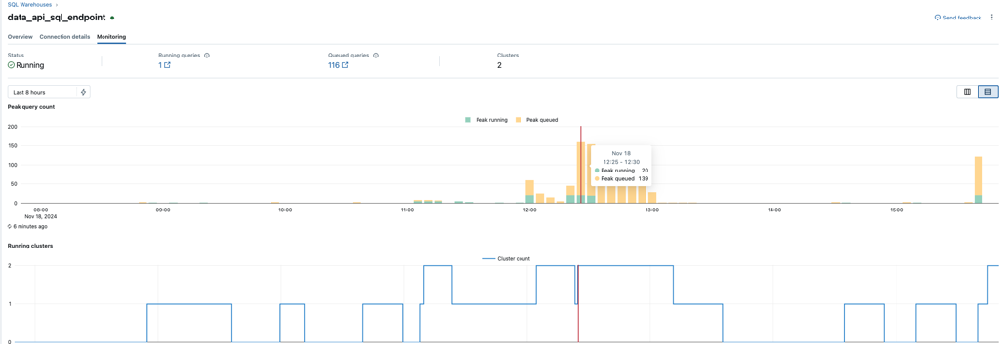
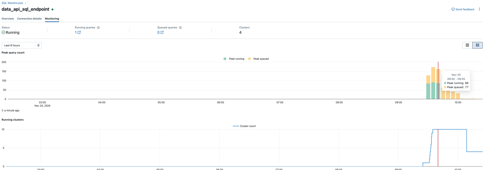
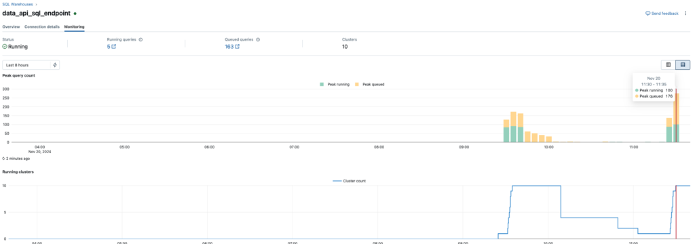
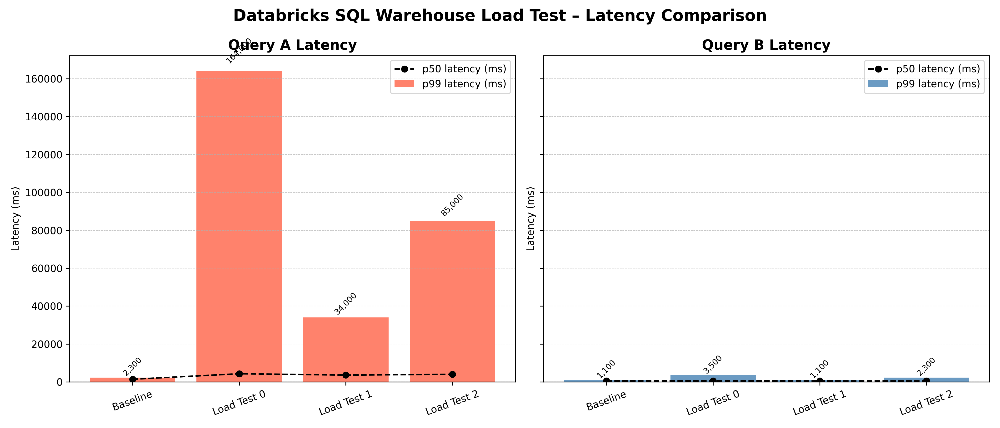
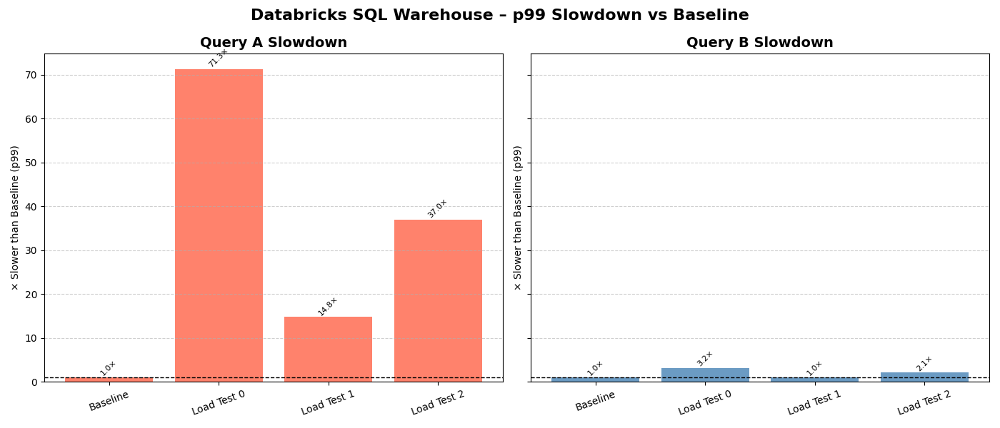

Our team needed to create a Data API to integrate in a downstream user facing system. This API was expected to recieve a load of around 100 requests per second of read operations.

The data that we needed to serve lived in Databricks, and we needed to find a way to make it available to the API in a secure, cost efficient and scalable manner.

At this point there were a few options, but the path of least resistance was to serve the data directly form Databricks using the SQL warehouse.

It would be very irresponsible from us to not check if the SQL warehouse was capable of handling the load before integrating it in the API, so this is what this post all about.

In this post I test the SQL Warehouse to see if I can sustain a load of up t 300 requests per second for two different queries. I review performance and cost considerations.

Enjoy!

## Methodology

This is the methodology used in this investigation

1. Create a baseline. Execute the queries under a low load.

2. Run load test for each of the proposed configurations.

3. Compare baseline to Load tests


## Preparation

For this use case we decided to go for serverless compute because it was the only option that can scale fast enough if there is a spike of requests.

Databricks recommends that for running multiple queries at one time, we should increase number of clusters

> *If you are running multiple queries at a time [serverless], add more clusters for autoscaling. [link](https://docs.databricks.com/aws/en/compute/sql-warehouse/warehouse-behavior#sizing-a-serverless-sql-warehouse)*

Autoscaling only kicks in after queries have been added to the queue. We want to find the right balance between min clusters available vs autoscaling clusters.

> *If the queue is not decreasing quickly enough, autoscaling kicks in to rapidly procure more compute. [link](https://docs.databricks.com/aws/en/compute/sql-warehouse/warehouse-behavior#serverless-autoscaling-and-query-queuing)*


## The queries
These are the queries used for this test. Query B is a simpler query with a GROUP BY clause. Query A is a bit more resource intensive with JOINs and window operations.



```sql
WITH ranked_events AS (
    SELECT *, ROW_NUMBER() OVER (PARTITION BY event_id ORDER BY created_date DESC) 
    FROM public.analytics.activity_events
    WHERE start_time BETWEEN '2024-11-08' AND '2024-11-10'
        AND user_id = ?
),
deduped_events AS (
    SELECT * FROM ranked_events WHERE row_num = 1
),
formatted_data AS (
    SELECT 
        start_events.reference_id,
        start_events.session_token,
        start_events.product_id,
        end_events.total_amount,
        end_events.net_result
    FROM (
        SELECT * FROM deduped_events WHERE event_type = 'STARTED'
    ) start_events
    LEFT JOIN (
        SELECT * FROM deduped_events WHERE event_type = 'COMPLETED'
    ) end_events
    ON start_events.reference_id = end_events.reference_id
)
SELECT *
FROM formatted_data
ORDER BY reference_id
LIMIT 100 OFFSET 200;
```




```sql
WITH aggregated_data AS (
    SELECT
        product_type_id,
        SUM(event_count) AS event_count,
        SUM(total_value) AS total_value,
        SUM(net_amount) AS net_amount,
        SUM(projected_amount) AS projected_amount,
        SUM(tier_a_value) AS tier_a_value,
        SUM(tier_b_value) AS tier_b_value,
        SUM(tier_c_value) AS tier_c_value
    FROM public.analytics.customer_activity_summary
    WHERE
        customer_id = ?
        AND time_period = 'year'
    GROUP BY GROUPING SETS ( (), (product_type_id) )
)
SELECT
    product_type_id,
    event_count,
    total_value,
    net_amount,
    projected_amount,
    tier_a_value,
    tier_b_value,
    tier_c_value
FROM aggregated_data
LIMIT 5000;
```


The load tests are executed using the Locust framework. To ensure realistic results [caching](https://docs.databricks.com/aws/en/sql/language-manual/parameters/use_cached_result) is disabled in the SQL Warehouse. On top of that, some of the query parameters are randomised to prevent from submitting the same query multiple times as much as possible.

## Baseline

The baseline consists on executing the SQL queries under very low load to find out what the *normal* exection times are for both queries.

#### Configuration
- **Users**: 2 concurrent users
- **Databricks**: Serverless, Small cluster size, Scaling min 1 to max 2
- **Cost**: $201/day ($6,048/month)

#### Results
*~1.5 requests/s*

| Query Name | p50 (ms) | p95 (ms) | p99 (ms) | max (ms) | avg (ms) |
|------------|----------|----------|----------|----------|----------|
| Query A | 1,400 | 1,900 | 2,300 | 2,730 | 1,489 |
| Query B | 500 | 650 | 1,100 | 1,489 | 526 |

## Load Testing Results

If you are not really interested in the specific numbers, feel free to skip this section completely and head directly to the results.


### Load Test #0
*Same configuration as baseline but loading it with 150 concurrent users*

#### Configuration
- **Users**: 150 users
- **Databricks**: Serverless, Small cluster size, Scaling min 1 to max 2
- **Cost**: $201/day ($6,048/month)

#### Results
* ~9 requests/s*

| Query Name | p50 (ms) | p95 (ms) | p99 (ms) | max (ms) | avg (ms) |
|------------|----------|----------|----------|----------|----------|
| Query A | 4,300 | 20,000 | 164,000 | 192,000 | 9,943 |
| Query B | 530 | 1,800 | 3,500 | 7,774 | 684 |



Databricks SQL warehouse screenshot showing details about the running queries, queued queries and running clusters.






#### Observations
- The databricks queue grows faster than queries can execute, which has a big effect on p95 and p99
- The slower query (Query A) experiences a greater performance degradation under load compared to faster queries, which are less impacted

---

### Load Test #1
*Same configuration as baseline but loading it with 150 concurrent users and increasing the number of max scaling clusters to 10*

#### Configuration
- **Users**: 150 users
- **Databricks**: Serverless, Small cluster size, Scaling min 1 to max 10
- **Cost**: $2,000/day ($60,048/month for 10 clusters running 24/7)

#### Results
* ~35 requests/s*

| Query Name | p50 (ms) | p95 (ms) | p99 (ms) | max (ms) | avg (ms) |
|------------|----------|----------|----------|----------|----------|
| Query A | 3,600 | 6,500 | 34,000 | 394,362 | 5,819 |
| Query B | 480 | 650 | 1,100 | 16,348 | 524 |



Databricks SQL warehouse screenshot showing details about the running queries, queued queries and running clusters.




#### Key Observations
- When clusters are at the concurrency limit, the queue size grows linearly, eventually stabilising at around 70 queries.
- Autoscaling kicks in within minutes
- During autoscaling, response time (P95) may spike briefly, but stabilizes once the new clusters are active
- P99 is really bad for query A, and not too bad for query B. It implies that the slower query suffers more when the load is high.
- The max value is shockingly bad. This suggest that some of the queued queries remain in the queue for very long times. It seems like databrick's queuing system favours faster queries and punishes slower queries with longer waiting times.


---

### Load Test #2
*Same as load test #1 but adding more users*

#### Configuration
- **Users**: 300 users
- **Databricks**: Serverless, Small cluster size, Scaling min 1 to max 10
- **Cost**: $2,000/day ($60,048/month for 10 clusters running 24/7)

#### Results
*~40 requests/s*

| Query Name | p50 (ms) | p95 (ms) | p99 (ms) | max (ms) | avg (ms) |
|------------|----------|----------|----------|----------|----------|
| Query A | 4,000 | 7,500 | 85,000 | 240,503 | 6,171 |
| Query B | 480 | 760 | 2,300 | 18,760 | 567 |



Databricks SQL warehouse screenshot showing details about the running queries, queued queries and running clusters. There are two spikes because I ran the test, then stopped and then ran it again.





#### Key Observations
- Autoscaling is relatively fast. 1 to 10 cluster within 4 minutes  
- P95 is a bit inconsistent (spikes) while autoscaling is happening, then it stabilises
- Queries queue at a linear rate faster than they can execute after ~ 180 users
- P99 is really bad for query A, and not too bad for query B. It implies that the slower query suffers more when the load is high.
- The max value, indicating the worst query execution times are shockingly bad for both queries.


## Results

### The Queue

If you took a look at the SQL warehouse screenshots for each of the tests you will have noticed that they all ended up with a very large queue of queries. This is not good, because it means that all load tests, the resources were not enough to handle the load, which caused the queries to be queued. In some cases they were queued for very long times (as we will see in the next section).

Let's borrow the screenshot from load test #1.


If we take a look at the peak load time when all 10 clusters were running, the peak count of concurrently running queries was 86, and the queue was 77. Almost half the queries were queued, which means that you would expect a delay on queries almost half of the times under that load.


### Query Execution times
The load tests showed really high max exectution times, which is why I will use the p50 instead of the average, which would be heavyly skewed towards these.

I will also be focusing on the p99, which will give the worst case execution times excluding the outliers. In other words, if we execute the query 100 times, 99 times the execution times will be equal or below the p99 value.

If we plot the results for each query side by side using the same y axis, we can barely see the latency for query B. Query A execution times are a lot higher for all experiments as compared to query B. But this is expected, because query A was already 2x slower in the baseline, so it makes sense this carries over to the load tests.



What I'm interested on finding out is the relative performance for each query. Do both queries degrade the same under load? To see this let's plot the performance degradation for each query as compared to their baseline. Each bar represents how many times worse the p99 was as compared to the baseline.



Now we can clearly see that query A has a much worse relative performance than query B for the p99 in all load tests. Query A gets 72x worse p99 for load test one as compared to 3x  worse for query B. 

For load test two, query A performs 37x times worse on the p99, as compared to 2.1x worse for query B. This indicates that the slower the query, the worse it scales as we add more load.

I'm going to make an assupmtion here, because I don't have enough data to verify this. There could be two reasons for the degradation to be much worse on the more on the slower queries.

One reason could be that the faster queries (query B) rarely end up in the [queue](https://docs.databricks.com/aws/en/compute/sql-warehouse/warehouse-behavior#serverless-autoscaling) and execute straight away without ending up in the queue.

Reason number two could be that the queue prioritises the faster queries because it is easier to find free available capacity in the cluster for queries that are less resource intensive. The queue does not work in a FIFO format but based on available capacity in the cluster. Queries in the queue best fits at the resources at a given time get prioritised.

### Cost

Assuming we have all of our clusters running capacity 24/7, running two small serverless clusters [costs](https://www.databricks.com/product/pricing/databricks-sql) $201 per day or $6,048 per month.

Running 10 small serverless clusters [costs](https://www.databricks.com/product/pricing/databricks-sql) $2,000 per day or $60,048 per month.

Of course, it may be the case where you have a small number of clusters running most of the time, and you only need to use the full capacity occassionally. But this should give you a rough idea of what you could be spending.

## Discussion

### Cost vs. Performance Scaling

Running 10 clusters in serverless mode is prohibitively expensive while only handling about 35 requests per second.

This cost structure doesn't cut it for our use case. We are better off investigating OLTP alternatives such as PostgreSQL, which are desinged for these type of use cases. The price of running a large PostgreSQL cluster with a read replica is prabably priced similarly to the 2 serverless cluster setup in databricks while being able to handle a much larger load of requests per second.

The only issue with serving from an external database is that you need to figure out the data pipelines to move data out of Databricks and into this operational store. Databricks offers [LakeBase](https://www.databricks.com/product/lakebase) which is a managed Postgres database where you can easily sync data from the warehouse.

### Query Complexity Determines Viability

As we seen in the results, the more resource intensive queries scale worse under load as compared to the simpler query.

You could justify creating an API hitting the SQL Warehouse directly if the query is simple and you don't mind the cost. On the other hand, complex queries quickly become a bottleneck, making the warehouse unsuitable for this use case.

## Summary

In this post I've load tested the Databricks SQL Warehouse to explore whether it can power user-facing APIs by serving data directly from the warehouse

This experiment has showed us something we already knew: OLAP databases are not a good fit for high-volume, low-latency workloads. That's what OLTP databases are for. This seems quite obvious in hindsight, but if nothing else this experiments reinforces why this is true.

I hope you've enjoyed it, see you next time.
