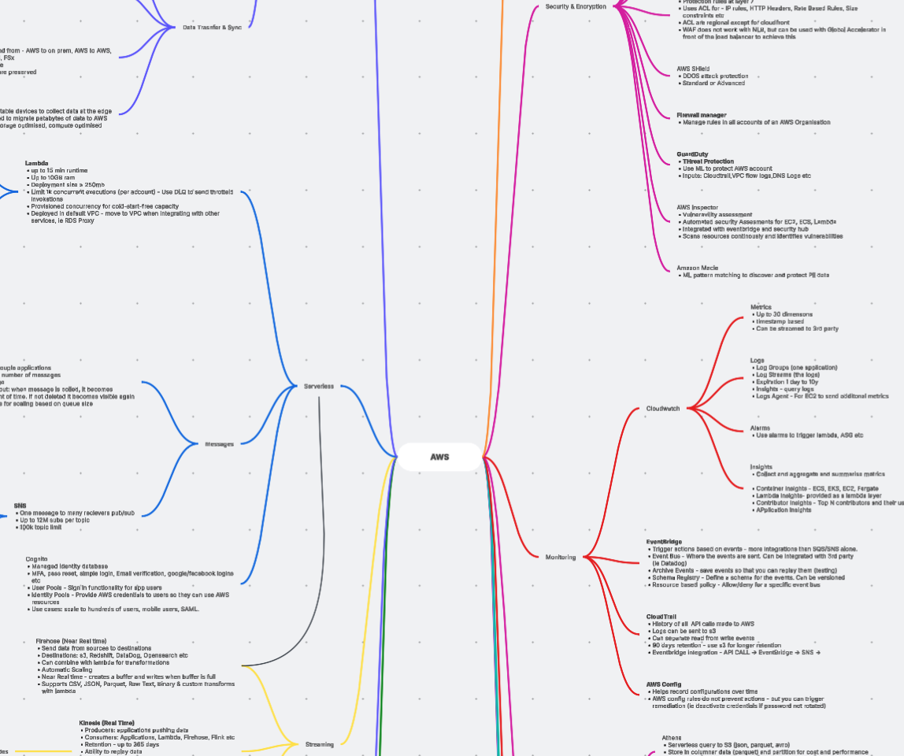

I recently passed the AWS Solutions Architect Associate exam with a score of 848.

This certification covers a wide range of AWS services which has taken a good amount of work and effort to prepare.

In this blog post I wanted to share my experience preparing for the exam, sharing some info about the exam, and what has worked for me.

## Preparation

I have about five years of on-and-off AWS experience, mostly with RDS, CloudFormation, Lambda, EC2 and a few other services.

To prepare, I took the well-known course by **Stephane Maarek**. It’s long (about 27 hours) and covers a huge amount of content, touching almost every service that may appear on the exam.

I studied for roughly a month, some days an hour or less, other days a few hours.

At first I took notes on every service and even drew a mind map of the services that could appear in the exam.

This helped me separate the unfamiliar services, since a lot of the names started to mix up in my head (Shield, GuardDuty, Config, etc).

The real key is to do hands-on practice if you can. That’s the only way things stick long term, and where you learn about the little details of each service.

I once read a quote along the lines of *If I can’t implement it, I don’t understand it*, which I try to live by.

Of course, there are some things you won't implement in your personal AWS account. VPNs or AWS Organizations, for example, aren’t things you easily spin up and then delete.

That’s why I also took the practice exams course from Udemy, which includes five mock tests. In my case, I have access to Udemy via my work, so I could access the exams at no extra cost, but I'd say its worth the money to ensure you are ready for the exam.

I failed the first test with 60% score, but I passed the rest with an average of 80% after that. That made me feel confident that I was ready for the exam. For every wrong answer, I would review the docs to fill in knowledge gaps. A single wrong questions could sometimes takes a few hours of research into a single service.

The exam can test for small details that may not be covered in the main course, and this is where the mock exams truly help. 

## Exam day

You check in about 30 minutes before the exam. The process can take around 20 minutes, especially if you don’t already have the secure browser installed.

You’re recorded for the whole session and you must show photos of your desk and room. Unlike the Kubernetes exam, books can stay if they’re out of reach. I even had my dogs walking around the room with no issues.

The exam has **65 questions in 130 minutes**. You’ll see both multiple-choice and multiple-response questions. You can flag questions and return later. I either knew the answer or not, so for those that I did not know I trusted my gut and moved on. I was so mentally exhausted by the end that I did not think reviewing tricky questions would be of any use.

The passing score is 720/1000.

## Exam Topics

Some of the topics that came up in the exam. This is not an exhaustive list:

- **Recycle Bin**
- **AWS Backup**  
- **AWS Elastic Disaster Recovery (DRS)**  
- **VPC Endpoints** (Interface vs Gateway)  
- **EC2, EC2 Auto Scaling, and ALB**  
- **EBS** volume types and choices  
- **CloudFront + S3**
- **Global Accelerator**
- **Kinesis family, SQS, SNS, Firehose, Athena**  
- **S3 + KMS**: SSE-KMS and **S3 Bucket Keys**  
- **S3 replication**  
- **EFS and FSx** (FSx for lustre integrates with S3)
- **Cross-account EFS access**  
- **RDS, Aurora, and migrations**  
- **WAF, AWS Config, GuardDuty**  
- **AWS Organizations and SCPs**  
- **Resource-based vs identity-based policies**  
- **Troubleshooting IAM policies**  
- **Amazon Cognito**  
- **Recovery Point Objective (RPO) and Recovery Time Objective (RTO)** (at least 2 questions)

## Is the certification worth it?

Only if you want it to be.

Some people pass the certification without ever having touched AWS. It may look good on a CV, but that alone might not bring you many practical benefits.

If you already use AWS it can be very valuable. You will get the chance to look into services that you may have used in the past, but have not explored in detail, and you may find functionality or features you were not aware of. You may also learn about services you did not even know existed.

Thanks to preparing this certification I feel more confident about designing systems in AWS. I am aware about the different services and their features that can be used to solve different problems.

## What’s next?

Preparing for this exam has been intense. There is a huge amount of content to cover, but since the knowledge is fresh, it would be silly not to attempt the Architect Professional certification next. That’s the plan, though I’ll see how it goes.  

If you are considering this certification, feel free to message me on [LinkedIn](https://www.linkedin.com/in/lopezsantoripablo/) and I’ll be happy to answer questions.  

Have a nice day!  
