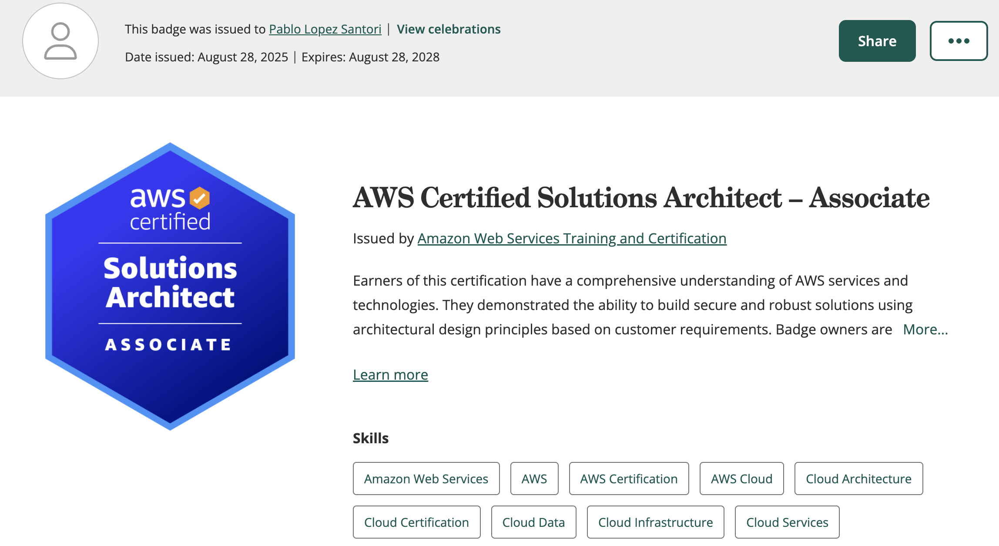

I recently passed the AWS Architect Associate Exam with a score of 848! This certification is tricky and covers a wide range of AWS services, so I wanted to share my experience preparing for it.  

## Preparation

I have about 5 years of on-and-off experience with AWS, mostly with RDS, Cloudformation, Lambda, EC2 and a few other services.  

To prepare, I took the well-known course by Stephane Mareek. It is a long course, around 27 hours, and it covers a huge amount of content. The course touches on almost every service that may appear in the exam. I definitely recommend going through it because I discovered services I had never used before, and for others I only knew some features but not all.  

Preparation took me about a month. Some days I studied for an hour or less, and other days I spent a few hours.  

At first, I took notes on every service and even drew a mind map of all AWS services covered in the exam.  

  

This was a nice way to start, because otherwise all the unfamiliar services blurred together in your head (shield, guarduty, config etc) 

The real key, though, is hands-on practice. Try the services yourself if you can. That’s the only way things will stick long term. 

I once read a quote along the lines of: *If I can’t implement it, I don’t understand it*, which I truly live by. 

Of course, not everything can be tested in a personal AWS account. Services like VPNs or AWS Organisations aren’t the kind of thing you spin up casually.  

That’s why I recommend also getting the practice exams course on udemy, which comes with five mock exams similar in difficulty to the real one. Going through wrong answers helps spot gaps in your knowledge, which then you can fill in by reading the documentation.  

The exam will often test you on fine details like [KMS keys at bucket or object level](https://docs.aws.amazon.com/AmazonS3/latest/userguide/bucket-key.html), which the main course might not cover.  

## Exam day

You need to check in about 30 minutes before the exam. The process itself can take 20 minutes or more, especially if you don’t already have the secure browser installed.  

You will be recorded for the entire session, and you must show photos of your desk and room. Thankfully, unlike the Kubernetes exam, you don’t need to remove books from the room as long as they are out of reach. I even had my dogs walking around while I sat the exam without any issues.  

The exam is 65 multiple choice questions. Some are harder than others; in my case, the first half felt tougher than the second. You can flag questions and return to them later. In my case, I either knew the question or not, so for those that I did not know I trusted my gut at the time with a guess and moved on. I did not go back to any of the flagged questions.

The exam lasts 2 hours 10 minutes, but you’ll likely finish earlier. I finished with 30 minutes to spare. The passing score is 72/100.

## Exam topics

Here are some of the topics that appeared in the exam. This is not a full list:  

- AWS Recycle Bin for accidental deletes and retention  
- AWS Backups  
- Elastic Disaster Recovery  
- VPC Endpoints (Interface vs Gateway)  
- EC2, ASG, and ALBs  
- EBS (choosing the right option)  
- CloudFront and S3 Buckets (use OAC)  
- Global Accelerator (for UDP connections)  
- Kinesis, SQS, SNS, Firehose, Athena  
- S3 and KMS Keys (Bucket Keys, Object Keys)  
- S3 Replication  
- EFS and Lustre (EFS to S3 access)  
- Cross-Account EFS access  
- RDS, Aurora and database migrations  
- WAF, AWS Config, GuardDuty  
- AWS Organisations and SCPs  
- Resource-based vs IAM-based Policies  
- Troubleshooting IAM Policies  
- Cognito  
- PTR and OTR questions (at least two)  

## Is the certification worth it?

Only if you want it to be.  

Some people pass the certification without ever having used AWS. While it may look good on a CV, I don’t think that alone brings many practical benefits.  

If you already have hands-on AWS experience, then it can be very valuable. For me, it helped fill a lot of gaps when thinking about end to end architectures, such as soldifying knowledge in DNS and Caching data at the edge, autoscaling and availability for EC2 and RDS, or security for S3.

Plus I got to learn about a bunch of new cool services such as Amazon Database Migration Service or DynamoDB Accelerator (DAX).

Thanks to preparing for the exam, I explored services in depth that I would not otherwise have touched. I now feel more confident designing end-to-end AWS architectures for different use cases.  

## What’s next?

Preparing for this exam has been intense. There is a huge amount of content to cover. But since the knowledge is fresh, it would be silly not to attempt the Architect Professional certification next. That’s the plan, though I’ll see how it goes.  

If you are considering this certification, feel free to message me on [LinkedIn](https://www.linkedin.com/in/lopezsantoripablo/) and I’ll be happy to answer questions.  

Have a nice day!  
