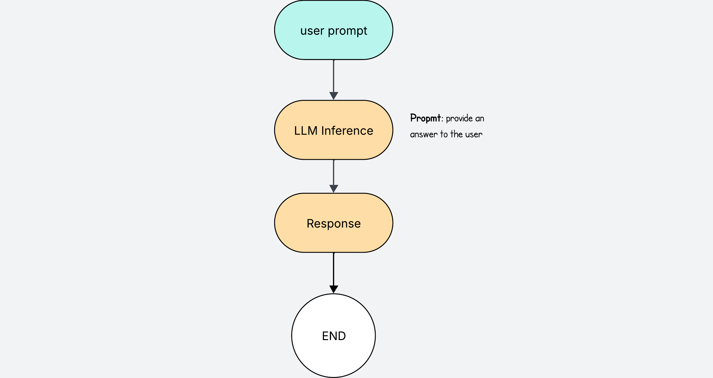
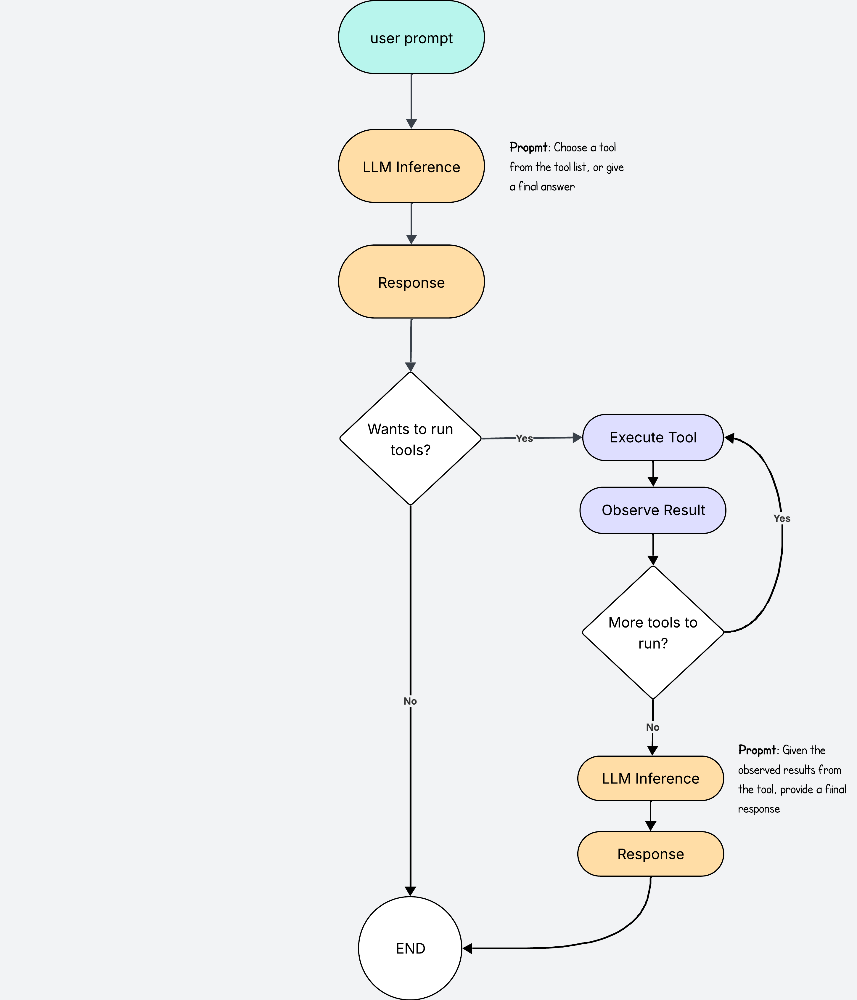
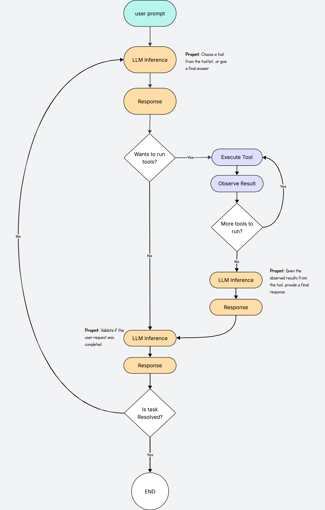
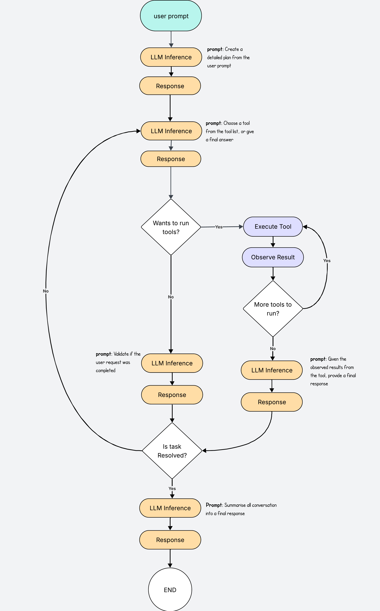

After having ignored the agent hype for quite a while, I was starting to get that inevitable feeling of being left out.

I recently came across [this blog post](https://ghuntley.com/agent/) which walks through the basic flow of an agent, and it inspired me to build my own.  

This post is walks through the steps to convert an LLM into an agent.

At the end I share an example of a Software Engineering Agent that uses the workflows described in this post.

## The LLM

Lets start with a simple LLM workflow. This will be our starting point.




The user writes a prompt, and the LLM returns a response.

We are already very familiar with this, we all use chatgpt everyday. Next.

## Accessing Tools

What makes an LLM tuly useful is when it can do things on its own.

It is very annoying having to copy the contents of a file, and ask ChatGPT to generate some tests for that file. Then we have to copy the code response, and manually create a file in our project.

It is much better if the LLM can do that directly for us. We can give the LLM access to tool for this.




The way it works is that you define a set of actions in your program that the LLM can execute. Lets say for example we are building a coding agent. We can create 2 actions to read and to write files.

In python it may look like this.

```python
# Define some simple tools
def read_file(path: str) -> str:
    """Read the contents of a file"""
    with open(path, "r") as f:
        return f.read()

def write_file(path: str, content: str) -> None:
    """Write some content to a file"""
    with open(path, "w") as f:
        f.write(content)

# Register tools in a dictionary so the agent can call them
TOOLS = {
    "read_file": read_file,
    "write_file": write_file,
}
user_prompt = "Write unit tests for search.py"
instructions = f"""
    You are a software engineering agent.
    When you need a tool, choose one of the provided tools.
    When you can answer, reply in plain text.
    Be decisive, keep steps minimal, and ground answers in observed tool results.

    Your goal is to answer the user prompt 
        {user_propmt}

    The available tools are
        {TOOLS}
""""

response = LLM.chat(instructions)

if wants_to_run_tools(response)
    response = ... # run tool

print("Final answer from LLM:", response)
```

And with this you already have a useful LLM that can independently choose any of the tools available to run all sorts of actions on its own. Goodbye copy/paste.

## Adding a Validation Loop

The thing is, that agents get it wrong all the time.

The best thing we can do is add a validation step before we send the final response to the user. We want to check if the LLM actually accomplished the goal set by the user propmt.

If we skip this step, it is very likely that the agent will do some of the work, and forget to do the rest, giving the user an incomplete response.

To do the validation, we take the final answer candidate, and make a new LLM call passing the original user prompt and all the tool observations (files read, files created etc.)



Now, before sending a final response to the user, we check if the task has been completed. If not, we start the process all over again.

With the new loop, we need to make sure we log and save all the outputs from every state into memory, so that the agent can re-use the outputs of previous actions in follow up iterations.

And with this we have a fully functional LLM agent that can independently do tasks for us. For a coding agent we may want to give access to more tools other than read and write, such as file search, listing directories, terminal command exectution, and even internet search so it can search documentation. The world is your oister.

## Final Tweaks

We can add a few tweaks here and there to make the agent even more robust.

For example we may decide to add an additional LLM call at the beggining to turn the user prompt into a detailed propmt with a step by step plan. This plan will make the validation process better for the model by not only giving the next LLM a clue of what tools to use and in what order (ie list files first, read file next, write after), but also by making the validation more robust. During validation we check the model actions against a detailed list of TODOs to see if the task was accomplished or not.

Another nice tweak is to add an LLM call before the final response, when the answer has already been validated. This way the model can take a full view of the action history and summarise the outcome into a one nice final answer. If you don't this part, the agent may still have done the task, but you may get an ugly and unpolished final text answer.



Now we can see this in action. I have built a coding agent so I could understand this process better. I recommend you do the same!


In this demo, the agent is asked to create unit tests for a specific file. It first uses the read tool to open `search.py`, then sends the contents for validation. Validation means checking if the agent’s action actually solved the problem.

The validator is an LLM that compares the original prompt with the tool’s results. The first validation fails, so the process restarts with a new LLM call. With the contents of `search.py` now in context, the agent uses the write tool to generate the unit tests. The outputs are validated again; this time they pass, and the agent sends the final response to the user.

## Final Words

We have seen how to go from LLM to agent by adding a few simple steps.

It is quite simple to build your own agent, and you can use them for all sorts of things, although I yet have to find a decent use case of a custom agent that can improve my efficiency at work. But still, they are fun to play with.

You don't have to build agents from scratch like we have done in this post. You can use libraries like [pydantic ai](https://martinfowler.com/articles/build-own-coding-agent.html) that abstract a lot of this logic, so you can mainly focus on the tooling part.

I hope you found this educational, and hopefully I've encouraged you to build your own LLM agent.

See you next time!
