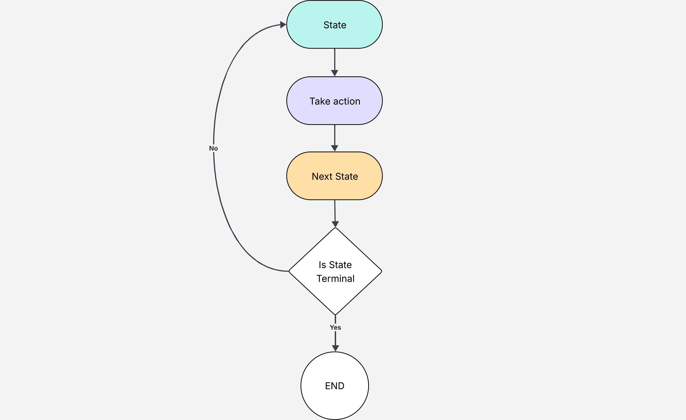
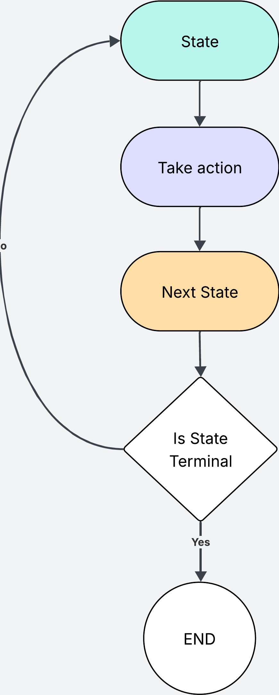

I recently came across [this blog post](https://ghuntley.com/agent/) which walks through the basic flow of an agent, and it inspired me to build my own.  

I had already [done some work with agents](https://pablolopezsantori.substack.com/p/q-learning-explained-through-billys) when learning reinforcement learning, so I wanted to see how LLM agents compare to the classic loop of state, action, next state, repeat.  

This post is an overview of what agents are, how they work, and how the same ideas show up in LLM agents today. At the end I share an example of a Software Engineering Agent I've built.  

## What is an agent?

An agent is something or someone taking actions within an environment. Usually trying to achieve a goal.

An agent could be your robot hoover, whose goal is to clean your livingroom (and getting stuck halfway)

An agent could also be a person, making choices in life towards the goal of finding the meaning of life.

Or an agent could simply be a computer program, like this elf, whose goal is to try and reach the present in the bottom right corner.

As you can see, an agent can be anything as long as you frame in the right way.
## How do agents work?

Lets take the elf as an example. This agent has been taken from the [Gymnasium library](https://gymnasium.farama.org/environments/toy_text/frozen_lake/), which offers a wide range of environments to make it easy to develop agents.

In very simple terms, agents are programs that need to achieve a goal. Agents live within an environment where they can execute a specific set of actions.

In this case, the elf would be the agent. It can only go up, down, left or right, and its goal is to reach the present at the very bottom.

A state is the position of the agent in the environment at a given point in time. In this case the initial state for the elf is the top right box.

Based on that state, the agent might decide to take an action. The agent will take into account its available actions, and its current state. Based on this, it chooses an action that will take it closer towards the goal.

Once it takes an action, it evaluatues its new state (its new position in the environment). It checks if the goal has been completed, and if not it continues until it completes the goal or dies along the way.

In this case, a terminal state can be when the elf reaches the present, or when it falls into a hole and dies. In the latter case the agent finishes the task without achieving its goal.

## Taking actions

Choosing the right actions is what makes a useful agent.

It is up to us to define how the agent behaves in the environment when it encounters different obsticles along the way. 

It is perfectly valid to create a rule-based agent or even an agent that takes actions at random. This may work for simpler environments like the frozen world, although it would not be very efficient.

For agents trying to navigate more complex environments, we need a better way to decide which actions to take. Think about building rule based logic for the Mars Rover to navigate the unknown surface of Mars. It can easily get out of hand.

This is where machine learning has come in very useful in the past decade. We can rely on *Neural Networks* to choose the right action for agents who need to navigate complex environments.

And this is where LLMs come into the picture.

## Building an agent with LLMs

LLMs are amazing at answering ambiguous questions, such as "Why did my girlfriend dump me?".

This feature also makes them great at solving ambigous goals such as "Write some unit tests for main.py", where we don't define which tests or even the location of main.py in the file system.

In the context of LLM agents, you can think of the user prompt as the *goal* the agent needs to achieve, and the LLM's answer as the *action* taken by the agent to attempt and achieve the *goal*.

To make the agent more useful, we can give it access to tools. For example, we can have a tool for writing files, that the LLM can use to perform edit, or delete actions on different files.

Finally, we can put this in a loop.

Every time the agent takes an action, we evaluate whether the agent has achieved its goal. If not we take a different action that will move us towards achieving this goal.

I've color coded each of the steps to what they correspond in the classic agent. As you can see the flow is pretty much the same, except we add LLM calls and tools into the mix.

In this flow, when the agent decides not to use any tools, we consider it a "final answer". We evaluate this answer to see if the goal has been achieved or not. And guess what, we can also use an LLM to do this evaluation.

## Tools and Actions

When talking about LLM agents, we talk a lot about tools. A tool is something the agent can use to execute an action.

Rather than limiting the LLM to a specific set of actions like our elf before, we give it access to tools and let it decide how to best use them to accomplish the goal.

In the same way you can use a hammer to hammer a nail or to kill a fly, the LLM can decide to use the internet search tool to look information in wikipedia or to search the latest gossip on Kim Kardashian. All depending on the end goal.

Depending on what you are building your agent for, you might decide to give it access to a different range of tools.

A tool is just a function I define in my code. For example, a read tool can simply be someting as simple as `def read(my_dir) -> os.listdir(my_dir)`. 

## Coding Agent Example

In the following example, I have created a Coding Agent that can independently write code. I gave it access to four tools to read, write, search and list files. 

In this demo, the agent is asked to create unit tests for a specific file. It first uses the read tool to open `search.py`, then sends the contents for validation. The validator is an LLM that compares the original prompt with the tool’s results. The first validation fails, so the process restarts with a new LLM call. With the contents of `search.py` now in context, the agent uses the write tool to generate the unit tests. The outputs are validated again; this time they pass, and the agent sends the final response to the user.

## Conclusion

I've been trying to avoid the agent hype for the last few months. Eventually I decided to give in, and build my own software engineering agent. I wanted to see how different LLM agents are to my concept of agents from the Reinforcement Learning days. As it turns out, it is pretty much the same thing, only that we add LLMs into the loop.

I have to say that it is pretty cool when you build something that is capable of taking actions independently to solve an ambigous propmt. And the best thing is that it is not difficult to build at all.

After all, all we are doing is an API call within a for loop.
