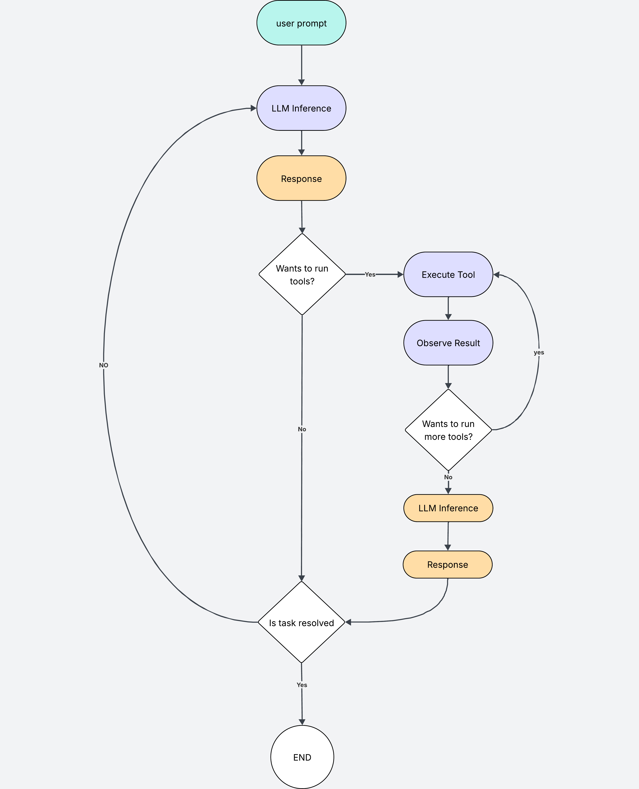

1. Intro
2. Agent workflow (for loop and choosing actions, check if terminal state)
2. Agents back in the day of reinforcement learning - workflow
4. Agents today - workflow
5. What is common and what has changed (conclusion)

## What Is an agent?

An agent is anything on anyone taking actions within an environment.

Usually trying to complete a goal.

An agent could be your robot hoover, whose goal is to clean your livingroom (and getting stuck halfway)

An agent could be a person, making choices to try and find the meaning of life

Or an agent could simply be a computer program, like this guy.

This guf is trying to reach the present without falling into the lake.

## How do agents work?

In very simple terms, an agent takes action within an environment. Every time it takes an action, it checks if it has accomplished its goal, and if it hasn't it continues.

Lets take a look at the elf in the frozen lake.

The agent is the little elf, whose goal is to get to the present at the bottom right corner.

The agent starts in an initial *state*, in this case, at the very top left of the map. A *state* is the position of the agent in the environment.

The agent acts within an environment, which is in this case it is a grid of 4x4.

In this environment the agent can take 4 *actions*, move up, down, left or right.

The basic loop looks something like this.

Every time the agent takes an action, it evaluates whether it has achieved its goal, and if not it continues to take more actions until it finally achieves its goal or dies along the way.

## Taking actions

This is where it gets interesting. It is up to us to define how the agent acts in the environment.

A very naive approach can be to get the agent to select an action randomly until it achieves its goal. However this will not only be inefficient, but it will not work for complex environments with more complex goals.

A better approach is to take an action by taking your current position in the environment. For example, if there is a hole in front of you, move right to avoid falling into it.

For this you can have rule based agents, which may work in some environments.

For more complex environments, machine learning models can come in handy.

And this is where LLMs come in.

## Building an agent with LLMs

LLMs can be used to create agents to solve non trivial tasks such as "*Add unit tests to my project*".

The agent flow remains pretty much the same, except we use an LLM to decide which actions to take and to evaluate whether the task has been completed.

Lets look at an updated diagram that we can use to build an agent.

In this case, the agent is the LLM, which has to take actions to achieve the goal defined in the user prompt.

The environmnent is your laptop, with its files, directories etc.

The actions available to the agent are those that you define within your program. For example, if we are building a software engineering agent, we could give it access to actions such as reading files, listing directories, searching files and writing files. You can add whichever actions you want.

It goes like this:
1. THe user writes a prompt. THis is basically the goal the agent needs to achieve. For example "*Write unit tests for my program*".
2. The prompt is passed to the LLM. THe LLM is aware of the available tools you have given it access to. It processes the prompt and returns a response. The response can be one of two:
    1. The LLM lists a list of tools that it wants to run to be able to achieve its task. To write some tests it may ask to run the read tool to read the files it needs to create tests for, and the list tool to know where it creates the new test files. 
    2. A final response. If the LLM does not want to use any tools, we can assume that the response is final.
3. If the LLM wants to use tools, your program goes ahead and executes them, it gathers all the information and feeds them back to the LLM so it can generate a response. Again, the LLM can choose to use more tools, or generate a final response. In this case, the LLM has not yet written the tests, so it may ask to write the test file now that it has the relevant info it needs. We repeat the process until the lLM generates a response that does not want to use more tools.
4. When we have a final response, we want to evaluate it agains the inital goal. Did the agent solve the task I originally asked for? We can also use an LLM for this.
