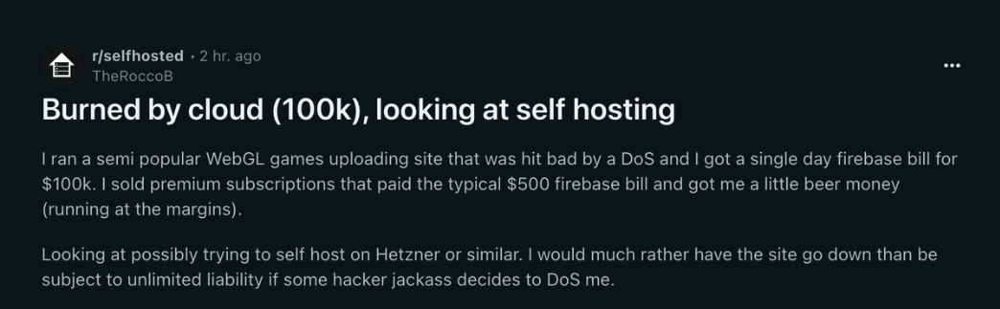
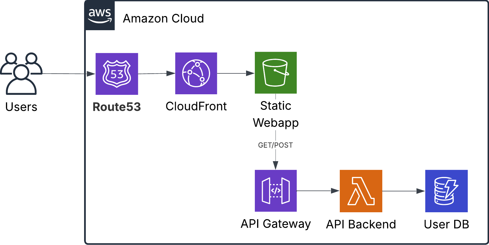

## Introduction

I was recently reading about some horror stories of developers running into insane bills on their serverless applications.

A few months ago I deployed a fully serverless web application for a hobby project. Looking back, I realised it could just as easily have been me staring at a six-figure bill at the end of the month. After reading some horror stories I decided that since I was not actively maintaining the app, to delete it and save myself some trouble. But this got me thinking about best practices to secure serverless applications in AWS.

One of the best things about serverless is how easy it is to get started. You don’t need to worry about infrastructure, scaling groups, or servers. You just deploy and go.

It’s also incredibly cheap for small projects or apps with low or inconsistent traffic. But there's a catch: the same flexibility that lets you pay almost nothing when traffic is low, can also bite you in the bum if traffic becomes suddenly very high, for example if a bad actor decides to do a DDoS attack. If you don't have the correct guardrails, you can endup bankrupt overnight.

In this post I walk through the serverless architecture I used for my app, sharing some best practices to keep costs predictable and the application safe.

## The application

I built a note taking app for career progress to keep track of every day career progress that you could easily refer to them later in time. In this application you could create, edit and delete notes. 

The webapp was created using React and hosted in an S3 bucket. The API logic to create notes was hosted in a lambda function, fronted by an API Gateway. For the database layer I used DynamoDB in serverless mode.

## Securing the components

In this section we take a look at each of the components, and see how we can secure them to prevent spending a lot of money when there is unusually high traffic, or when a bad actor tries a Denial of Service attack.

This is not the kind of post to read through in sequence, so feel free to scroll and jump up and down to find whatever may be relevant to your use cases.

### S3 Buckets

S3 is a very cheap way to host static websites or webapps, for example those you build with React. One thing that is easy to forget is that S3 charges you for egress costs. This means that every time someone accesses the website, you will pay for all the media that needs to be loaded in the user's browser. If you have larger files, like HD images, music or videos [this can get expensive very fast](https://old.reddit.com/r/webdev/comments/1b14bty/netlify_just_sent_me_a_104k_bill_for_a_simple/).

The easiest way to save yourself trouble is to cache any content that does not change very often, like static images or videos, and to block any direct traffic into your bucket that is not coming from your application.

[**Caching with CloudFront**](https://docs.aws.amazon.com/AmazonCloudFront/latest/DeveloperGuide/getting-started-secure-static-website-cloudformation-template.html): CloudFront caches content at edge in locations all over the world. Every request that CloudFront serves directly is one less request hitting your S3 bucket. This reduces S3 read costs and, more importantly, avoids unnecessary data transfer charges.

**Restrict Direct Access to S3**: Add an [Origin Access Control (OAC)](https://aws.amazon.com/blogs/networking-and-content-delivery/amazon-cloudfront-introduces-origin-access-control-oac/) to your bucket, so content can only be accessed via CloudFront. This prevents people from bypassing caching and hammering your bucket directly.

[**AWS Web Application Firewall**](https://docs.aws.amazon.com/AmazonCloudFront/latest/DeveloperGuide/distribution-web-awswaf.html): AWS WAF are a set of rules you add to protect CloudFront from unwanted traffic, such as blocking specific IPs. AWS has sets of predefined rules that are easy to setup and can come in handy.

### API Gateway

An API Gateway sits in front of your APIs and handles authentication, security, and routing, so you don’t need to build that logic into your application code. This separation makes microservices easier to maintain. AWS's API Gateway can be used as a first layer of security to protect your backend from unnecessary calls.

[**Enable Rate Limiting**](https://docs.aws.amazon.com/apigateway/latest/developerguide/api-gateway-request-throttling.html): Use API Gateway’s rate limiting features to stop anyone from spamming your API. With rate-limiting you can set a maximum number of calls that can be made to your API within a window of time, for example add a limit of 100 requests per second. Anything beyond that receives a 429 error. Rate-limiting can be set globally, per endpoint or per user.

[**Add Authentication**](https://docs.aws.amazon.com/apigateway/latest/developerguide/http-api-jwt-authorizer.html): Don’t expose your API to the entire internet without checks. At minimum, validate JWTs (e.g., Cognito, Auth0). This ensures requests come from valid clients that have authenticated to your application.

[**Use Caching**](https://docs.aws.amazon.com/apigateway/latest/developerguide/api-gateway-caching.html): Cache frequent read requests in API Gateway. If your data changes infrequently, set longer cache times so repeated calls are served at the gateway instead of hitting your backend.

[**Lock Down CORS**](https://docs.aws.amazon.com/apigateway/latest/developerguide/how-to-cors.html): Only allow requests from your known frontend domain(s). This prevents random websites from abusing your API in browser contexts.

[**AWS Web Application Firewall**](https://docs.aws.amazon.com/apigateway/latest/developerguide/apigateway-control-access-aws-waf.html): AWS WAF are a set of rules you add in front of your API Gateway to help you reduce unwanted traffic, such as blocking specific IPs. AWS has sets of predefined rules that are easy to setup and can come in handy.

### Lambda  

Lambda is the one service in AWS that can literally be squeezed anywhere and everywhere, and one of its many uses is that it can be used to power your AWS APIs. Lambda functions are charged per millisecond of execution time. 

[**Set Reserved Concurrency**](https://docs.aws.amazon.com/lambda/latest/dg/configuration-concurrency.html): You can configure reserved concurrency to cap the maximum number of concurrent executions, giving you predictable costs and preventing downstream services (like DynamoDB) from being overwhelmed. It also guarantees that other Lambda functions in your account still have room to run, even during heavy load.

[**Right-size your functions**](https://docs.aws.amazon.com/lambda/latest/operatorguide/computing-power.html): Allocate only as much cpu and memory as your function needs. More resources means higher cost.

[**Set execution timeouts**](https://docs.aws.amazon.com/lambda/latest/dg/configuration-timeout.html): Always set explicit timeouts to cut off functions that take longer than expected.  

### DynamoDB

DynamoDB is a low latency key value database for unstructured data. It comes with serverless and provisioned options. Serverless is the more expensive mode, but it comes at the benefit of out of the box autoscaling and not having to pay for provisioned infrastructure. The other side of the coin is that you run into higher cost when the traffic is high.

[**Use DAX for Caching**](https://docs.aws.amazon.com/amazondynamodb/latest/developerguide/DAX.html): Consider using DynamoDB Accelerator (DAX) to cache repeated read operations. By serving cached responses, you cut costs and improve latency.

[**Apply Resource-Based Policies**](https://docs.aws.amazon.com/amazondynamodb/latest/developerguide/access-control-resource-based.html): Restrict DynamoDB access to just your Lambda functions. This ensures nobody can hit your tables directly.

## Conclusion

Serverless is powerful because it lets you move fast without managing infrastructure. The tradeoff is that the same flexibility can lead to unpredictable costs if you do not set guardrails. 

If you are going to have a public facing application that uses a serverless in the infrastructure, it is a good idea to add these protections from the start, rather than discovering a surprising AWS bill.

If you want more real-world examples of what happens when these guardrails aren’t in place, check out [serverlesshorrors.com](https://serverlesshorrors.com/).

I don't know about you, but if I had an extra 100k to spare, I'd rather spend it on a [cool campervan](https://www.volkswagen-vans.co.uk/en/new-vehicles/california.html) than on a cloud bill.

