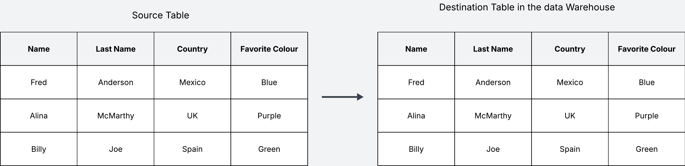
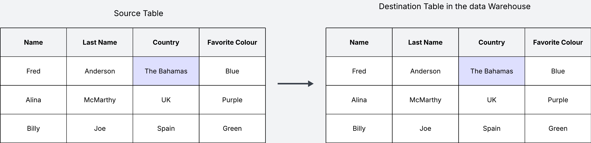
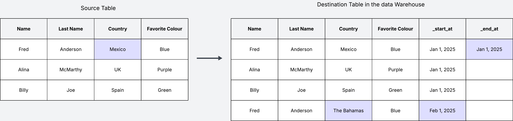
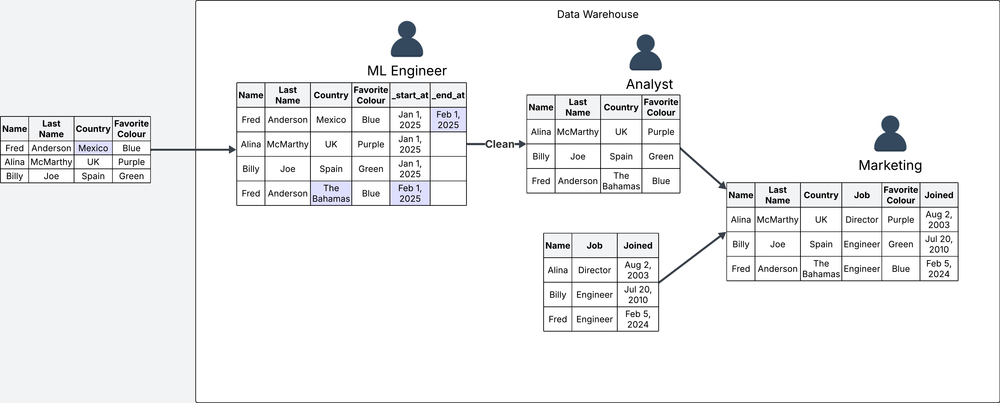

Slowly changing dimensions, what a confusing name. This is the sort of term I've been hearing for a while now, but never really bothered to properly look up what it actually means. As it turns out, all at it means is how you handle row updates/deletes in your data pipelines. Whether you decide to maintain historical data in your tables by appending new rows when a change happens, or you decide to update in place instead.

Over the last few weeks I've had to work on a migration project where I needed to create a data pipeline to move data from an outside system into the data warehouse. After working on the project for a few weeks, and once the pipeline was more or less in place, a new question came up. Do we want our data in the warehouse to keep a history of row changes? Or do we simply want to update any changes in place?

Let me illustrate with some visuals.

Let's say my source table keeps track of user information, their name, last name, country, address and favorite colour. When building the data pipeline to move this data, we create an exact copy of the source table in our warehouse.

But what happens when the data in the source updates? We have two options: we can update the table in the warehouse in place, which means we replace the old values with the new value; or for every change we can add a new row with the new changes, keeping the original row intact.

Let's see an example of implementing the first option, where we update in place. This is also known as the Slowly Changing Dimension of type 1 (SCD1). In this example, when the source table updates, we update the destination table in the warehouse in place as well.

The main disadvantage of this approach is that you don't keep track of the data history. We won't know that Fred Anderson used to live in Mexico, and now lives in the Bahamas. The question here is whether keeping track of this historical data makes sense for us. If this is not useful, then updating in place is absolutely fine.

On the other hand, if keeping track of history is important for us, we can do it by appending new changes rather than updating data in place. This is what is known as the Slowly Changing Dimension of type 2 (SCD2).

With this approach we append a new row every time there is an update in the source table. See how we have added two additional metadata columns `_start_at` and `_end_at`, which we need to keep track of when this change was introduced, and when it was "outdated" by a new change.

One of the biggest disadvantages of the history tracking approach (SCD2) is that our data will keep growing as long as there are new changes in the source table. If there are a lot of changes, the table in our warehuse will get large very fast, making it more expensive to maintain. On the other hand when we update in place instead, the table size will only be as large as the source table, but of course you lose all the history. These are the tradeoffs to keep in mind.

## Fictional Business Use Case

Let's make up some fake business use cases to illustrate the usefulness of history tracking. For this fake business use case, a company has built a pipeline to move data from an outside system that tracks user information into their data warehouse so they can use it to enhance their products. They have decided to enable history tracking.

For example, when the data lands in the warehouse, the analysts want to build some dashboards that show the geographic spread of their users. This might be useful for analyists to understand if there are any opportunities for refining the company products based on country. For this use case we don't care about history, so we create a new table where we remove any duplicates to keep only the latest records. 

You may be thinking, what's the point of keeping history if we are then removing it? The idea of the data warehouse is that data may serve multiple use cases down the line. For example, some months down the line, the machine learning team might want to build a model on this data, for which they need the full history to train their models. In this case they can access the raw data directly.

Finally, we may have some other use case, where the marketing team wants to see user information combined with other user data that is tracked in a different table in the warehouse. We can take the cleaned table that created for the analysts, and combine it with an existing table to create a final table ready for the marketing department to use.

These made up examples showcase how one table may support multiple use cases. More often than not, it is a good idea to enable history tracking on your tables to make sure you are not losing any data that may become useful in the future. After all, dumping large amounts of data is what the warehouse is for. But of course, everything depends on your specific use case. Just keep an eye on your S3 costs.
