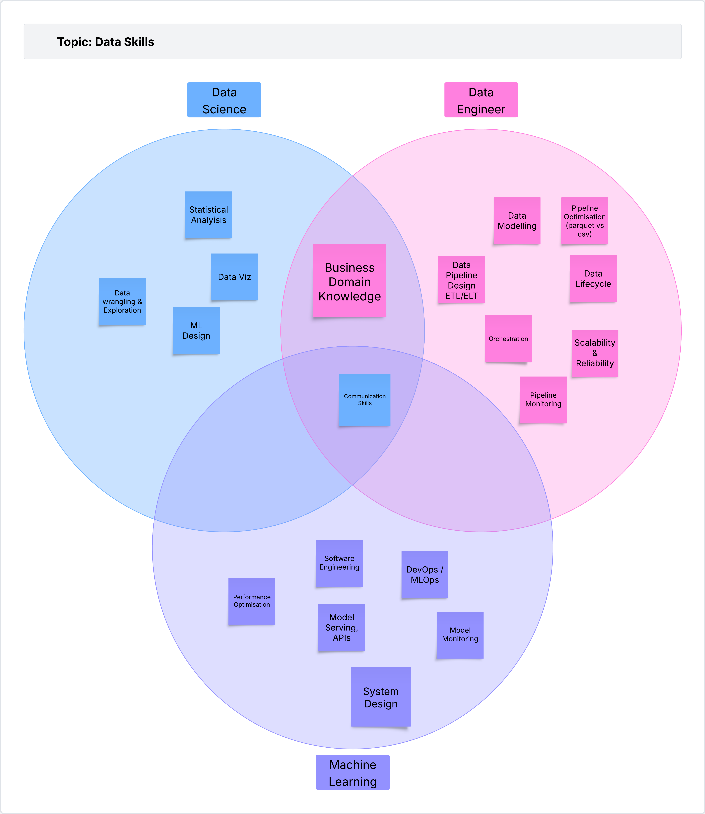
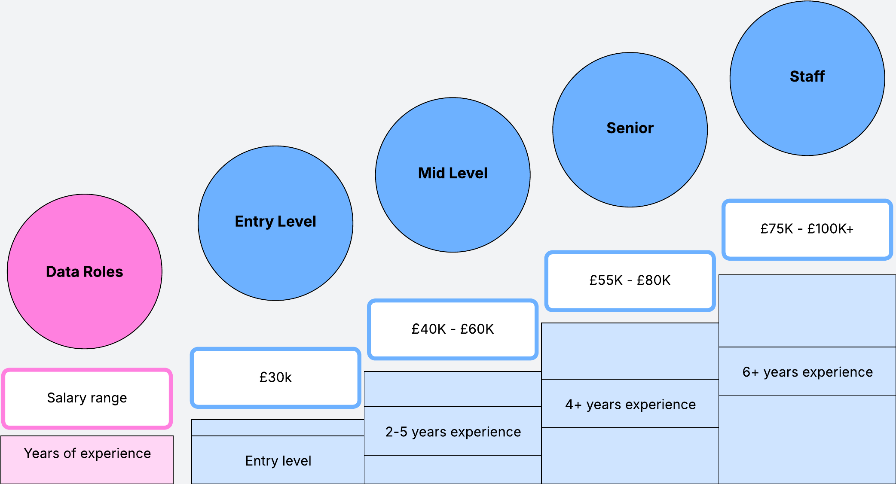

In this post I wanted to describe the different options if you are considering a data role. All of the information in this blog post is based on my own work experience working in different data roles over the last five years in Scotland. The goal is to help you get a better idea of the data landscape so you can make more informed decisions coming out of university and getting a job.

I am going to describe three of the main roles in Data: Data Science, Data Engineering and Machine Learning Engineering.

There are other roles that I won't be discussing such as Data Analyst, AI engineer and so on mainly because I don't have experience on those, so I wouldn't be able to give a legitimate description.

## Roles & Responsibilites

Let's start with a brief description for each of these roles to understand what each is responsible for.

### Data Engineers

Data Engineers are tasked with delivering data to stakeholders. They will ingest, load and transform raw data into usable data stakeholders can use. These stakeholders are usually other teams within the organisation which use this data in different ways, such as analytics (e.g. correlation between marketing campaigns and sales) or operational use cases (e.g. fraud detection).

**Example**: an e-commerce company has recently ran a marketing campaign for black friday which includes a range of their tech products. They want to know how many sales came from users clicking their marketing banners, and how many of these clicks derived into actual sales. The job of the data engineer is to build the pipelines to ingest the user data (users that clicked the banners, did they buy product or not etc) and ingest it into the data warehouse. In the data warehouse they need to build additional pipelines to clean the raw data into something usable, and to enrich it with other data sources to add business value. For example they can combine the user clicks with a table wich includes information about user profile so the stakeholders can have more context about the type of users who click on their marketing banners.


### Data Scientist

Data Scientists use machine learning models to get additional insights from data. They are data domain experts who understand the data they work with and use machine learning to support operational business use cases (e.g fraud detection, or recommendation engine). Their job is to work with raw datasets and build models that add business value.

**Example**: a consulting company in the construction industry uses satellite imagery to track construction activity. They get new images every day for different locations across the UK, which they use to track construction activity so they can consult their clients about different construction sites and their progress. THe data scientist is in charge of working with the satellite images to build a model that can detect construction activity in different estates, and identify the construction stage of each lot in the state (foundation stage, under construction or finished)

### Machine Learning Engineer

Machine learning engineers are software engineers whose job is to deploy and monitor machine learning models in production. They are in charge of productionalising the models created by the Data Scientists.

**Example**: The company wants to add a new section on their website which recommends registered users producs based on their purchase history. THe data science team has developed a model that uses the user purchase history to reccomend new products. The job of the machine learning team is to deploy this model to run once a day and store the reccomendations in a table. The have to build an API service that fetches the data from this table so it can be populated in the website for each user when they log in. THey need build monitoring and observability systems to ensure models are healthy and running.




## Tooling

I won't get into too much details about the different technologies required for each role because there are too many. When you are first starting in the data world focus on becoming good at python and the relevant libraries for each role (data viz, ml, data transforms etc). Depending on the role you may want to spend more time in developing some skills or others. Each of these skills might require developing expertise in different tooling.

The important part here, is that you will learn most of these as part of your job, and each company will use a different mix of tools and technologies. It is more important to know the fundamentals (ML model lifecycle; Data Warehousing; Model Training and Validation). If you master that then you will find many different tools that you can use achieve those.

If you really want to know specific tooling for each role you can simply ask ChatGPT and go from there.

## Career Progression

There are two main pathways for career progession which is standard across most tech companies: you can either stay in the individual contributor track, which means you always stay close to the tech; or you can go into the people managemnt route, which means your job becomes more about managing the team rather than hands on programming. Both options are great and whether you decide to go one way or another depends completely on you like most. To become a manager, you usually need to have some previous experience working as an individual contributor. These levels remain the same across different roles.


### Individual Contributor

As an individual contributor, as you progess in your career, you always stay close to the technology. When you first start in your career you spend most of your time completing programming tasks. As you move up in your career you start being more involved in strategic planning and having more impact across multiple teams.

As an individual contributor your progression usually goes like this:

```
junior -> mid level -> senior -> staff -> principal
```

The levels and names change for different companies, but the responsabilities usually remain the same.

A junior developer is someone with no previous work experience. They need mentoring from more senior engineers to be able to complete their work.

A mid level develper usually has at least two years of experience. They are more or less independent, meaning they can complete their work without much help, but they still need mentoring from more senior members for some tasks.

A senior developer can work independently and will usually mentor less experienced developers in the team. They are able to lead bigger projects and make technical decisions. A senior developer usually has at least four to five years experience.

A staff engineer is an experienced developer whose work impacts not just the team, but potentially other teams in the organisation. Staff engineers are more involved in shaping the roadmap of work the team's going to be focusing on. Becoming a staff engineer does not necessarily need to be more knowledgable than a senior engineer (although a lot of the times they are), but rather it is more about delivering projects that have a broader impact in the organisation.

#### Pay for Individual Contributors


In terms of pay, this is a rough guide of what Data professionals can expect (as of 2025/2026) in Scotland.




### People management

I don't have that much experience here, so I won't be commenting as much. A manager's job is to work with their team to ensure they deliver the work. A manager's role is more about working with the different stakeholders in the company to understand the work that needs done, and translating those requirements into technical tasks that the team can deliver. A manager works with a mix of engineers (junior, senior, staff etc), and is also in charge of ensuring the team remains motivated and consistenly delivering the work.

To become a manager you usually need to have some technical knowledge which usually comes from having worked as an engineer in the past, although this is not always the case. In some companies, an mid-level engineer might choose to become a manager rather than a senior engineer if the opportunity comes. In other cases people go into management whithout previous hands on programming experience, but with enough knowledge for them to be able to work with the team and understand the work.

When you go the management route you have a little bit more room for growth, and how much you can grow depends on the type and size of your company. An example career progression for a manager can be manager, senior manager, director, senior director, vice president, senior vice president, CTO.


## Final tips

The data landscape has changed a lot since I first started. With the arrival of AI models into the workplace the ways we work have changed considerably. Now we rely on LLMs for so many tasks during our day to day by helping us write documents or assisting with generating code.

I get the impression that at the moment there is a slight decrease in hiring junior developers because there is a but uncertainty about much value they bring to the team, now that we have all of these AI tools. Companies are also worried that junior developers will blindly use AI without really understanding the code behind it, risking introducing security issues, bugs, and creating bloated code.

Organisations are spending a lot of money in making these AI tools available for developers, which means they really want you to use them. But at the same time they expect you to be knowledgable and responsible for any generated AI code.

I believe that if you are a junior developer today, you need to embrace AI tools as a key skill to be competitive in the job market, but you need to know how to use them responsibly. You need to be able to show maturity of how you use AI: learn the times when it is okay to copy/paste vs when deeper understanding is required; use it to learn faster, to increase your understanding, to make you more competent. 

When you go to an interview show that you can embrace AI tools to make you more productive, but also be sure that you show you know what you are talking about, and you understand the boundaries when using AI.


----


Ideas

- Remote Roles vs In-Person vs Hybrid
- Jobs - Glasgow & Edinburgh manily
