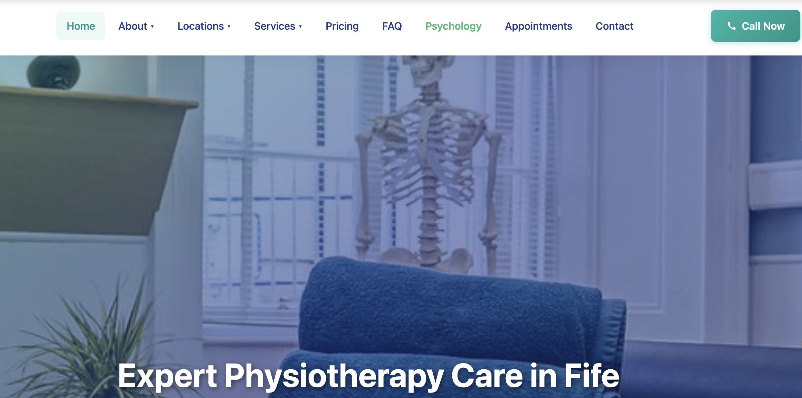

This is the story of how I overengineered a software project because I made the wrong assumptions too early. This was originally going to be a success story of how I managed to rescue my friend's website from his web developer who was keeping it hostage. I was going to write about how I used AI to rewrite a whole website in a day, despite me not being a web developer. In the end, I realised I could have done this in 20 minutes, rather than taking a full day.

----
The story begins when we went to my neighbours house, for our kids to play together. My neighbour owns a physiotherapy business, and my wife had recently visited his practice to see an acupuncture specialist. I told him that I was peeking at my wife's phone when she was browsing the business website, and that I thought it looked a buggy and not as good as it could be, especially the mobile version. I'm not an expert web developer by any means, but even I know that these days you should design websites thinking mobile first, because that's what most people will use to book their appointments.

He then told me he was having issues with the web developer who built and maintains his website. He told me that he wanted access to the website code, because he was thinking of potentially using another web developer who was more reliable or even migrating his website to a wordpress that he could easily manage. However, the web developer didn't want to give him access to the code artifacts, he was essentially holding it hostage so he could keep his monthly maintenance fee.

I told him that, although I'm not a professional web developer, I know my way around web development, and that I could take a look for him. I thought that with AI coding agents, it could not be too hard to make a copy of the website so that he could own the code.

When I mentioned the word "AI", he said that the guy who had created his website had told him that he had used his own "AI platform to build it". I then got the feeling, that this developer was building a marketing campaign around what probably was him simply using AI coding agents, with the goal of trying to impress his clients. This already raised some alarms in my head, and made me instantly doubt this developer.

I had already formed some ideas in my head that this website was going to be using some complex and weird frameworks (even though I hadn't looked at it yet), and that the best way forward was probably going to be to build it from scratch with the help of AI.

The next day, I went and had a look at his site. It seemed like a simple static website, with a bunch of HTML pages and no complex logic anywhere beyond your typical hamburger menu in the navigation section. So I decided to give it a go. I could see from 100 miles away that the dev had indeed used AI to create the website. I could tell by the shape of the cards, emojis, font colors in titles etc. The idea that this website was going to be a mess was becoming stronger and stronger in my head.

 Making these assumptions early on, without any proof, was going to be my downfall, but I'm getting ahead of myself.

## The Requirements

The requirements for this project were simple

1. Create a clone of the website. The copy should look as similar to the original. If we were to swap them a returning customer should feel like they have landed on the same site.
2. Create a clean repo structure that can easily be picked up by any developer that has landed on it.
3. No frameworks. Plain HTML + CSS + JavaScript so we would not need to worry about library updates in the years to come.
4. All the links, media and everything else should work as per the original site.
5. Make the site is mobile first. Ensure the mobile version looks good since that's what most people will use.

## The Setup

I decided to use Claude Code combined with the [agent skills](https://github.com/addyosmani/agent-skills) framework. I have previous experience working with a [spec driven development lifecycle](https://www.ibm.com/think/topics/spec-driven-development), and I know this would be the best way to approach a project like this.

With Spec Driven Development, I could define the requirements and expected outcomes and leave the AI to plan and lead the implementation phase.



## Getting started

The first thing I wanted to do was to download the original website locally so I could use it as reference. My plan was to run it locally and let the coding agent reference the content and styles to make the new clone look exactly the same.

The command that claude suggested to clone the site was this. I asked it to run it for me and run the website in localhost.

```shell
  wget --mirror --convert-links --adjust-extension --page-requisites --no-parent https://example.com
```

Once it downloaded, I had a quick look at the files. To be honest, I spent less than 5 seconds looking at the list. I could see a bunch of HTML stuff and png files with random names, all flat in the directory. I had already decided that rebuilding the whole thing was the best way forward, and with AI it would not be too much upheaval.


```shell
home-physio.html
Homehero.jpeg
index.html
joint-mobilisation.html
lisa.html
locations.html
manipulation.html
manual-therapy.html
massage-therapy.html
MBM00268.jpeg
opc1.jpeg
opc2.jpeg
opc3.jpeg
Pic_placeholder.png
post-op-rehab.html
pricing.html
privacy-policy.html
psychologist-writing-his-notebook copy.jpg
psychology-reviews.html
psychology.html
...
```

I checked my local server, and I could see that the website was running locally, so I was ready to migrate.

## Building the Website

I got started. I opened claude code in the terminal and fired up the agent skills framework.


I started using the `/interview-me` skill to set the original requirements. I have to say, whoever came up with this idea is a genius. This skill will ask you questions about what you want to build until it has enough confidence that it's got enough detail of all the specs. If you combine this skill with your microphone to narrate your answers, it makes for a pretty sweet workflow.

Within 5 minutes I had all of the requirements defined. So I moved on to generate the specification file - containing all the requirements in writing - by using the `/spec` skill.

The `spec.md` file gathered all of the HTML files that we needed to create, 32 in total, one for each page in the website. It also contained a list of all the external links that needed to be preserved, such as the booking links handled by 3rd party services.

The generated `spec.md` document was quite long, as it is normally the case with AI generated documents, so without going too much into detail, I checked that everything in there more or less made sense. After I was sure everything was in order, I moved on to the planning phase.

The plan phase consists on using the `/plan` skill, which creates a breakdown of the tasks to complete the whole project. In the plan you can also specify any tech choices you want to follow. In my case I made sure no frameworks were getting used. I wanted a simple HTML/CSS/Javascript site that needed little maintenance and could easily be handed over to any web developer.

The `plan.md` document had 7 steps to build the whole thing incrementally. It would start with the landing page and the base styles. Once that was correct it would go on to build the rest of the site, re-using styles from the first step. This looked good to me, so I asked claude code to start building the website.

## Human in the loop

I first let claude do its own thing, and it cracked on for 10 minutes setting things up. I was using the sonnet 4.7, which I believe is quite a good model, so I was filled with confidence that I was going to get it right in one shot. After all I'd specified in the spec that it should use the downloaded website as guide. The definition of done was that everything had to look exactly the same as the original.

When I first opened the first draft to check the nav bar and styles, it was all a mess. The nav bar was showing some of the options without anyone hovering on them, and the options were overlapping each other. Claude Code was obviously ignoring my instructions, or at least, it wasn't properly checking the final result. So I started manually providing some screenshots of the issues I was seeing and asking claude to fix it.


As you can imagine, this was a lot of work for something the AI should probably be able to do itself. After having provided 20 different screenshots, I decided that it was enough. I explicitly asked Claude Code to take screenshots of the website to validate its own code.

Turns out that's all that was needed, somehow Claude got hold of the screenshot tool provided by macBook, and it used it to grab screenshots and self evaluating the final website results. From here on the results were much better and consistent with the original website.

 

I still had to do a lot of manual approval of the random scripts (because I'm too much of a coward to run `--dangerously-skip-permissions`). But I could do this while focusing on other stuff, so I didn't mind it too much.

## Final Refinements

It took a whole day to finish the website and have it in a reasonable state. The website looked more or less the same as the original, with some differences here and there. The biggest issue was that for some of the pages it had ignored the original and it had "hallucinated" its own page structure and content. Towards the end, I had to go through each page and compare it to the original, and specifically tell claude what things needed fixed.

The morning of the following day I had finished the clone of the website. Everything was looking well on both web and mobile versions, almost exactly the same as the original, with minor improvements here and there.


## I Could Have Saved Myself 95% of the work

The website was finished. Like with many AI Developed projects, I hadn't spent the time going through the generated files. I simply assumed that claude was staying true to the original specs. At the end, I had a bunch of HTML files, a single CSS file and a javascript file. Just what I expected.

I hosted the site in github pages and shared it with my neighbour. He was really impressed and also pleased to be able to own the code to his business website.

I thought this story would make a great blog post. In my head, I was imagining this sort of story _"How I become a professional web developer, even though I'm not a web developer, thanks to the help of AI"_

As I started writing the blog, it occurred to me that I hadn't really checked the original files. What was wrong with them in the first place? Why did I need a full rebuild? How different was the final outcome to the original stuff?

Upon checking the original files using the `ls` command, they looked surprisingly similar to my "cloned" version. A bunch of HTML files, one for each page and some image files. I opened the HTML files for the original website, and the main difference between the clone and the original is that the original baked all of the CSS and javascript inside each HTML file. Other than that, the content of the HTML files are pretty much the same.

The main improvements from my version is that I re-organised the images into an `assets` folder, and I created some re-usable CSS styles. I then realise, I could have asked claude to take the copy of the original website, and simply re-organise the file structure to the structure I wanted, and also to extract some of the CSS and javascript into re-usable styles that could be used across files.

More importantly, none of the "improvements" I made were that relevant. I could have simply taken the downloaded files from the original, and deploy that directly and shared the files with my neighbour to do with them whatever he wanted. That would have saved me 95% of the work and would have taken 20 minutes instead of a day and a bit.

I could have done this project with no AI involved at all.


## Final thoughts

I have to say, this has been an slightly embarrassing story to share. As an experienced professional I thought I was above making mistakes like this. I let my assumptions take the better of me leading me to choose the wrong the approach to solve the problem. I let my assumptions guide me rather than using empirical evidence.

Looking back, I can see the main factors leading me to choosing the "wrong" approach was that I have some negative connotations about AI usage, even though I use AI agents heavily myself. I prematurely reached the conclusion that because the AI had originally been used to build the website, it would not be salvageable, and it would need to be started from scratch.

In the end, the outcome wasn't too bad. Yes, it took me much longer to complete the project, but using AI made the whole thing pretty much effortless. The main downside is time "wasted" and tokens spent, that could have otherwise been saved.

This experience is also a good reminder to keep our assumptions in check. As new technology emerges and we learn to use the new tools, it is important to stick to the foundations, and follow good processes for project planning and definition. AI will follow along with anything you ask it to do, but it is up to ourselves as developers to define the correct processes, even before starting to write a specifications file.

We need to ensure we continue to collaborate in our teams, to ensure we identify the right approach to problems early on. AI simply follows your direction without questioning. Good engineering practices are more than simply writing code or defining architecture diagrams.

I'll end with a quote, which after reflecting on this experience, I can't get out of my head:

> _If all you have is a hammer, everything looks like a nail_
>
> -- [Maslow's hammer](https://en.wikipedia.org/wiki/Law_of_the_instrument)


