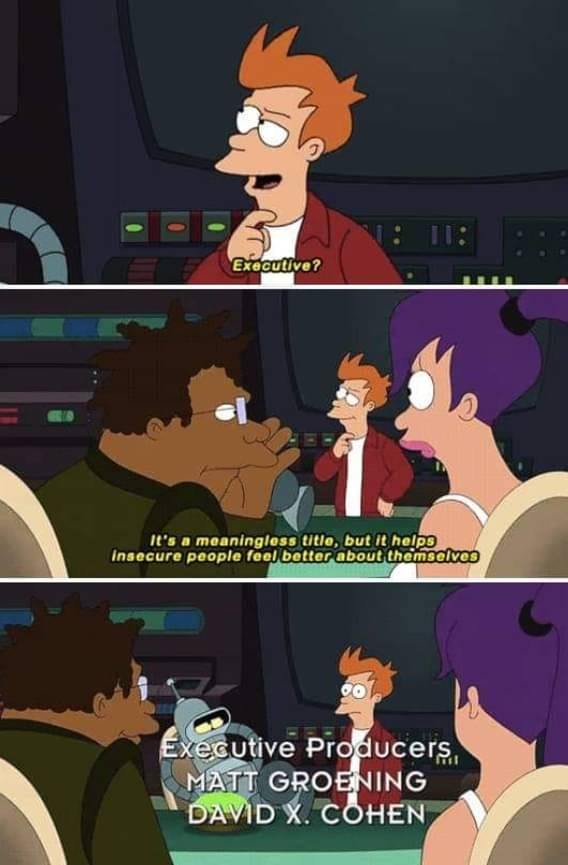

This is my story of how I went from non-tech into becoming a Machine Learning Engineer. I must have told this story multiple times in many different forms, but this will be the first time it goes into writing. Enjoy.

I have a bachelor’s degree in Commerce. I found the last few years of school so exhausting that the thought of doing an engineering degree put me off. Four + years of no life? Oft, no thanks. I also thought I wasn’t smart enough to do engineering anyway so instead I chose Commerce - which “coincidentally” was the same degree my brother was doing.

Right after finishing uni I landed my first job as a Sales Executive in Lisbon - which is just fancy wording for “phone sales”. Despite working with the best possible people, this job made me the most miserable I’ve ever been in my life, so after 7 months I quit.

A few months down the line I interviewed for a graduate scheme in a bank. The job consisted on working on different branches of the bank across Madrid for a couple years and then move up the career ladder until I become some sort of director after a few years of hard work. The thought of working on a bank offering people mortgages almost made me want to die. So while they were processing my paperwork I moved to Scotland which gave me a great excuse to reject the offer when it finally came: “I no longer in in the country sorry”.

On my second day in Scotland I got a job as a Kitchen Porter. I handed my CV with my fancy degree and my fancy sales experience to the head chef, and I was hired in the spot. I felt very proud of myself.

After a couple months - and because of some confusion when changing head chefs - I was promoted to Chef and I worked in the starters section. Now let me tell you, this was hard work. I would always forget that my bread burning in grill while I was doing other stuff. Despite the hard work and the crazy hours I really enjoyed the mentoring from the head chef, who showed infinite patience with me and taught me how to make food with finesse.

While my gig as a chef was going on, I had already got interested in programming. What started with opening the console to hack candybox2 to get more candy, evolved into an interest for web development. I started learning javascript from youtube and moved on to learning React and Node.js from Udemy. What helped the most was building stuff as I was learning, like building a flappy bird game or coursesearch.net which was my attempt at a search engine to find free online courses.

After about a year, I came across a free course on Deep Learning with Pytorch from Udacity. This was my first ever contact with python and machine learning and it blew my mind. Even though I had to dig back to my high school maths to get through concepts like Cross Entropy Loss and Gradient Descent it made me realise that you don’t need an engineering background - although it probably helps - to get into this field, all it really takes is some passion and practice.

I kept learning AI using online resources, and paid for my first ever AI bootcamp for a more in depth course - which taught me about classical ML - such as regression or random forests and also other Deep Learning topics such as LSTMs or Reinforcement Learning. My favourite project out this course was building a reinforcement learning agent that learned how to balance a pole in a cart.

After a couple of years of self learning AI and web dev, I started looking for jobs. However it was very tricky to land any dev job without an engineering degree. I nearly managed to get a summer internship as a ruby engineer, but got rejected in the last round.

So decided to pursue some formal education.

I first tried going to college which kinda sucked. Later, I found out that because of my bachelor’s degree I was elegible for a Master’s degree. So I went shopping for any AI related degrees and found an AI MsC in AI for Speech and Multimodal agents at the local uni.

This was the boost that I really needed to finally land a job in AI. Thanks to the DataLab I was able to do an internship at UserTesting, which was the CV boost I needed to land my first job as a Machine Learning Engineer later on.

It’s now been over three years and I have worked on lots of interesting projects including training LLMs or designing MLOps platforms. It’s definitely not been a straight road to get there in the end, but I did get there in the end.

Thanks for reading!

---
## My Newsletter

I send out an email every so often about cool stuff I'm building or working on.


