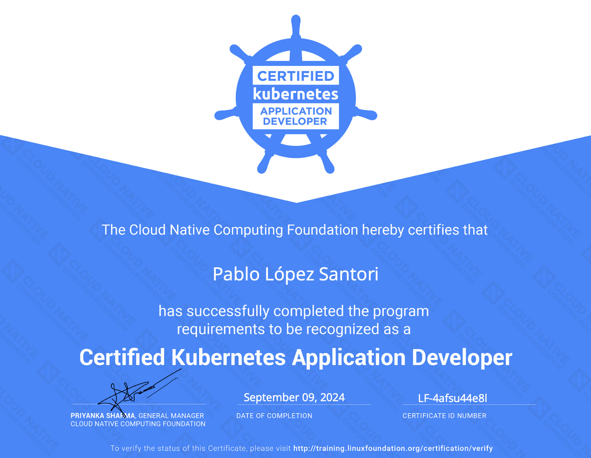

## Learning
To prepare for the exam I took the Udemy Kubernetes Certified Application Developer (CKAD) with Tests which I could access for free through my company. The course covers all the topics required for the exam with labs to practice each section which I found super helpful. The labs are hosted on KodeKloud and they are free to access as part of the course.

I had some previous experience interacting with kubernetes as part of my job, but I lacked a good understanding of the basic concepts.

It took me about 6 weeks from starting the learning to completing the exam. I spent the first 4 weeks going through the course contents and the labs, spending roughly an hour a day during the weekdays. The last couple of weeks I spent them doing excercises and mock exams.

## Purchasing the exam

Once you purchase the exam, you get one year to book it. You also get two practice tests on the killer.sh website (the same test twice) which runs on a simulator very similar to the real exam.

The mock exams are more difficult than the real exam: questions require more work and you get 22 questions instead of the 16 that I got in the real exam. In the mock exams you get the solutions and a 36 hour session to play around and work on any questions you got wrong.

## Readiness Checklist
This is the checklist I followed to make sure I was ready to take on the exam

- I did Udemy’s lightning labs and the mock exams at least three times.

- I was able to finish Udemy’s lightning labs in less than 40 minutes.

- I got over 80% on the killer.sh exam on the second attempt, after having learned from my mistakes from the first attempt where I got 62%.

This made me feel confident enough for the exam. If I performed badly on any practice questions I made sure to go back to the course videos and revisited that topic. I practiced the lightning labs and mock exams in Udemy until I got no questions wrong.

## Tips
The exam requires you to be very familiar with `kubectl` so you can quickly create resources in kubernetes. If you go through the course, you’ll get familiar with the cli soon enough, but here are some tips:

- Use the `—-help` flag in `kubectl`. Each resource has different examples that you can directly copy paste and modify.

- Use `—-dry-run=client -o yaml > resource.yaml` flag to quickly create yaml templates for a resource.

- The main commands I had to use are `run`, `create`, `edit`, `apply`, `expose`, `label`, `describe`, `logs` and `rollout`.

- Learn how to navigate the documentation. You won’t be allowed google, but you will be allowed the kubernetes docs, so practice navigating them when going working on the labs.

- Learn the pod structure by heart: how to add different types of volumes and volume mounts, environment variables or readiness probes without having to look at the docs. This will save you lots of time.

- When defining commands in your pod definition file remember to add `sh -c` before the command so you don’t run into runtime issues.

- Use the short syntax when possible, such as `k create deploy --image=nginx -r 3`

- Learn enough VIM to be fast enough

- Learn a few bash commands such as piping to redirect output to a file or decoding base64 strings.

## Learn VIM basics

If you are as useless as I was with vim prior to the exam, here are the basic commands that were enough for me to get through.

**Navigation**

- use `gg` to go to the top of the page and `GG` to go to the bottom

- use `w` to go the end of the word, and `b` to go to the beggining of the word

- use `/` to search a word and `n` to go to the next word match

- use `h`, `j`, `k` and `l` to move left, up, down and right

**Editing**

- use `esc` to exit editing mode

- use `i` for inserting and `a` for inserting one to the right of the current character

- use `D` to delete everything from current cursor to the end of line

- use `diw` to delete current word and `dd` to delete full line

- use `:wq` to save and quit, `:q` to quit and `:q!` to quit without saving changes.

- use `v` to enter view mode and select some text.

    - use `2>` or 2<` to add/remove indentation to the selected text. Use different numbers for different tab levels.

    - use `y` to copy the selected text and `p` to paste it.

## The Exam
On the day of the exam you will need to check in a bit earlier so you can install the PSI secure browser. This should take you about 10-30 minutes, but be mindful that if you are using a company laptop you might run into issues installing/starting the browser.

It is recommended to do the exam on a large screen, but I did it on my small laptop and while it wasn’t a great experience, it is absolutely fine. You are not allowed additional monitors.

You need to have a working camera and microphone because you are monitored during the whole exam. You will be asked to remove any electronics and anything with text from the room, this includes books or wall art with text in it. Thankfully you get a pee break.

The exam consisted of 16 questions covering docker commands, pods, deployments, jobs, cronjobs, services, network policies, service accounts, probes, canary deployments, troubleshooting questions etc. You get 2 hours to complete the exam.

You can attempt the questions in any order and you can flag questions to come back later on. In my case, if a question was going to take me more than a few minutes to complete, I flagged it and moved on to the next. There are easier questions towards the end.

I completed the exam in about an hour and twenty minutes, then spent the last 40 minutes reviewing the four questions I had flagged, which took up the remaining time.

## Conclusion
That was the preparation I took to do prior to taking the Certified Kubernetes Application Developer exam. I got a score of 82% in the exam.

Before the exam, my knowledge of Kubernetes was quite basic. However, I now feel confident in working with and troubleshooting Kubernetes applications. Preparing for the certification was the perfect motivation to up skill in Kubernetes.

---
## My Newsletter

I send out an email every so often about cool stuff I'm building or working on.


