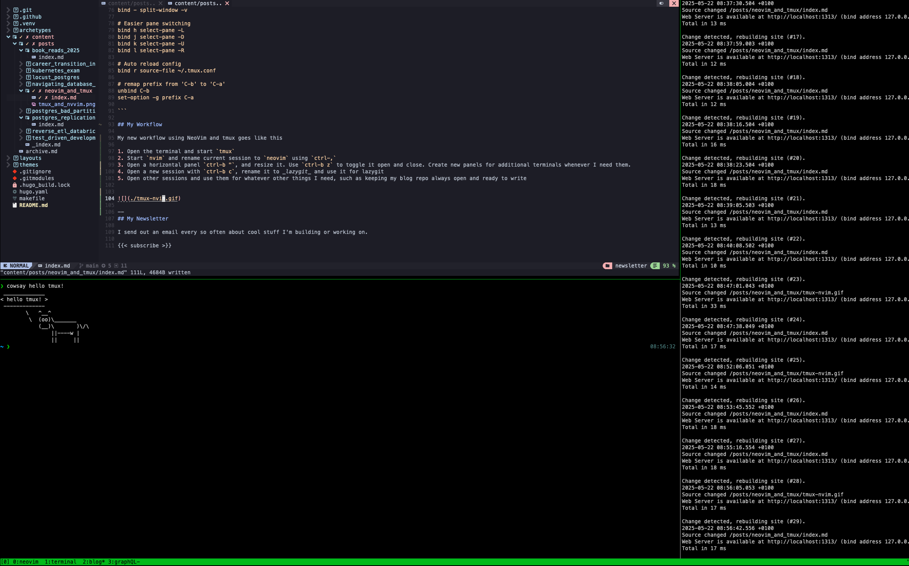

I currently have a basic setup in NeoVim: I use [NvChad](https://nvchad.com/) by default with [treesitter](https://github.com/nvim-treesitter/nvim-treesitter) to get pretty text highlighting, [telescope](https://github.com/nvim-telescope/telescope.nvim) to navgate files, [conform](https://github.com/stevearc/conform.nvim) for all my formatting needs and some python utilities such as pyright. This is enough to get me by.

The thing that has been annoying me the most lately is the terminal workflow in NeoVim. For starters, the terminal does not save any history across sessions, which is incredibly annoying. I'm pretty sure there are many workarounds online, but I'm not the kind of person who cares much about tinkering with the config, I just want something easy out of the box.

The second thing that's been annoying me lately is navigating buffers. I'm pretty sure I'm missing something here, but I always end up circulating my buffers using the `tab` key, which can get pretty slow if you have many tabs open. In a lot of cases I just want a single key tap to go to my terminal from whatever window I'm currtently at.

And finally, I find the the `ctrl-\ n` command to detach from the current terminal very awkward to use.

For these reasons - and because I'm too lazy to properly research how to _fix_ these things with my current setup - I have decided to learn tmux so that I can run neovim inside it. I believe it might solve my problems. It also feels like tmux is a useful tool to have under you belt, so why not?

# Using tmux

It took me around 20 minutes to research into tmux and get a basic setup going on. It is incredibly easy to use and I believe I already have a much tidier workflow than I did before. Here are some basics on how to install it and use it. I found this [blog](https://hamvocke.com/blog/a-quick-and-easy-guide-to-tmux/) post very useful.

### Install

```bash
brew install tmux
```

### Creating panels
- Starting a tmux terminal: `tmux`
- Creating a vertical panel: `ctrl-b %` (that means, press `control` + `b`, release and then press `%`)
- Creating a horizontal panel: `ctrl-b "`
- Move to left/right/up/down panel: `ctrl-b <arrow-key>`
- Closing pane: `ctrl-d` or type `exit`

### Creating Sessions
Unlike panels, which sit within the same _desktop_, sessions are like different desktops. For example you use one session to have your vim and another to have your terminal and lazygit. You can view your active sessions on the green bar at the bottom left.

- Create a new session: `ctrl-b c`
- Move to next/previous session: `ctrl-b n` and `ctrl-b p`
- Move to specific session: `ctrl-b <number>`


### Other
- Renaming a session: `ctrl-b ,`
- Current panel full size toggle: `ctrl-b z`
- Detaching current session: `ctrl-b d` 
- Attaching a session: `tmux ls` to list sessions and `tmux attach -t <number>`
- Swap panels `ctrl-b ctrl-o`

### Resizing
Resizing windows can be accomplished by pressing `ctrl-b ctrl-<arrow>`. That is, you press `ctrl` and `b` first, then you release and then you press `ctrl` and `<arrow>` to resize.

I should note that mac already uses the `ctrl-<arrow>` keybinding for something else, so you'll need to disable it in your keyboard shortcut settings for this to work.


### Creating a config
You can create a tmux config file for customisation at `~/.tmux.conf`. This is my config

```yaml
# Use vim keybindings in copy mode
setw -g mode-keys vi

# Allow mouse to switch panes
set -g mouse on

# Split panes
bind | split-window -h
bind - split-window -v

# Easier pane switching
bind h select-pane -L
bind j select-pane -D
bind k select-pane -U
bind l select-pane -R

# Auto reload config
bind r source-file ~/.tmux.conf

# remap prefix from 'C-b' to 'C-a'
unbind C-b
set-option -g prefix C-a

```

## My Workflow 

My new workflow using NeoVim and tmux goes like this

1. Open the terminal and start `tmux`
2. Start `nvim` and rename current session to `neovim` using `ctrl-,`
3. Open a horizontal panel `ctrl-b "`, and resize it. Use `ctrl-b z` to toggle it open and close. Create new panels for additional terminals whenever I need them.
4. Open a new session with `ctrl-b c`, rename it to _lazygit_ and use it for lazygit
5. Open other sessions and use them for whatever other things I need, such as keeping my blog repo always open and ready to write


--
## My Newsletter

I send out an email every so often about cool stuff I'm building or working on.


