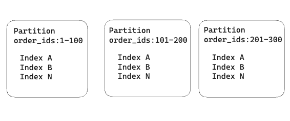
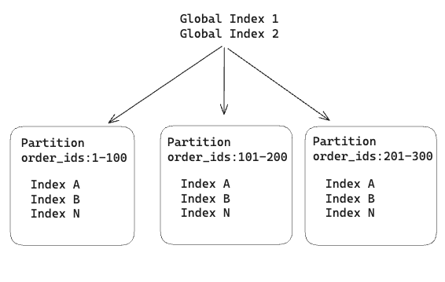

The other day my team came across a peculiar situation with our Postgres database. We had this table partitioned by a primary key, which we’ll call order_id.



We realised one of the queries was taking a very long time to execute, and like good SQL debuggers we looked at the query plan.

Let’s pretend this was the slow query:

```shell
EXPLAIN ANALYZE
SELECT * FROM orders WHERE customer_id = 12345;
Upon inspection, we observed that the query plan was scanning at every single partition! And in our case, there were a lot of them.

Seq Scan on orders_2020  (cost=0.00..25000.00 rows=10000 width=64)
  Filter: (customer_id = 12345)
Seq Scan on orders_2021  (cost=0.00..25000.00 rows=10000 width=64)
  Filter: (customer_id = 12345)
Seq Scan on orders_2022  (cost=0.00..25000.00 rows=10000 width=64)
  Filter: (customer_id = 12345)
Seq Scan on orders_2023_q1  (cost=0.00..25000.00 rows=10000 width=64)
  Filter: (customer_id = 12345)
Seq Scan on orders_2023_q2  (cost=0.00..25000.00 rows=10000 width=64)
  Filter: (customer_id = 12345)
Seq Scan on orders_2023_q3  (cost=0.00..25000.00 rows=10000 width=64)
  Filter: (customer_id = 12345)
Seq Scan on orders_2023_q4  (cost=0.00..25000.00 rows=10000 width=64)
  Filter: (customer_id = 12345)
Seq Scan on orders_2024_q1  (cost=0.00..25000.00 rows=10000 width=64)
  Filter: (customer_id = 12345)
Seq Scan on orders_2024_q2  (cost=0.00..25000.00 rows=10000 width=64)
  Filter: (customer_id = 12345)
Seq Scan on orders_2024_q3  (cost=0.00..25000.00 rows=10000 width=64)
  Filter: (customer_id = 12345)
```

If you look closely at the query, there is no filter based on the partition key (order_id). Which explains why the query plan needs to look at every single partition to see if it includes the customer_id. If your partitions are large or without the correct indexes it can make your queries slow.

What’s happening is that in Postgres you create indexes per partition. Each partition is basically a separate table, and there are no indexes across partitions.

We then thought about creating a global index that spans all partitions. This index would help the query planner determine which partitions to scan when a partition key is not provided in the filters. By using additional columns beyond the partition key, we would be able to direct queries to the correct partition, even in cases where the partition key is not provided.



During our google research (yes, chatgpt too), we found this thread where this type of feature was proposed, but strongly rejected from the very start (if you follow the thread, the discussion gets a bit heated). Long story short, there are no such things as global indexes in Postgres.

In the end, we didn’t find a solution to our problem, other than being reminded of the single most important principle in data engineering (according to me):


> Always optimise your tables based on the data access patterns.


The moral of the story is not to try and fix bad query patterns, but to focus on table design guided by the access patterns.

# Lessons Learned

- If you don’t partition, you can create as many indexes as needed for different query patterns.

- If you do partition, ensure your queries use the partition column as a filter to benefit from partition pruning.

- Partitioning commits you to using the partition column in all queries. Once the right partition is located, indexes can handle additional filters.

- Partitioning is useful when:

    - Your data is extremely large (leading to table limitations).

    - Index creation is slow, and splitting by partition helps.

    - You need an easy way to drop older data (e.g. partitions older than six months).

    - Your queries naturally filter on the partition column to reduce scanned data.

---
## My Newsletter

I send out an email every so often about cool stuff I'm building or working on.


