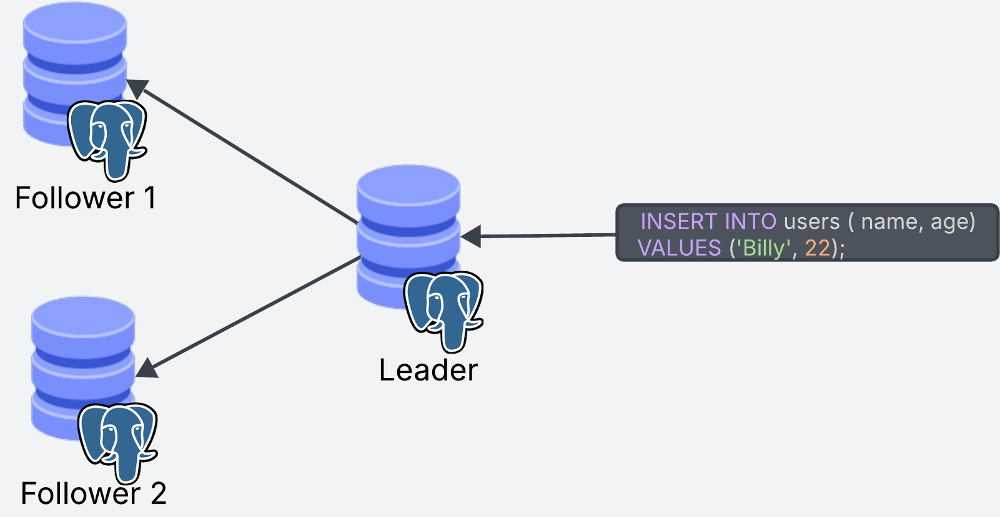
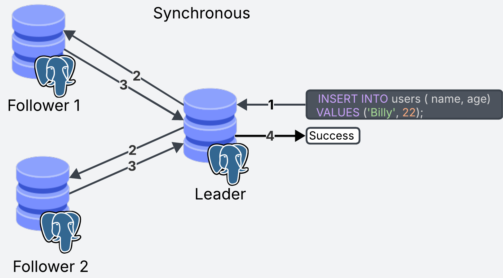
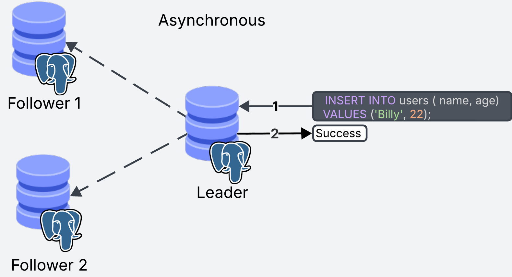
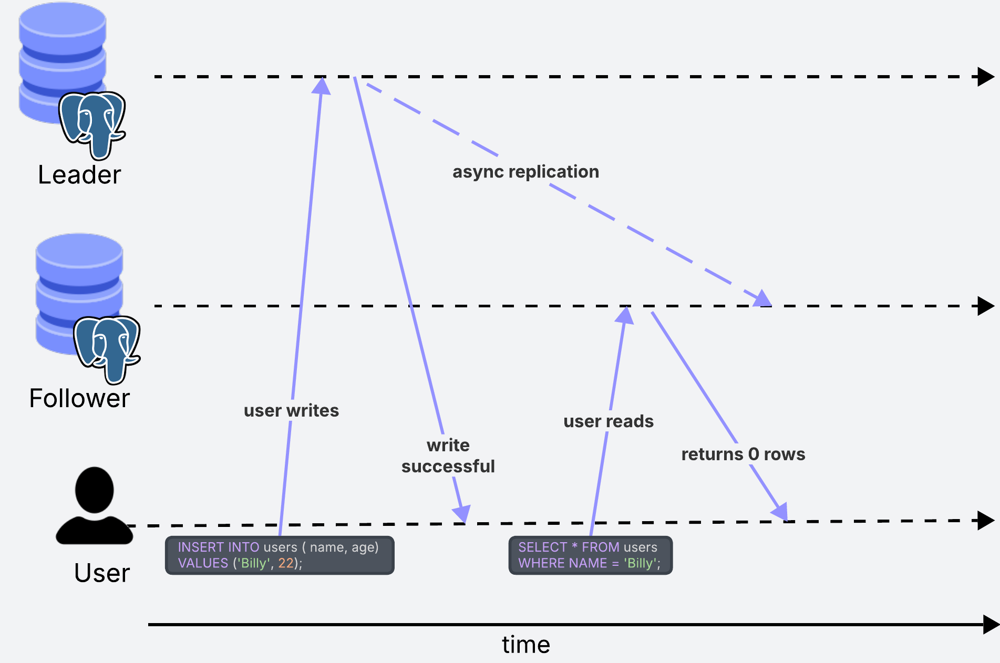
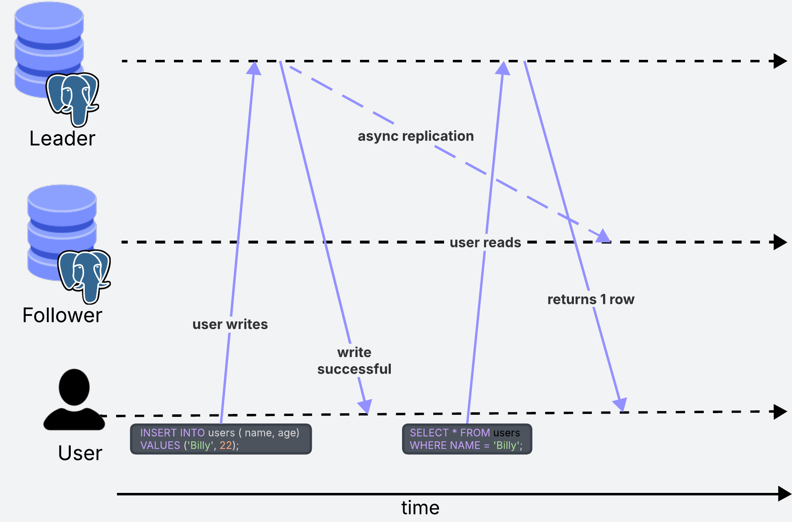

Replication refers to having copies or backups of your data, so if your database goes down, you still have a backup to prevent data loss.

In this post I give an overview of how Postgres handles replication. One thing to note is that a lot of the strategies mentioned in this blog are not only applicable to Postgres but are common to many database systems.

# Leader-Follower replication strategy

This is the most common strategy for replication across databases, and the one used by Postgres as well. In the Leader-Follower strategy there are two types of replicas: leaders and followers.

The leader is in charge of the write operations to the database. All write operations can only go through the leader replica.

The follower replicas keep an up-to-date copy of the data from the leader. Whenever any data is written to the leader, the updates are propagated to the followers so they can stay up to date. Follower replicas can only do read operations (because read operations don't change the data)

In Postgres, there is one leader but there can be more than one follower. When a write operation comes through, it goes to the leader, which then updates the follower replicas. Read operations can go to any replica, including the leader.



# Handling Failover

The main reason for having replication is to avoid data loss if the database goes down, thanks to having copies of the data in different instances.

The nice thing about replication is that even if one of our replicas goes down, we are still able to serve data to our users through the other replicas. This is also known as availability.

If you remember from the previous section, all the writes have to go through the leader, which creates a single point of failure for _write_ operations. If the leader goes down, we won't be able to serve _write_ requests and users will only be able to run _read_ operations from the follower replicas. This means _write_ operations won't be available until the leader comes back up, which could mean potential data loss if we are not able to process incoming requests.

A possible approach to handle such situations is to promote a follower to become the leader when the current leader fails. This is how systems like dynamoDB or Kafka handle these situations, but it is not part of Postgres by default.

There are third party tools that can be used to implement this functionality, but it adds an additional layer of complexity to your system. For example, if the leader fails and a follower becomes the new leader, and then the old leader comes back to life, we must have a mechanism for informing the old leader that it is no longer in charge. This is necessary to avoid situations where both systems think they are the leader, which will lead to confusion and ultimately data loss.

# Sync vs Async replication

An important aspect of a replicated system is whether the replication process happens synchronously or asynchronously. 

With synchronous replication, when the leader is updated, the transaction is not marked as complete until all the replicas have recieved the update.

The main advantage of synchronous replication is that all replicas will always be synced with up-to-date data. Multiple users, querying different replicas will always get the same results.

The downside is that _write_ operations will be slower since we need to wait until all replicas have been updated. Communication between replicas goes through the network, which means that if we have networking issues the transaction can be slow.



From the diagram, keep in mind that steps 2 and 3 might take different amounts of time to execute on each replica. When working with a sync system the transaction will be as slow as your slowest replica.

Slow writes will block further writes, which can cause issues if we deal with a high volume of write operations.

Asynchronous replication does not wait for the replicas to acknoweledge the updates. As soon as the update happens in the leader replica, the transaction is marked as succesful. The replicas are then updated asynchronously.

The main advantage of this approach is that the leader does not have to wait, meaning that _writes_ are a lot faster. This is a common requirement for transactional systems with a high volume of writes.

The main dowsnside is that users querying the same data, could potentially be getting outdated results. For example, if a user writes to the leader and another user reads from a follower replica that hasn't yet been updated, the second user might be looking at outdated results.



Long story short, asynchronous replication is used when synchronous would be too slow. Postgres supports both types of replication strategies, using asynchronous by default.

# Read After Write Consistency

What happens in the scenario where one user writes some data, and then immediately after tries to read that data from a follower replica?

If we are using asynchronous replication, there could be a situation where the user reads data from the follower before it has had the chance to update. In this case they would see outdated data. In some situations, this can lead to confusion.


For example, in a social media site, when a user updates their user name, it should immediately reflect that change to the user, otherwise they may think the change has not taken effect. This can happen when the update goes through the leader, but the user tries to read the changes immediately after form a follower replica which has not been updated. In this case, what we could do is to always read user profile information from the leader replica to ensure the user is always seeing the latest changes.

Reading from the leader can be a good solution for cases like this one, but if we find ourselves reading from the leader too much, we could end up putting too much strain on that instance, losing the benefit of load balancing read operations across the followers.



In other situations, users seeing outdated data might not be a problem at all. In the same example as before, this user's friends will not care if for some time they see an outdated user name of their friend.

# Updating the replicas

So far we've seen different strategies to work with a replicated Postgres database. But we still have no idea how the replication process happens.

When the leader recieves a write operation, the operation is first _logged_ into a log or file.

Only after the log has been created, the data is actually updated. This is know as Write Ahead Log (WAL) because the log is written before the data is actually updated. The reason for doing it this way, is that as long as the log is created, if the database goes down, when it comes back up it can simply look at the log to rebuild the data. The log is actually what gets sent to the followers to keep them up to date.

There are different ways to write the logs. One way is to log the actual SQL statements, and then run those statements in order to recreate the data.

The main advantage of this, is that the logs are very intuitive and easy to read. The problem is when we have non determinstic operations, we have no way of consistently replicating it across the replicas.

For example, take a look at the following log file:
```sql
-- Log 1
INSERT INTO users (id, name, age)
VALUES (1, 'Billy', 22);

-- Log 2
UPDATE users
SET id = FLOOR(RAND() * 100)
WHERE name = 'Billy';

-- Log 3
UPDATE accounts
SET balance = 150
WHERE id = 3;

-- Log 4
...
```
Log number 2 won't be replicable. Every time the statement gets executed it will return a different result. To avoid this, Postgres actually logs the data changes rather than the SQL statements themselves.

For example, we run the SQL statement in memory first (without actually updating the data), we observe how the data will change and we record it to the log. Using this method we can replicate the data consistently even for non deterministic operations because the statement is only ran once, and then the data changes are applied equally across replicas. In this case the log might look like this:

```bash
-- Log 1
Row inserted into "users": {id: 1, name: "Billy", age: 22}

-- Log 2
Row updated in "users" where name = "Billy": id changed from 1 to 57

-- Log 3
Row updated in "accounts" where id = 3: balance changed from 200 to 150

-- Log 4
...
```

In reality, these logs contain byte-level changes to disk rather than row level changes as shown in the example.

Thanks to the WAL, if any of the replicas goes down, as it restarts, it can look at the logs and replay all the changes from where it left off to become up to date with the leader.

# Final Thoughts 

Thanks for making it this far! Writing this has been an excercise for me to better understand replication in Postgres. During the writing of this post I got to better understand the tradeoffs and limitations of Postgres as compared to other database systems.

It has started some questions in my head, such as, _why is more advanced failover not supported by default?_ It seems like this would increase its availability in situations when the leader goes down.

The other question is, _why is sharding not supprted natively?_ This would add horizontal scalability to Postgres, rather than its current vertical scaling which can be limited for larger scale applications.

I wonder if these are tradeoffs the developers have made the to reduce the moving components of running Postgres, making it easier to run and operate in production.


---

Resources:
- Designing data Intensive applications by Martin Kleppman (diagram ideas shamelessly stolen from the book)
- Postgres Documentation


